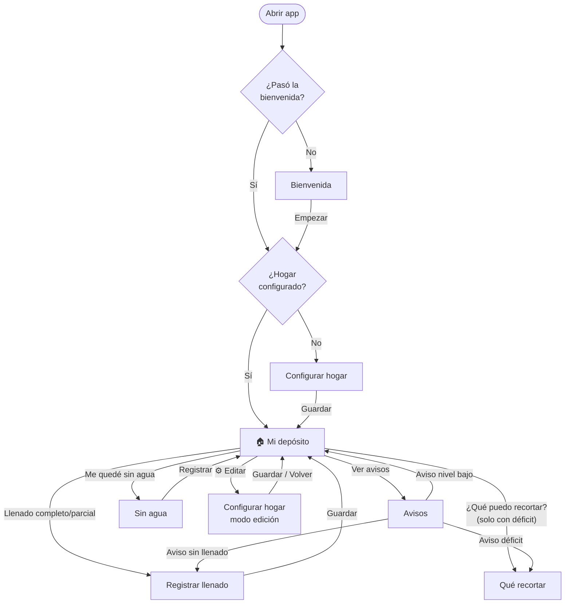
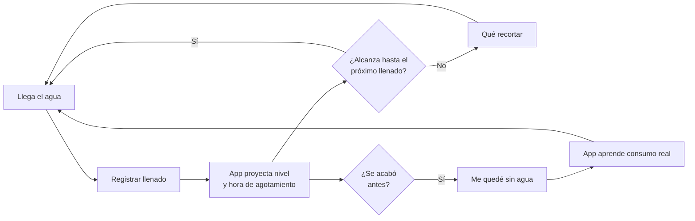
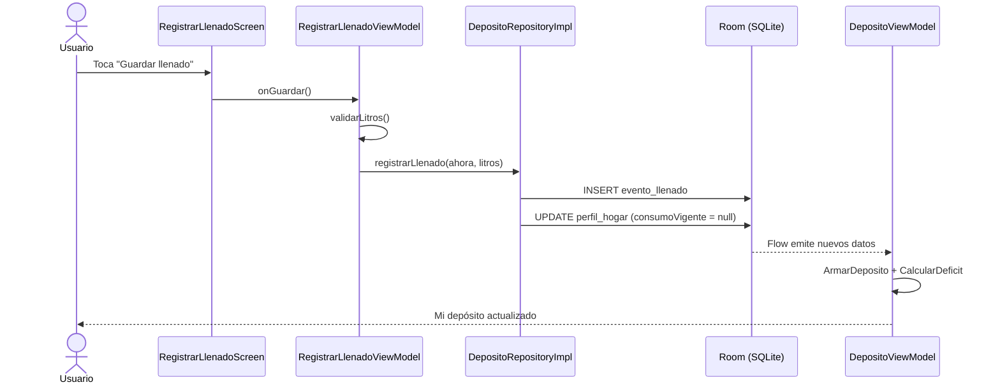
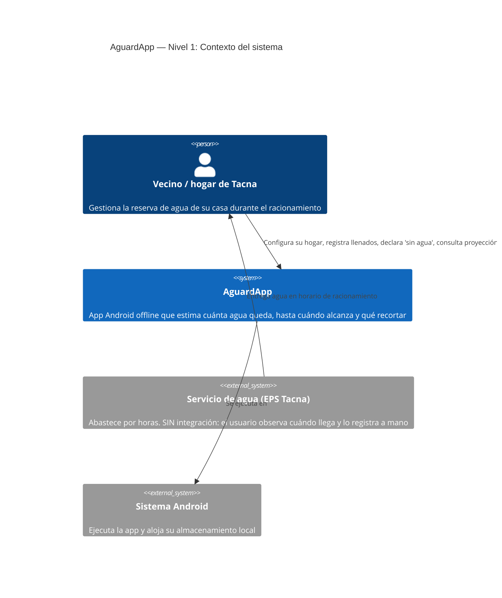
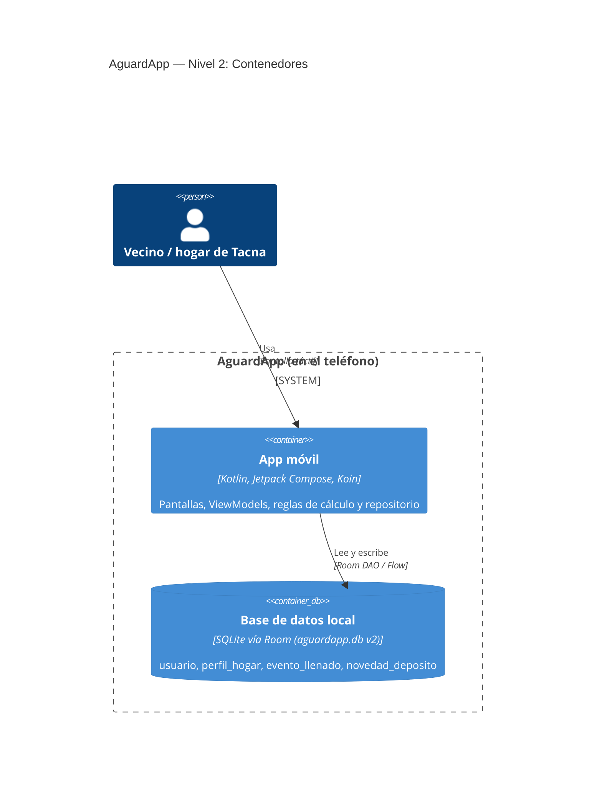
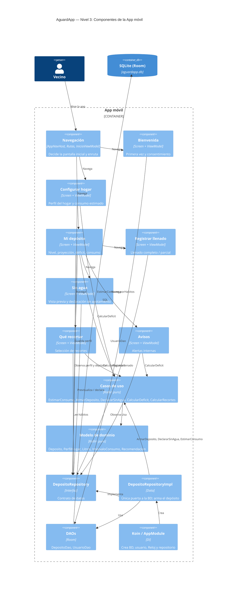
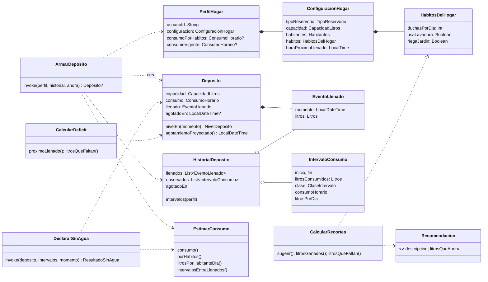

# 📋 Reporte de revisión — AguardApp

> Revisión completa del código de la app Android **AguardApp** (rama `master`, último commit `24de5e6`).
> Fecha de la revisión: 2026-10-02.

---

## Índice

1. [Objetivo del proyecto](#1-objetivo-del-proyecto)
2. [Cómo funciona la aplicación (visión general)](#2-cómo-funciona-la-aplicación-visión-general)
3. [Para qué sirve cada apartado (guía de uso)](#3-para-qué-sirve-cada-apartado-guía-de-uso)
4. [Funciones de la aplicación](#4-funciones-de-la-aplicación)
5. [Flujo del proyecto](#5-flujo-del-proyecto)
6. [Cómo funciona por dentro (código)](#6-cómo-funciona-por-dentro-código)
7. [Los cálculos explicados](#7-los-cálculos-explicados)
8. [Si quiero corregir algo: ¿a dónde voy?](#8-si-quiero-corregir-algo-a-dónde-voy)
9. [Diagramas C4](#9-diagramas-c4)
10. [Residuos: código y archivos que no sirven](#10-residuos-código-y-archivos-que-no-sirven)
11. [Puntos a revisar (posibles errores o mejoras)](#11-puntos-a-revisar-posibles-errores-o-mejoras)

---

## 1. Objetivo del proyecto

En **Tacna** el agua llega por **racionamiento**: solo unas horas al día, y cada hogar guarda agua en un tanque elevado, una cisterna o bidones. El problema es que la familia **no sabe cuánta agua le queda ni si le va a alcanzar** hasta que vuelva el servicio, y termina comprando agua de emergencia.

**AguardApp responde a dos preguntas:**

- 💧 **¿Cuánta agua me queda ahora?**
- ⏰ **¿Me alcanza hasta que vuelva el agua? Si no, ¿qué puedo dejar de hacer?**

Lo hace **sin medidor y sin internet**: el usuario solo marca cuándo llenó su tanque y la app calcula el resto con una estimación de consumo que **aprende** con el tiempo. Todo se guarda en el teléfono.

---

## 2. Cómo funciona la aplicación (visión general)

La idea es muy simple:

1. El usuario dice **cómo es su hogar** (tamaño del tanque, cuántas personas, hábitos y a qué hora suele llegar el agua).
2. Con eso la app **estima cuántos litros por hora** gasta el hogar.
3. Cuando llega el agua, el usuario toca **"Registrar llenado"**.
4. Desde ese momento la app **resta el consumo hora a hora** y muestra cuánta agua queda, a qué hora se acabará y si faltará agua antes del próximo llenado (**déficit**).
5. Si falta agua, sugiere **qué recortar** (no lavar ropa, duchas cortas, etc.).
6. Si el agua se acabó antes de lo previsto, el usuario lo dice con **"Me quedé sin agua"** y la app **corrige su estimación** de consumo.
7. Cuantos más llenados registra, más precisa es la estimación (usa el historial real en vez de los hábitos declarados).

No hay servidor, no hay cuentas, no hay login: un usuario por teléfono, identificado con un UUID local.

---

## 3. Para qué sirve cada apartado (guía de uso)

### 🟦 Bienvenida
**Cuándo aparece:** solo la primera vez que se abre la app.
**Para qué sirve:** presenta la app ("Sabe cuánta agua te queda y hasta cuándo te alcanza") y pide aceptar que los datos se guarden en el teléfono. Al tocar **"Empezar"** no vuelve a aparecer.

### ⚙️ Configurar hogar ("Configura tu depósito")
**Cuándo aparece:** después de la bienvenida, o cuando el usuario toca el engranaje en *Mi depósito* para editar.
**Para qué sirve:** contarle a la app cómo es el hogar.

| Campo | Para qué se usa |
|---|---|
| Tipo de reservorio (tanque elevado / cisterna / bidones) | Solo informativo: cambia el ícono y el texto, **no afecta los cálculos** |
| Capacidad (200 – 5 000 L) | El máximo de agua que cabe; un "llenado completo" usa este valor |
| Habitantes (1 – 12) | Para estimar consumo y el promedio por persona |
| Próximo llenado (hora) | A qué hora suele llegar el agua cada día; sirve para calcular si alcanza |
| Duchas por día, lavadora, riego | Estimación inicial del consumo; también decide qué recortes se sugieren |
| "Consumo estimado" | Se muestra en vivo (L/h) mientras se mueven los controles |

### 🏠 Mi depósito (pantalla principal)
**Para qué sirve:** ver de un vistazo el estado del agua.

- **Cabecera:** saludo, número de personas, dibujo del tanque y **litros disponibles** (con % de la capacidad) y cuándo fue el último llenado.
- **Proyección de hoy:** nivel actual, **"Te alcanza hasta"** (hora en que se acaba), **próximo llenado** y **déficit** (en rojo si falta agua).
- **Consumo:** litros por hora estimados y **promedio L/persona/día** (aparece "—" hasta tener suficientes datos).
- **Botones:**
  - *Registrar llenado completo* → el tanque quedó lleno.
  - *Registrar llenado parcial* → el tanque quedó con X litros.
  - *¿Qué puedo recortar?* → solo aparece si hay déficit.
  - *Ver avisos*.
  - *Me quedé sin agua antes de lo previsto*.
- Se **actualiza sola cada minuto** (el nivel baja con el tiempo).

### 💧 Registrar llenado
- **Completo:** confirma "Sí, está lleno" → se guarda la capacidad total.
- **Parcial:** pregunta "¿Con cuántos litros quedó tu tanque?" (los litros **que hay en el tanque**, no los que entraron). No puede superar la capacidad.
- El llenado se guarda **con la hora actual** (no se puede registrar un llenado pasado).

### ✂️ ¿Qué puedo recortar?
**Para qué sirve:** cuando el agua no alcanza, propone acciones con los litros que ahorra cada una. El usuario las marca y ve en vivo cuánto gana y cuánto le sigue faltando, hasta "¡Cubriste el déficit!". Solo propone lo que el hogar hace (si no riega, no sugiere "no regar").

### 🚱 Me quedé sin agua
**Para qué sirve:** enseñarle a la app el consumo real. Muestra lo que se proyectaba vs. cuándo se acabó realmente, la diferencia y cómo cambiaría el consumo estimado (p. ej. `40 → 52 L/h`). Opciones: *"Se acabó ahora"* o *"Se acabó antes, a las…"* (hora HH:mm de hoy).

### 🔔 Avisos ("Alertas de tu depósito")
**Para qué sirve:** lista de alertas **dentro de la app** (no son notificaciones push):

| Aviso | Cuándo sale | A dónde lleva |
|---|---|---|
| "Tu reserva se agota antes de que vuelva el agua" | Hay déficit | ¿Qué puedo recortar? |
| "Te queda poca agua" | Nivel < 20 % | Mi depósito |
| "¿Llegó el agua a tu casa?" | Nunca se registró un llenado | Registrar llenado |

---

## 4. Funciones de la aplicación

| # | Función | Pantalla | Dónde está en el código |
|---|---|---|---|
| F1 | Primera vez / consentimiento | Bienvenida | `feature/bienvenida/presentation/` |
| F2 | Configurar y editar el hogar | Configurar hogar | `ConfiguracionViewModel.kt`, `ConfiguracionScreen.kt` |
| F3 | Estimar consumo por hábitos | Configurar hogar | `EstimarConsumo.porHabitos` |
| F4 | Registrar llenado completo/parcial | Registrar llenado | `RegistrarLlenadoViewModel.kt` |
| F5 | Calcular nivel actual y hora de agotamiento | Mi depósito | `Deposito.nivelEn`, `Deposito.agotamientoProyectado` |
| F6 | Calcular déficit hasta el próximo llenado | Mi depósito / Avisos | `CalcularDeficit.kt` |
| F7 | Aprender consumo con el historial | (automático) | `EstimarConsumo.consumo` |
| F8 | Declarar "me quedé sin agua" con vista previa | Sin agua | `DeclararSinAgua`, `SinAguaViewModel.kt` |
| F9 | Sugerir recortes | Qué recortar | `CalcularRecortes.kt`, `Recomendacion.kt` |
| F10 | Avisos internos | Avisos | `AvisosViewModel.kt` |
| F11 | Promedio L/persona/día | Mi depósito | `EstimarConsumo.litrosPorHabitanteDia` |
| F12 | Funcionar 100 % sin internet | Toda la app | Room (`AguardAppDatabase.kt`) |

---

## 5. Flujo del proyecto

### 5.1 Flujo de pantallas (navegación)



La decisión inicial la toma `InicioViewModel` ([InicioViewModel.kt](app/src/main/java/com/example/aguardapp/core/navigation/InicioViewModel.kt)) y las rutas están en [AppNavHost.kt](app/src/main/java/com/example/aguardapp/core/navigation/AppNavHost.kt) y [Rutas.kt](app/src/main/java/com/example/aguardapp/core/navigation/Rutas.kt).

### 5.2 Ciclo de uso diario



### 5.3 Flujo de datos de una acción (ej. registrar llenado)



---

## 6. Cómo funciona por dentro (código)

### 6.1 Tecnologías

| Pieza | Tecnología |
|---|---|
| Lenguaje | Kotlin |
| UI | Jetpack Compose + Material 3 |
| Navegación | Navigation Compose (rutas de texto) |
| Base de datos | Room (SQLite) — `aguardapp.db`, versión 2 |
| Inyección de dependencias | Koin (`koin-core`, usado como *service locator*) |
| Fechas | `kotlinx-datetime` |
| Arquitectura | MVVM + capas tipo Clean/DDD (presentation / domain / data) |

### 6.2 Estructura de carpetas

```
app/src/main/java/com/example/aguardapp/
├── AguardApplication.kt        ← arranca la app: crea BD, usuario y Koin
├── MainActivity.kt             ← única Activity, llama a App()
├── App.kt                      ← tema + decide pantalla inicial
├── core/
│   ├── data/Usuario.kt         ← tabla "usuario" + UsuarioDao
│   ├── db/AguardAppDatabase.kt ← definición de la base Room
│   ├── di/AppModule.kt         ← qué se inyecta (Koin)
│   ├── navigation/             ← AppNavHost, Rutas, InicioViewModel
│   ├── ui/theme/               ← colores, fuente, tema, barra de estado
│   └── util/Reloj.kt           ← hora actual y generador de UUID
└── feature/
    ├── bienvenida/presentation/ ← pantalla + VM de bienvenida
    └── deposito/
        ├── domain/             ← 🧠 REGLAS Y CÁLCULOS (Kotlin puro)
        │   ├── model/          ← Litros, Deposito, Hogar, Recomendacion…
        │   ├── usecase/        ← EstimarConsumo, CalcularDeficit, ArmarDeposito…
        │   └── repository/     ← interfaz DepositoRepository
        ├── data/               ← 💾 BASE DE DATOS
        │   ├── local/          ← tablas (Entities) y DAO
        │   ├── mapper/         ← convierte tabla ↔ modelo
        │   └── DepositoRepositoryImpl.kt
        └── presentation/       ← 📱 PANTALLAS + ViewModels
            └── componentes/    ← botones, tarjetas, tanque dibujado…
```

### 6.3 Las capas y cómo se hablan

```
 Pantalla (Compose)  ──observa──▶  ViewModel (UiState)
                                        │ llama
                                        ▼
                               DepositoRepository (interfaz, domain)
                                        ▲ implementa
                               DepositoRepositoryImpl (data)
                                  │ usa            │ lee/escribe
                                  ▼                ▼
                     Casos de uso (domain)     DepositoDao → Room/SQLite
```

- **Presentation:** cada pantalla tiene un `XxxScreen` (solo dibuja) y un `XxxViewModel` (estado y acciones). Los VM exponen un `StateFlow<XxxUiState>`; la pantalla lo observa con `collectAsStateWithLifecycle()`. Los VM se crean con `desdeInyeccion()` que saca las dependencias de Koin.
- **Domain:** Kotlin puro, sin Android. Contiene **todas las fórmulas**. Los tipos `Litros`, `CapacidadLitros`, `ConsumoHorario`, `Habitantes` son *value classes* que **validan** sus valores (no permiten negativos, ceros, etc.).
- **Data:** el repositorio es la **única puerta** a la base. Lee las tablas como `Flow` (reactivo): cuando cambia una tabla, todas las pantallas que la observan se recalculan solas.

### 6.4 Arranque de la app

1. `AguardApplication.onCreate()` → `iniciarAplicacion()` ([AppModule.kt](app/src/main/java/com/example/aguardapp/core/di/AppModule.kt)):
   - Crea la base Room.
   - Busca el usuario; si no existe, lo crea con un UUID (`runBlocking`).
   - Arranca Koin con: `Reloj`, `UsuarioDao` y `DepositoRepository`.
2. `MainActivity` → `App()` → `InicioViewModel` lee si pasó la bienvenida y si hay perfil → elige ruta inicial.
3. `AppNavHost` monta todas las pantallas.

### 6.5 Base de datos (tablas)

| Tabla | Qué guarda | Campos clave |
|---|---|---|
| `usuario` | El usuario del teléfono | `id` (UUID), `bienvenidaCompletada` |
| `perfil_hogar` | La configuración del hogar (1 por usuario) | `capacidadLitros`, `habitantes`, `duchasPorDia`, `usaLavadora`, `riegaJardin`, `horaProximoLlenado` ("HH:mm"), `consumoPorHabitosLitrosHora`, `consumoVigenteLitrosHora` |
| `evento_llenado` | Cada llenado | `momento` (ISO), `litros` (cómo quedó el tanque) |
| `novedad_deposito` | Cada "me quedé sin agua" | `momento`, `inicioObservado`, `litrosObservados` |

> ⚠️ La base usa `fallbackToDestructiveMigration`: **si subes `version` sin escribir una migración, se borran todos los datos del usuario.**

### 6.6 Las dos "fuentes" de consumo del perfil

- `consumoPorHabitos`: se calcula al guardar la configuración (fórmula de hábitos).
- `consumoVigente`: se guarda al declarar "me quedé sin agua" (con tope de ±30 %). **Se borra (`null`) cada vez que se registra un llenado**, para recalcular con el historial completo.

---

## 7. Los cálculos explicados

Todos los parámetros numéricos están en **`ParametrosConsumo`** ([EstimarConsumo.kt:12-30](app/src/main/java/com/example/aguardapp/feature/deposito/domain/usecase/EstimarConsumo.kt:12)).

### 7.1 Consumo por hábitos (estimación inicial)

```
por persona  = 60 L + duchas/día × 30 L
diario       = habitantes × por persona + (lavadora ? 100 L : 0) + (riego ? 150 L : 0)
consumo L/h  = diario / 12 h de uso al día
```

**Ejemplo:** 4 personas, 2 duchas, lavadora, sin riego →
`4 × (60 + 60) + 100 = 580 L/día → 580 / 12 ≈ 48 L/h`.

### 7.2 Qué consumo usa la app (prioridad)

`ArmarDeposito` ([CalcularDeposito.kt:27](app/src/main/java/com/example/aguardapp/feature/deposito/domain/usecase/CalcularDeposito.kt:27)):

1. Si hay `consumoVigente` (recién declarado "sin agua") → usa ese.
2. Si no, `EstimarConsumo.consumo(...)`:
   1. Si el **historial alcanza** → **mediana** del consumo de los intervalos válidos.
   2. Si no, el **consumo por hábitos**.
   3. Si tampoco hay, `capacidad / 48 h`.

**Cómo se arma el historial:**
- Cada par de llenados seguidos = un intervalo `POR_LLENADO` (se supone que se gastó lo que había al llenar).
- Cada "me quedé sin agua" = un intervalo `OBSERVADO` (dato exacto).

**Filtros (`seleccionar`)**:
- Descarta intervalos `POR_LLENADO` de menos de **6 h** (rellenos/correcciones).
- Toma los **5 más recientes**.
- Descarta los que duran más de **2× la mediana** (llenados olvidados).
- Si hay algún `OBSERVADO`, **solo usa los observados**.
- Alcanza para estimar con **1 observado** o **2 inferidos**.

### 7.3 Nivel actual y hora de agotamiento

[Deposito.kt:38-50](app/src/main/java/com/example/aguardapp/feature/deposito/domain/model/Deposito.kt:38)

```
nivel(t)      = litrosDelÚltimoLlenado − consumo L/h × horas desde el llenado   (mínimo 0)
agotamiento   = momentoDelLlenado + litrosDelLlenado / consumo L/h
```
Si el usuario declaró "sin agua" después del último llenado, el nivel es 0 y el agotamiento es esa hora.

### 7.4 Déficit

[CalcularDeficit.kt](app/src/main/java/com/example/aguardapp/feature/deposito/domain/usecase/CalcularDeficit.kt)

```
próximo llenado = hoy a la hora configurada (si aún no pasó), si no mañana
déficit         = consumo L/h × horas hasta el próximo llenado − nivel actual   (mínimo 0, redondeado)
```

**Ejemplo:** quedan 300 L, consumo 48 L/h, el agua llega en 10 h → `480 − 300 = 180 L` de déficit.

### 7.5 Me quedé sin agua (aprendizaje)

[CalcularDeposito.kt:39-56](app/src/main/java/com/example/aguardapp/feature/deposito/domain/usecase/CalcularDeposito.kt:39)

- Se crea un intervalo `OBSERVADO`: desde el último llenado hasta el momento declarado, con los litros del llenado.
- Se recalcula el consumo con ese dato, pero **limitado a ±30 %** del consumo anterior (para que un error de dedo no desordene todo).

### 7.6 Recortes

[Recomendacion.kt](app/src/main/java/com/example/aguardapp/feature/deposito/domain/model/Recomendacion.kt)

| Recomendación | Ahorra | Se sugiere si… |
|---|---|---|
| No lavar ropa hoy | 80 L | usa lavadora |
| No regar el jardín hoy | 80 L | riega |
| Duchas de 5 minutos | 40 L | duchas > 0 |
| Cerrar el caño al lavar platos | 45 L | siempre |
| Usar un balde en el inodoro | 30 L | siempre |

`faltan = déficit − suma de lo elegido` (mínimo 0).

### 7.7 Promedio por persona

`mediana(litros/día de los intervalos válidos) / habitantes`. Muestra "—" mientras no haya datos suficientes.

---

## 8. Si quiero corregir algo: ¿a dónde voy?

### 🧮 Cálculos y parámetros

| Quiero cambiar… | Archivo | Línea aprox. |
|---|---|---|
| Litros base por persona, por ducha, lavadora, riego, horas de uso al día | [EstimarConsumo.kt](app/src/main/java/com/example/aguardapp/feature/deposito/domain/usecase/EstimarConsumo.kt:25) | 25-29 |
| Cuántos intervalos recientes se usan, filtro de "olvidos", mínimo de horas entre llenados, mínimo de inferidos | [EstimarConsumo.kt](app/src/main/java/com/example/aguardapp/feature/deposito/domain/usecase/EstimarConsumo.kt:13) | 13-22 |
| Estimación cuando no hay nada (capacidad / 48 h) | [EstimarConsumo.kt](app/src/main/java/com/example/aguardapp/feature/deposito/domain/usecase/EstimarConsumo.kt:15) | 15 |
| Tope de cambio al declarar "sin agua" (30 %) | [EstimarConsumo.kt](app/src/main/java/com/example/aguardapp/feature/deposito/domain/usecase/EstimarConsumo.kt:16) | 16 |
| Fórmula de consumo por hábitos | `porHabitos` en [EstimarConsumo.kt](app/src/main/java/com/example/aguardapp/feature/deposito/domain/usecase/EstimarConsumo.kt:46) | 46 |
| Usar mediana vs. promedio, criterio de selección | `consumo` / `seleccionar` en [EstimarConsumo.kt](app/src/main/java/com/example/aguardapp/feature/deposito/domain/usecase/EstimarConsumo.kt:36) | 36, 72 |
| Cómo baja el nivel / hora de agotamiento | [Deposito.kt](app/src/main/java/com/example/aguardapp/feature/deposito/domain/model/Deposito.kt:38) | 38, 46 |
| Fórmula del déficit / cálculo del próximo llenado | [CalcularDeficit.kt](app/src/main/java/com/example/aguardapp/feature/deposito/domain/usecase/CalcularDeficit.kt:15) | 15, 21 |
| Qué consumo tiene prioridad | `ArmarDeposito` en [CalcularDeposito.kt](app/src/main/java/com/example/aguardapp/feature/deposito/domain/usecase/CalcularDeposito.kt:27) | 27 |
| Lógica de "me quedé sin agua" | `DeclararSinAgua` en [CalcularDeposito.kt](app/src/main/java/com/example/aguardapp/feature/deposito/domain/usecase/CalcularDeposito.kt:39) | 39 |
| Recomendaciones de ahorro (texto, litros, condición) | [Recomendacion.kt](app/src/main/java/com/example/aguardapp/feature/deposito/domain/model/Recomendacion.kt:9) | 9-13 |
| Conversión de horas/fechas | [TiempoDeposito.kt](app/src/main/java/com/example/aguardapp/feature/deposito/domain/model/TiempoDeposito.kt) | — |

### 📏 Límites y valores por defecto de la interfaz

| Quiero cambiar… | Archivo | Línea |
|---|---|---|
| Capacidad mínima/máxima/paso del deslizador (200/5000/50) | [ConfiguracionViewModel.kt](app/src/main/java/com/example/aguardapp/feature/deposito/presentation/ConfiguracionViewModel.kt:22) | 22-24 |
| Máximo de habitantes (12) y duchas (6) | [ConfiguracionViewModel.kt](app/src/main/java/com/example/aguardapp/feature/deposito/presentation/ConfiguracionViewModel.kt:25) | 25-26 |
| Valores por defecto del formulario (1000 L, 4 personas, 2 duchas…) | [ConfiguracionViewModel.kt](app/src/main/java/com/example/aguardapp/feature/deposito/presentation/ConfiguracionViewModel.kt:28) | 28-35 |
| Texto "típico 1 000 – 2 500 L" | [ControlesConfiguracion.kt](app/src/main/java/com/example/aguardapp/feature/deposito/presentation/componentes/ControlesConfiguracion.kt:105) | 105 |
| Umbral del aviso "poca agua" (20 %) | [AvisosViewModel.kt](app/src/main/java/com/example/aguardapp/feature/deposito/presentation/AvisosViewModel.kt:19) | 19 |
| Textos de los avisos | `armarAvisos` en [AvisosViewModel.kt](app/src/main/java/com/example/aguardapp/feature/deposito/presentation/AvisosViewModel.kt:58) | 58 |
| Cada cuánto se refresca Mi depósito (60 s) | [DepositoViewModel.kt](app/src/main/java/com/example/aguardapp/feature/deposito/presentation/DepositoViewModel.kt:59) | 59 |
| Datos que muestra Mi depósito | `armarVista` en [DepositoViewModel.kt](app/src/main/java/com/example/aguardapp/feature/deposito/presentation/DepositoViewModel.kt:75) | 75 |
| Validación de litros del llenado parcial | [RegistrarLlenadoViewModel.kt](app/src/main/java/com/example/aguardapp/feature/deposito/presentation/RegistrarLlenadoViewModel.kt:97) | 97 |
| Validación de la hora en "sin agua" | [SinAguaViewModel.kt](app/src/main/java/com/example/aguardapp/feature/deposito/presentation/SinAguaViewModel.kt:109) | 109 |
| Formato de horas ("6:40 p.m."), "hoy/mañana", miles "1 100", saludo, nombre del tipo | [FormatoDeposito.kt](app/src/main/java/com/example/aguardapp/feature/deposito/presentation/FormatoDeposito.kt) | 15-64 |
| Colores | [Color.kt](app/src/main/java/com/example/aguardapp/core/ui/theme/Color.kt) | — |
| Textos de la bienvenida | [BienvenidaScreen.kt](app/src/main/java/com/example/aguardapp/feature/bienvenida/presentation/BienvenidaScreen.kt) | 83-95, 132 |

### 💾 Datos guardados

| Quiero… | Archivo |
|---|---|
| Agregar/cambiar una columna o tabla | Entidad en [DepositoEntidades.kt](app/src/main/java/com/example/aguardapp/feature/deposito/data/local/DepositoEntidades.kt) + mapper en [DepositoMapper.kt](app/src/main/java/com/example/aguardapp/feature/deposito/data/mapper/DepositoMapper.kt) + **subir `version`** en [AguardAppDatabase.kt](app/src/main/java/com/example/aguardapp/core/db/AguardAppDatabase.kt:27) (⚠️ borra datos si no hay migración) |
| Cambiar consultas SQL | [DepositoDao.kt](app/src/main/java/com/example/aguardapp/feature/deposito/data/local/DepositoDao.kt) |
| Cambiar qué se guarda al registrar llenado / declarar sin agua | [DepositoRepositoryImpl.kt](app/src/main/java/com/example/aguardapp/feature/deposito/data/DepositoRepositoryImpl.kt:54) |
| Borrar los datos de prueba del teléfono | Ajustes de Android → Apps → AguardApp → Borrar datos (la app no tiene botón para esto) |

### 🧭 Navegación

| Quiero… | Archivo |
|---|---|
| Agregar una pantalla o cambiar a dónde lleva un botón | [AppNavHost.kt](app/src/main/java/com/example/aguardapp/core/navigation/AppNavHost.kt) + [Rutas.kt](app/src/main/java/com/example/aguardapp/core/navigation/Rutas.kt) |
| Cambiar la pantalla inicial | [InicioViewModel.kt](app/src/main/java/com/example/aguardapp/core/navigation/InicioViewModel.kt:37) |

> 💡 **Regla práctica:** si es **una fórmula o un número del cálculo** → carpeta `domain/`. Si es **un texto, un límite del formulario o un formato** → carpeta `presentation/`. Si es **lo que se guarda** → carpeta `data/`.

---

## 9. Diagramas C4

El modelo C4 (Simon Brown) describe la arquitectura en **4 niveles de zoom**: **Contexto → Contenedores → Componentes → Código**.

> 📝 **Nota sobre el README actual:** el diagrama de contenedores del `Readme.md` dibuja las *capas* (Presentation, Domain, Data) como contenedores. En C4, un **contenedor** es algo que se ejecuta o almacena datos por separado (una app, una base de datos). Las capas son **componentes** dentro de la app. Abajo está la versión corregida. Además, el diagrama de componentes del README solo muestra *Mi depósito*; aquí están todas las pantallas.

### Nivel 1 — Contexto



### Nivel 2 — Contenedores



### Nivel 3 — Componentes (dentro de la App móvil)



### Nivel 4 — Código (modelo de dominio)



---

## 10. Residuos: código y archivos que no sirven

Verificado buscando referencias en todo `app/src/main`.

### 🗑️ Se pueden borrar sin riesgo

| Residuo | Ubicación | Por qué |
|---|---|---|
| Ícono `ic_info` | `app/src/main/res/drawable/ic_info.xml` | 0 referencias |
| Ícono `ic_reloj` | `app/src/main/res/drawable/ic_reloj.xml` | 0 referencias |
| Ícono `ic_flecha_abajo` | `app/src/main/res/drawable/ic_flecha_abajo.xml` | 0 referencias |
| Color `CoralOscuro` | [Color.kt:19](app/src/main/java/com/example/aguardapp/core/ui/theme/Color.kt:19) | Se declara pero nunca se usa |
| Archivo `rules.keep` | `app/src/main/keepRules/rules.keep` | Es la plantilla por defecto (solo comentarios) y además la optimización (R8) está desactivada en `build.gradle.kts` |
| Dependencias `ui-tooling` y `ui-tooling-preview` | `app/build.gradle.kts` | No hay ningún `@Preview` en el proyecto. (Si piensas usar previews, consérvalas) |
| Dependencia `junit` | `app/build.gradle.kts` | `ExampleUnitTest.kt` fue borrado (cambio sin commitear) y **no queda ningún test** |

### ⚠️ No es basura, pero conviene saberlo

| Elemento | Comentario |
|---|---|
| `app/schemas/.../1.json` | Esquema viejo de Room. **No borrar**: es el historial que Room usa si algún día escribes migraciones. |
| Carpeta `.idea/` versionada en git | Archivos del IDE; normalmente se ignoran en `.gitignore`. |
| `androidx-lifecycle-runtime-ktx` | Probablemente redundante (ya llega con `lifecycle-runtime-compose`), pero es inofensivo. |
| `TipoReservorio` | Se guarda pero **no influye en ningún cálculo**; solo cambia ícono y texto. Es correcto si es intencional. |
| `EstimarConsumo()` / `ArmarDeposito()` | Se crean objetos nuevos en cada cálculo (p. ej. `HistorialDeposito.intervalos` crea uno cada vez). No es un error, solo un poco de repetición. |

### 📄 Documentación desactualizada (README / comentarios)

| Dónde | Qué está mal |
|---|---|
| `Readme.md` (badges y requisitos) | Dice "Android 8.0+", pero `minSdk = 24` es **Android 7.0**. |
| `Readme.md` → Diagrama de clases | `EventoLlenado` tiene un campo `tipo` que **no existe** (completo/parcial solo cambia los litros; no se guarda). |
| `Readme.md` → C4 contenedores | Usa las capas como contenedores (ver nota de la sección 9). |
| `Readme.md` → C4 componentes | Solo muestra *Mi depósito*; faltan Configurar, Registrar, Sin agua, Recortes, Avisos. |
| `Readme.md` → Solución | "Registrar llenados (completo o a la mitad)": el parcial es "con X litros", no "a la mitad". |
| Comentario en `guardarPerfil` ([DepositoRepositoryImpl.kt:39](app/src/main/java/com/example/aguardapp/feature/deposito/data/DepositoRepositoryImpl.kt:39)) | Dice que "el aprendido se descarta", pero las novedades "sin agua" siguen en la tabla y se vuelven a usar en el siguiente cálculo. |

---

## 11. Puntos a revisar (posibles errores o mejoras)

No son residuos, pero los encontré durante la revisión y conviene decidir si son intencionales:

1. **El consentimiento viene marcado por defecto** — `consentimiento: Boolean = true` en [BienvenidaViewModel.kt:15](app/src/main/java/com/example/aguardapp/feature/bienvenida/presentation/BienvenidaViewModel.kt:15). Un consentimiento normalmente debe empezar **desmarcado** (el usuario lo activa).
2. **La bienvenida promete "Puedo borrarlos cuando quiera", pero no existe ninguna opción para borrar los datos** dentro de la app.
3. **El tope de ±30 % al declarar "sin agua" es temporal**: al registrar el siguiente llenado, `consumoVigente` vuelve a `null` y el consumo pasa a ser la mediana de los intervalos observados **sin tope**, así que puede saltar más de 30 %.
4. **"Se acabó antes, a las…" solo acepta horas de hoy.** Si el agua se acabó ayer en la noche, no se puede registrar.
5. **No se puede registrar un llenado pasado**: siempre se guarda con la hora actual. Si el usuario se olvida y lo registra horas después, la proyección queda desplazada.
6. **La hora del próximo llenado es una sola para todos los días** (no contempla días sin servicio ni horarios por día).
7. **Los avisos no se refrescan solos** (Mi depósito sí, cada minuto) y **no son notificaciones del sistema**: hay que abrir la pantalla para verlos.
8. **Cambiar la base de datos borra los datos** (`fallbackToDestructiveMigration`). Antes de publicar a usuarios reales conviene escribir migraciones.
9. **`runBlocking` en el arranque** ([AppModule.kt:22](app/src/main/java/com/example/aguardapp/core/di/AppModule.kt:22)) hace una consulta a la base en el hilo principal. Es rápida, pero en teléfonos lentos puede retrasar el inicio.
10. **`litrosPorHabitanteDia()` lee la base cada minuto** desde Mi depósito (por el refresco). No es grave, pero se podría calcular solo cuando cambian los datos.
11. **No hay pruebas unitarias.** La capa `domain/` es Kotlin puro y sería muy fácil de probar (`EstimarConsumo`, `CalcularDeficit`, `DeclararSinAgua`); es justo donde un cambio de fórmula podría romper algo sin que se note.

---

*Reporte generado a partir de la lectura completa del código fuente (`app/src/main`), recursos, configuración de Gradle y `Readme.md`.*
