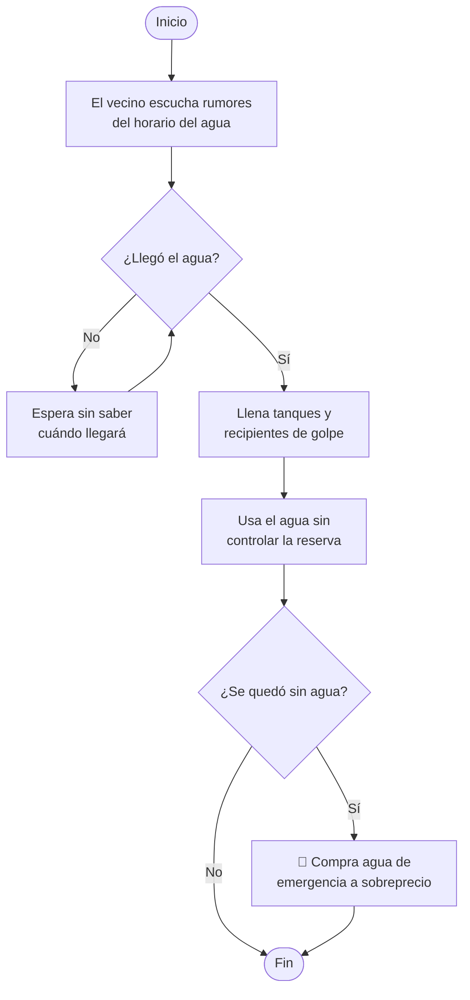
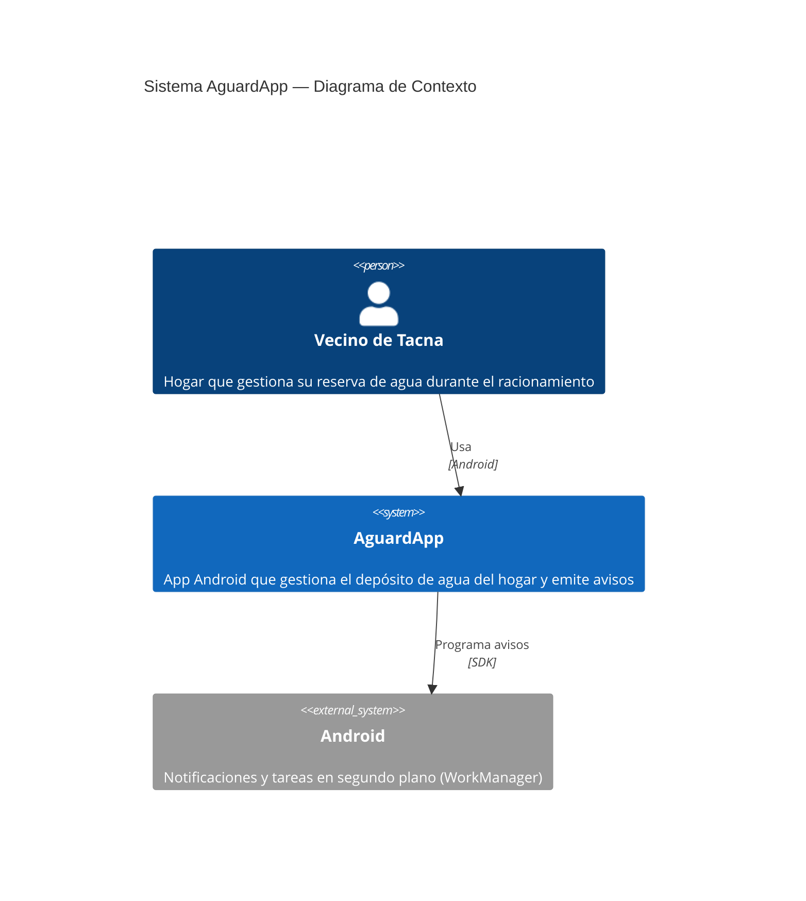
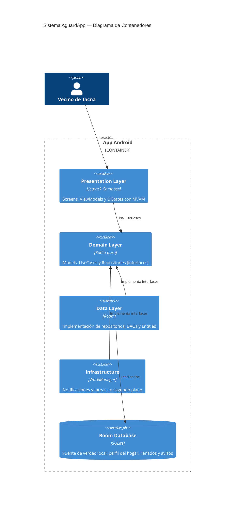
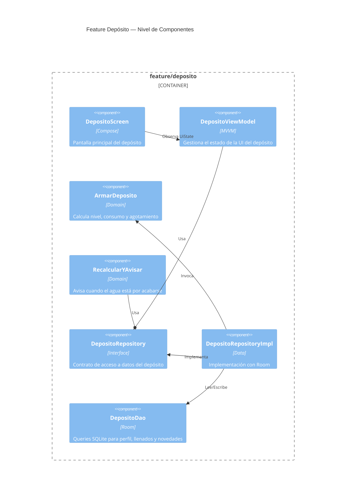
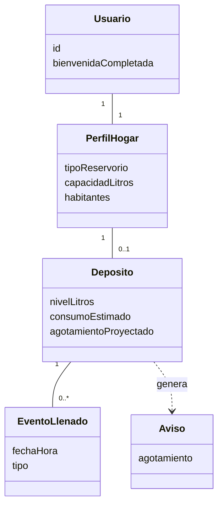

<p align="center">
  
</p>

<h1 align="center">💧 AguardApp</h1>

<p align="center">
  <em>Sistema móvil para la gestión de la reserva domiciliaria de agua y la anticipación de cortes durante el racionamiento hídrico en Tacna</em>
</p>

<p align="center">
  
  
  
  
  
</p>

<p align="center">
  
  
  
  
  
</p>

---

## 👥 Integrantes del Proyecto

| # | Integrante | Código | Rol |
|:-:|---|---|---|
| 🔵 | **Mamani Cori, Cristhian Carlos** | `2023077282` | Jefe de Proyecto · Core y Reserva |
| 🟢 | **Jahuira Pilco, Dayan Elvis** | `2022075749` | Sector y Mapas |
| 🟠 | **Sierra Ruiz, Iker Alberto** | `2023077090` | Recibo e IA · Líder de Pruebas |
| 🟣 | **Llica Mamani, Jimmy Mijair** | `2023076789` | Retos, Reportes y Despliegue |

> **Universidad Privada de Tacna** · Facultad de Ingeniería · Escuela Profesional de Ingeniería de Sistemas  
> **Curso:** Soluciones Móviles I · **Docente:** Mag. Alberto Johnatan Flor Rodríguez

---

## ❗ Problemática

La ciudad de **Tacna** se abastece de agua potable bajo un esquema de **racionamiento por sectores**, con servicio solo durante algunas horas al día. Los hogares enfrentan:

| Problema | Impacto |
|---|---|
| 🔴 **Sin información clara** de cuándo llega el agua a su sector | Desabastecimiento imprevisto |
| 🔴 **Sin control** sobre cuánta reserva queda en el hogar | Desperdicio del recurso |
| 🔴 **Información oficial dispersa** y poco confiable | Mala planificación del consumo |
| 🔴 **Compra de agua de emergencia** a sobreprecio | Gasto innecesario |



---

## ✅ Solución

**AguardApp** es una aplicación Android que permite a los hogares de Tacna:

| Funcionalidad | Descripción |
|---|---|
| 📊 **Gestionar el depósito** | Saber cuántos litros quedan y hasta cuándo alcanza |
| 💧 **Registrar llenados** | Un toque cuando llega el agua (completo o a la mitad) |
| 📉 **Aprender el consumo** | Ajusta la proyección cuando el agua se acaba antes de lo previsto |
| 🔔 **Avisos proactivos** | Notificaciones antes del agotamiento |
| 📡 **100 % local** | Funciona sin internet: todo se guarda en el teléfono (SQLite) |

---

## 📐 Factibilidad

Según el Informe de Factibilidad **(FD01, Versión 1.0)**, el proyecto es viable en todas las dimensiones:

| Dimensión | Estado | Detalle |
|---|:-:|---|
| 🔧 **Técnica** | ✅ | Equipo competente, tecnologías gratuitas, MVP operativo |
| 💰 **Económica** | ✅ | Inversión: S/ 17,720.00 · VAN positivo · TIR: 22.2% |
| ⚙️ **Operativa** | ✅ | Flujos simples, interfaz accesible |
| ⚖️ **Legal** | ✅ | Cumple Ley N.° 29733 de Protección de Datos Personales |
| 🌱 **Social y Ambiental** | ✅ | Fomenta el ahorro y consumo responsable del agua |

---

## 🎯 Visión y Misión

> ### 🔭 Visión
> Ser un referente en el desarrollo de soluciones móviles con **impacto social** en la región de Tacna, aplicando buenas prácticas de ingeniería de software para resolver problemas reales de la comunidad.

> ### 🚀 Misión
> Desarrollar aplicaciones móviles **accesibles y de calidad** que mejoren la vida de los ciudadanos; para este proyecto, ayudando a los hogares de Tacna a gestionar su reserva de agua durante el racionamiento.

---

## 🛠️ Stack Tecnológico

| Categoría | Tecnologías |
|---|---|
| **Lenguaje** |  |
| **UI** |   |
| **Base de datos** | -003B57?style=flat-square&logo=sqlite&logoColor=white) |
| **DI** |  |
| **Tareas** |  |
| **Fechas** |  |
| **Arquitectura** |    |

---

## 📂 Estructura del Proyecto

```
AguardApp/
├── 📄 build.gradle.kts                    Configuración raíz de Gradle
├── 📄 settings.gradle.kts                 Módulos y repositorios
├── 📄 Readme.md                           ← Estás aquí
│
├── 📁 app/                                Módulo principal Android
│   ├── 📄 build.gradle.kts                Dependencias y plugins
│   ├── 📁 schemas/                        Esquemas exportados de Room
│   └── 📁 src/main/
│       ├── 📄 AndroidManifest.xml
│       ├── 📁 res/                        Recursos (iconos, strings, etc.)
│       └── 📁 java/com/example/aguardapp/
│           ├── 📄 AguardApplication.kt    Inicia DB, Koin y tarea horaria
│           ├── 📄 MainActivity.kt         Permiso de avisos
│           ├── 📄 App.kt                  Tema + acceso + depósito
│           │
│           ├── 📁 core/                   🔧 Infraestructura transversal
│           │   ├── 📁 data/               Usuario local (UUID) y DAO
│           │   ├── 📁 db/                 AguardAppDatabase (Room)
│           │   ├── 📁 di/                 Módulos de Koin
│           │   ├── 📁 ui/theme/           Colores, tipografías y tema
│           │   └── 📁 util/               Reloj y UUID
│           │
│           └── 📁 feature/               📦 Features (cada uno con DDD)
│               ├── 📁 bienvenida/         Pantalla de entrada (solo el primer uso)
│               └── 📁 deposito/           Depósito de agua del hogar
│
└── 📁 informes/                           📋 Documentación académica
    ├── 📄 FD01-Factibilidad.md
    ├── 📄 FD02-Vision.md
    ├── 📄 FD03-SRS.md
    ├── 📄 FD04-SAD.md
    └── 📄 FD05-Informe-Final.md
```

### Capas internas de cada Feature

Cada feature sigue el patrón **MVVM + DDD** con estas capas:

| Capa | Contenido | Depende de |
|---|---|---|
| 📐 `domain/` | `model/`, `repository/` (interfaces), `usecase/` — Kotlin puro | Nada |
| 💾 `data/` | Implementaciones de repositorios, `local/` (Room), `mapper/` | `domain/` |
| ⚙️ `infrastructure/` | Adaptadores Android: notificaciones y WorkManager | `domain/` |
| 🔌 `di/` | Módulo de Koin de la feature | Todas |
| 🖼️ `presentation/` | `*Screen`, `*ViewModel`, `*UiState` (MVVM), `componentes/` | `domain/` |

---

## 🏗️ Diagrama C4 — Nivel de Contexto



## 🏗️ Diagrama C4 — Nivel de Contenedores



## 🏗️ Diagrama C4 — Nivel de Componentes (Feature Depósito)



---

## 📊 Diagrama de Clases Principal



---

## 🔧 Requisitos Previos

| Requisito | Versión |
|---|---|
| Android Studio | Ladybug o superior |
| JDK | 11+ |
| Android SDK | API 24 (mínimo) — API 36 (target) |
| Dispositivo/Emulador | Android 8.0+ |

## 🚀 Cómo Ejecutar

```bash
# 1. Clonar el repositorio
git clone https://github.com/tu-usuario/AguardApp.git

# 2. Abrir en Android Studio

# 3. Sincronizar Gradle y ejecutar
./gradlew :app:assembleDebug

# O simplemente presionar ▶️ Run en Android Studio
```

---

## 📋 Requerimientos Funcionales Principales

| ID | Requerimiento | Prioridad |
|---|---|:-:|
| RF-04 | Configurar perfil del hogar | 🔴 Alta |
| RF-06 | Calcular depósito y agotamiento | 🔴 Alta |
| RF-11 | Operar sin conexión | 🔴 Alta |

> 📄 Ver documentación completa en [`informes/FD03-SRS.md`](./informes/FD03-SRS.md)

---

## 📚 Documentación

| Documento | Descripción |
|---|---|
| [`FD01-Factibilidad.md`](./informes/FD01-Factibilidad.md) | Estudio de factibilidad técnica, económica y operativa |
| [`FD02-Vision.md`](./informes/FD02-Vision.md) | Documento de visión del proyecto |
| [`FD03-SRS.md`](./informes/FD03-SRS.md) | Especificación de Requerimientos de Software |
| [`FD04-SAD.md`](./informes/FD04-SAD.md) | Documento de Arquitectura de Software |
| [`FD05-Informe-Final.md`](./informes/FD05-Informe-Final.md) | Informe final del proyecto |

---

## 📜 Licencia

Proyecto académico desarrollado en la **Universidad Privada de Tacna** — 2026.

---

<p align="center">
  <sub>Hecho con 💧 para los hogares de Tacna</sub>
</p>
