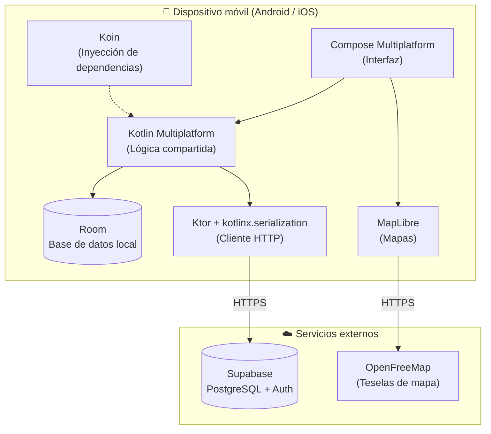
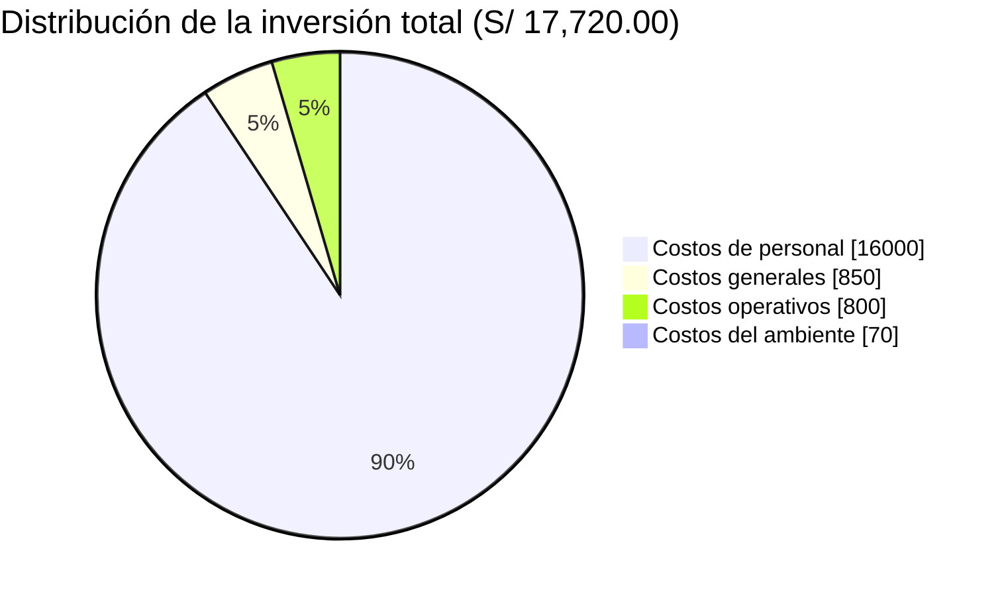
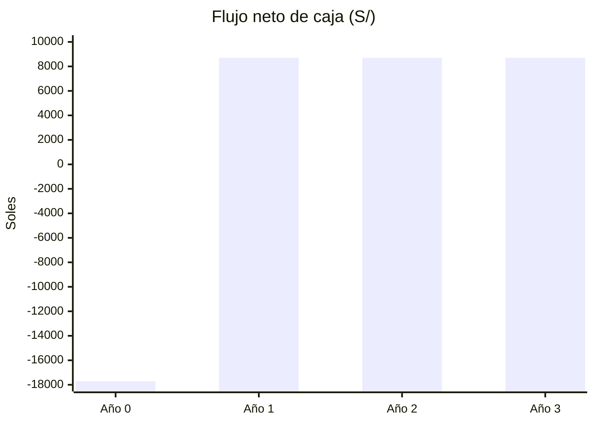

# AguardApp — Informe de Factibilidad

> **Universidad Privada de Tacna** · Facultad de Ingeniería · Escuela Profesional de Ingeniería de Sistemas
> **Curso:** Soluciones Móviles I · **Docente:** Mag. Alberto Johnatan Flor Rodríguez
> **Proyecto:** AguardApp: sistema móvil para la gestión de la reserva domiciliaria de agua y la anticipación de cortes durante el racionamiento hídrico en Tacna
> **Versión:** 1.0 · Tacna – Perú, 2026

**Integrantes**

| Integrante | Código |
|---|---|
| Jahuira Pilco, Dayan Elvis | 2022075749 |
| Llica Mamani, Jimmy Mijair | 2023076789 |
| Mamani Cori, Cristhian Carlos | 2023077282 |
| Sierra Ruiz, Iker Alberto | 2023077090 |

## Control de versiones

| Versión | Hecha por | Revisada por | Aprobada por | Fecha | Motivo |
|---|---|---|---|---|---|
| 1.0 | DJ - JL - CM - IS | AFR | AFR | 30/09/2026 | Versión Original |

## Índice

1. [Descripción del Proyecto](#1-descripción-del-proyecto)
2. [Riesgos](#2-riesgos)
3. [Análisis de la Situación actual](#3-análisis-de-la-situación-actual)
4. [Estudio de Factibilidad](#4-estudio-de-factibilidad)
5. [Análisis Financiero](#5-análisis-financiero)
6. [Conclusiones](#6-conclusiones)

---

## 1. Descripción del Proyecto

### 1.1. Nombre del proyecto

AguardApp: sistema móvil para la gestión de la reserva domiciliaria de agua y la anticipación de cortes durante el racionamiento hídrico en Tacna.

### 1.2. Duración del proyecto

4 meses.

### 1.3. Descripción

AguardApp es una aplicación móvil multiplataforma (Android e iOS) desarrollada con Kotlin Multiplatform y Compose Multiplatform, cuyo propósito es ayudar a los hogares de Tacna a administrar su reserva de agua durante el racionamiento del servicio. La aplicación permite conocer a qué sector pertenece el domicilio, cuándo llega el agua según el cronograma de abastecimiento, cuánta reserva le queda al hogar y hasta cuándo alcanza, así como ubicar los puntos de cisterna cercanos y recibir alertas oportunas.

El sistema opera bajo el principio de "sin conexión como base": la información se almacena localmente (Room) y se sincroniza con la nube (Supabase) cuando hay red, garantizando su funcionamiento en los sectores periféricos con menor cobertura. Incorpora además un modelo colaborativo en el que los propios vecinos confirman la hora de llegada y de corte del agua, con lo que el sistema estima el horario del sector aun cuando la información oficial de la EPS no esté disponible.

La importancia del proyecto radica en que Tacna, ubicada en una de las regiones más áridas del país, enfrenta un racionamiento crónico del agua potable; contar con información confiable y anticipada sobre el abastecimiento reduce el riesgo de quedarse sin agua y fomenta un uso más responsable del recurso.

### 1.4. Objetivos

#### 1.4.1. Objetivo general

Desarrollar una aplicación móvil que permita a los hogares de Tacna planificar y optimizar el uso de su reserva domiciliaria de agua durante el racionamiento, anticipando los cortes del servicio y facilitando el acceso a fuentes alternativas de abastecimiento.

#### 1.4.2. Objetivos Específicos

- **Gestionar la reserva del hogar:** calcular el nivel actual de la reserva del hogar, proyectar su agotamiento y recomendar recortes de consumo.
- **Asociar el domicilio a su sector:** asociar el domicilio al sector correspondiente y mostrar el cronograma de abastecimiento y los puntos de cisterna cercanos en un mapa.
- **Digitalizar el recibo:** digitalizar el recibo de agua de EPS Tacna y ofrecer un asistente hídrico que oriente al usuario sobre su consumo.
- **Promover el ahorro:** fomentar el ahorro de agua mediante retos gamificados y reportes ciudadanos de incidencias.
- **Operar sin conexión:** garantizar la operación sin conexión con sincronización en la nube y el cumplimiento de la privacidad de los datos de los usuarios.

## 2. Riesgos

| Riesgo | Descripción | Mitigación |
|---|---|---|
| Disponibilidad de datos oficiales | Que EPS Tacna no entregue a tiempo la sectorización y los cronogramas oficiales. | Modelo colaborativo entre vecinos y datos de muestra mientras llega la información oficial. |
| Dependencia del backend gratuito | El plan gratuito del servicio en la nube (Supabase) pausa el proyecto tras varios días de inactividad. | Monitoreo periódico y previsión de migrar a un plan de pago si el piloto lo requiere. |
| Adopción de usuarios | El modelo colaborativo requiere una masa crítica de usuarios para estimar horarios confiables. | Reclutamiento de 20 a 30 hogares piloto y complemento con datos de la EPS. |
| Compatibilidad de dispositivos | Diferencias entre dispositivos pueden provocar fallas del mapa en ciertos emuladores. | Pruebas en dispositivos físicos y uso de MapLibre, multiplataforma y gratuito. |
| Restricción de tiempo | El tiempo limitado del semestre puede afectar el alcance. | Orden de recorte definido de antemano en la constitución del proyecto. |

## 3. Análisis de la Situación actual

### 3.1. Planteamiento del problema

La ciudad de Tacna se abastece de agua potable bajo un esquema de racionamiento por sectores, en el que el servicio se brinda solo durante algunas horas al día y en horarios que varían según la zona. En la actualidad, los hogares no cuentan con información clara y oportuna sobre cuándo llegará el agua a su sector ni sobre cuánta reserva les queda en sus tanques y cisternas domiciliarias.

Esta incertidumbre lleva a que las familias se queden sin agua de forma imprevista y tengan que recurrir a la compra de agua de emergencia mediante camiones cisterna o bidones, a un costo considerablemente mayor. La información oficial de la empresa prestadora se difunde de manera dispersa (redes sociales, comunicados aislados) y no siempre coincide con la realidad de cada sector, lo que agrava la desconfianza y la mala planificación del consumo.

La ausencia de una herramienta que centralice la sectorización, los cronogramas de abastecimiento y el estado de la reserva del hogar deriva en desperdicio del recurso, gastos innecesarios y estrés en las familias. AguardApp surge para resolver esta necesidad, poniendo en manos del ciudadano información confiable, colaborativa y disponible sin conexión.

### 3.2. Consideraciones de hardware y software

#### 3.2.1. Hardware

El proyecto no requiere infraestructura de hardware especializada. Del lado del usuario final basta con un teléfono inteligente con Android 8.0 o superior. Para el desarrollo, el equipo utiliza sus propias computadoras portátiles y un dispositivo Android adicional destinado a las pruebas en equipo físico. El almacenamiento y procesamiento en la nube se realiza sobre la infraestructura administrada de Supabase, por lo que no se requiere adquirir ni mantener servidores propios.

#### 3.2.2. Software

La solución se construye íntegramente con tecnologías gratuitas y de código abierto, lo que hace innecesaria la compra de licencias. La siguiente tabla resume el stack tecnológico y su justificación:

| Capa | Tecnología | Justificación |
|---|---|---|
| Multiplataforma | Kotlin Multiplatform + Compose Multiplatform | Un solo código para Android e iOS; reduce tiempo y costo de desarrollo. |
| Base de datos local | Room | Persistencia local para operar sin conexión (fuente de verdad). |
| Backend / nube | Supabase (PostgreSQL + Auth) | Base de datos relacional con seguridad por fila y API automática; plan gratuito. |
| Cliente HTTP | Ktor + kotlinx.serialization | Comunicación con la nube, multiplataforma y ligera. |
| Inyección de dependencias | Koin | Configuración simple del grafo de dependencias en KMP. |
| Mapas | MapLibre + OpenFreeMap | Mapas gratuitos, sin llave de API ni tarjeta, multiplataforma. |
| Control de versiones | Git + GitHub | Trabajo colaborativo del equipo con revisión por pares. |

## 4. Estudio de Factibilidad

El estudio de factibilidad determina la viabilidad del proyecto desde las perspectivas técnica, económica, operativa, legal, social y ambiental, con el fin de sustentar la decisión de continuar con su desarrollo e implantación.

### 4.1. Factibilidad Técnica

El proyecto es técnicamente factible. El equipo de desarrollo posee las competencias necesarias en Kotlin, Compose Multiplatform, Room, Ktor, Koin y en el consumo de servicios en la nube. Las tecnologías seleccionadas son maduras, gratuitas y de amplia comunidad, y están disponibles y son alcanzables sin necesidad de adquisiciones especiales.

La viabilidad técnica está respaldada por un producto mínimo viable ya operativo: se cuenta con la pantalla de sector con mapa (MapLibre y OpenFreeMap), la gestión de la reserva con proyección de agotamiento, el registro de puntos de cisterna, la operación sin conexión con Room y la sincronización real con Supabase (con seguridad por fila ya verificada). Esto demuestra que la arquitectura propuesta es implementable con los recursos disponibles.

Respecto al hardware y software, el sistema corre sobre teléfonos Android de gama de entrada y utiliza infraestructura administrada en la nube, por lo que no exige equipos servidores, dominios costosos ni redes especializadas. El acceso a internet solo es necesario para la sincronización, ya que la aplicación funciona sin conexión.

### 4.2. Factibilidad Económica

El estudio de factibilidad económica determina los costos de desarrollo del sistema y los contrasta con los beneficios esperados. Dado que se emplean herramientas gratuitas y de código abierto, el costo principal corresponde al recurso humano (el equipo de desarrollo). A continuación se detallan los costos por categoría.

#### 4.2.1. Costos Generales

Comprenden los materiales de oficina y de uso diario, así como el dispositivo de pruebas necesario para el desarrollo.

| Concepto | Total (S/) |
|---|---:|
| Útiles de oficina | 150.00 |
| Impresiones y anillados | 100.00 |
| Smartphone Android de pruebas | 600.00 |
| **Total** | **850.00** |

#### 4.2.2. Costos operativos durante el desarrollo

Corresponden a los servicios necesarios para la operatividad del equipo durante los cuatro meses de desarrollo.

| Concepto | Mensual (S/) | Meses | Total (S/) |
|---|---:|---:|---:|
| Internet | 120.00 | 4 | 480.00 |
| Energía eléctrica (equipos) | 80.00 | 4 | 320.00 |
| **Total** | | | **800.00** |

#### 4.2.3. Costos del ambiente

Corresponden a los requerimientos técnicos para la implantación del software: backend, base de datos, mapas, autenticación y dominio. La mayoría se cubre con planes gratuitos.

| Concepto | Total (S/) |
|---|---:|
| Backend y base de datos en la nube (Supabase, plan gratuito) | 0.00 |
| Mapas (OpenFreeMap / MapLibre) | 0.00 |
| Autenticación con Google (Google Cloud, capa gratuita) | 0.00 |
| Dominio .pe (anual) | 70.00 |
| **Total** | **70.00** |

#### 4.2.4. Costos de personal

Incluyen los gastos generados por el recurso humano necesario para el desarrollo del sistema. El equipo está conformado por cuatro integrantes, cada uno responsable de una vertical del producto, con una dedicación equivalente a la de un practicante de desarrollo durante cuatro meses. No se considera personal para la operación y funcionamiento posterior del sistema.

| Rol | Integrante | Costo mensual (S/) | Meses | Total (S/) |
|---|---|---:|---:|---:|
| Desarrollador Core y Reserva | Cristhian Mamani | 1,000.00 | 4 | 4,000.00 |
| Desarrollador Sector y Mapas | Dayan Jahuira | 1,000.00 | 4 | 4,000.00 |
| Desarrollador Recibo e IA | Iker Sierra | 1,000.00 | 4 | 4,000.00 |
| Desarrollador Retos y Reportes | Jimmy Llica | 1,000.00 | 4 | 4,000.00 |
| **Total** | | | | **16,000.00** |

#### 4.2.5. Costos totales del desarrollo del sistema

La inversión total requerida para el desarrollo del sistema, sumando todas las categorías, asciende a **S/ 17,720.00**. Dado que el proyecto se realiza en el marco académico, este monto representa una valorización del esfuerzo y los recursos empleados.

| Categoría | Total (S/) |
|---|---:|
| Costos de personal | 16,000.00 |
| Costos generales | 850.00 |
| Costos operativos durante el desarrollo | 800.00 |
| Costos del ambiente | 70.00 |
| **Inversión total del proyecto** | **17,720.00** |

### 4.3. Factibilidad Operativa

El proyecto es operativamente factible. La aplicación está diseñada para ser altamente intuitiva y de uso cotidiano por parte de cualquier ciudadano, sin requerir conocimientos técnicos. Al operar sin conexión, funciona incluso en los sectores con cobertura de datos deficiente, que son justamente los más afectados por el racionamiento.

El sistema no requiere la contratación de personal adicional para su operación: se sostiene con el modelo colaborativo de los propios usuarios y con la información de la EPS cuando esté disponible. El mantenimiento posterior es mínimo, dado el uso de infraestructura administrada en la nube. Los beneficiarios (los hogares de Tacna) tienen la capacidad de usar y mantener el sistema en funcionamiento con un teléfono de gama básica.

### 4.4. Factibilidad Legal

El proyecto se alinea con el marco legal peruano vigente y no presenta conflictos legales:

- **Ley N.° 29733 – Ley de Protección de Datos Personales:** el sistema aplica la privacidad por diseño. En el servidor se almacena la ubicación del usuario únicamente a nivel de sector, nunca la coordenada exacta del domicilio, y cada usuario accede solo a sus propios registros mediante políticas de seguridad a nivel de fila.
- **Licenciamiento de software:** todas las tecnologías utilizadas son gratuitas y de código abierto, empleadas conforme a sus licencias. El código fuente es propiedad del equipo y podrá documentarse para su eventual registro.
- **Consentimiento y autenticación:** la aplicación funciona en modo invitado y la autenticación con Google es opcional, solicitándose solo para funciones que la requieren; el usuario puede eliminar su cuenta y sus datos desde la propia aplicación.

### 4.5. Factibilidad Social

El impacto social del proyecto es altamente positivo y contribuye directamente a varios Objetivos de Desarrollo Sostenible (ODS):

- **ODS 6 – Agua Limpia y Saneamiento:** AguardApp facilita el acceso equitativo a la información sobre el abastecimiento de agua, ayudando a las familias a asegurar el recurso durante el racionamiento, especialmente en los sectores periféricos más vulnerables.
- **ODS 11 – Ciudades y Comunidades Sostenibles:** la aplicación reduce la incertidumbre y el estrés de las familias, mejora la planificación del consumo doméstico y fomenta la organización comunitaria mediante el modelo colaborativo entre vecinos.
- **ODS 12 – Producción y Consumo Responsables:** al informar el nivel de reserva y recomendar recortes, promueve un consumo consciente y responsable del agua en una región de extrema escasez hídrica.
- **ODS 9 – Industria, Innovación e Infraestructura:** la solución introduce innovación tecnológica (aplicación multiplataforma, datos colaborativos y computación en la nube) al servicio de un problema social concreto de la ciudad de Tacna.

### 4.6. Factibilidad Ambiental

El impacto ambiental del proyecto es netamente positivo:

- **Conservación del recurso hídrico:** al mostrar el nivel de la reserva y proyectar su agotamiento, la aplicación incentiva el ahorro y evita el desperdicio del agua, un recurso especialmente escaso en Tacna, ubicada en una zona desértica.
- **Reducción de traslados:** la información de cisternas cercanas y horarios reduce viajes y esperas innecesarias para conseguir agua, disminuyendo el consumo de combustible asociado.
- **Bajo impacto material:** es una solución exclusivamente de software que no genera residuos físicos ni requiere hardware de alto consumo; corre sobre dispositivos que los usuarios ya poseen.

## 5. Análisis Financiero

El análisis financiero contrasta la inversión y los costos del proyecto con los beneficios económicos que genera, con el fin de estimar su rentabilidad.

> **Nota:** al tratarse de una solución de bien público sin fines de lucro, los beneficios se valorizan a partir del ahorro y del valor generado para los hogares beneficiarios; las cifras son estimaciones que deben ajustarse con datos reales del piloto.

### 5.1. Justificación de la Inversión

#### 5.1.1. Beneficios del Proyecto

Los beneficios tangibles del proyecto, valorizados de forma anual sobre la base de los hogares beneficiarios, son los siguientes:

| Beneficio tangible | Valor anual (S/) |
|---|---:|
| Ahorro por evitar la compra de agua de emergencia (bidones y cisternas) | 6,300.00 |
| Ahorro de tiempo valorizado (menos viajes y esperas por agua) | 2,900.00 |
| Reducción de pérdidas por desperdicio de agua (mejor planificación) | 1,600.00 |
| **Total de beneficios anuales** | **10,800.00** |

Entre los beneficios intangibles se encuentran: la tranquilidad y previsibilidad para las familias, el fortalecimiento de la organización vecinal a través del modelo colaborativo, la generación de una cultura de ahorro de agua y la disponibilidad de información confiable para la toma de decisiones del hogar.

#### 5.1.2. Criterios de Inversión

Para evaluar la conveniencia de la inversión se calcularon la relación beneficio/costo (B/C), el valor actual neto (VAN) y la tasa interna de retorno (TIR), considerando un horizonte de tres años y un costo de oportunidad del capital (COK) del 12 % anual. Los costos operativos anuales posteriores a la implantación se estiman en S/ 2,100.00 (hosting en la nube, dominio y mantenimiento).

##### 5.1.2.1. Relación Beneficio/Costo (B/C)

La relación B/C compara el valor presente de los beneficios frente al valor presente de los costos (inversión más costos operativos), descontados al COK del 12 %.

| Concepto | Valor (S/) |
|---|---:|
| Valor presente de los beneficios (3 años) | 25,940.00 |
| Valor presente de los costos (inversión + operativos) | 22,764.00 |
| **Relación B/C** | **1.14** |

**Interpretación:** como la relación B/C es 1.14, mayor que 1, se acepta el proyecto: por cada sol invertido se recupera ese sol y se genera un beneficio adicional.

##### 5.1.2.2. Valor Actual Neto (VAN)

El VAN calcula el valor presente de los flujos de beneficio neto generados en tres años, descontados al COK del 12 % anual, menos la inversión inicial.

| Año | Beneficios (S/) | Costos op. (S/) | Flujo neto (S/) |
|---|---:|---:|---:|
| 0 (Inversión) | 0.00 | 17,720.00 | -17,720.00 |
| Año 1 | 10,800.00 | 2,100.00 | 8,700.00 |
| Año 2 | 10,800.00 | 2,100.00 | 8,700.00 |
| Año 3 | 10,800.00 | 2,100.00 | 8,700.00 |
| **VAN (COK = 12 %)** | | | **S/ 3,176.00** |

**Interpretación:** el VAN es positivo (S/ 3,176.00 > 0), lo que confirma que el proyecto genera valor por encima del costo de oportunidad del capital; por lo tanto, se acepta.

##### 5.1.2.3. Tasa Interna de Retorno (TIR)

La TIR es la tasa que hace que el VAN sea igual a cero; indica la rentabilidad promedio anual del capital invertido en el proyecto.

| Indicador | Valor |
|---|---|
| TIR calculada | 22.2 % anual |
| Costo de oportunidad del capital (COK) | 12.0 % anual |
| **Resultado** | **TIR (22.2 %) > COK (12 %)** |

**Interpretación:** la TIR del 22.2 % supera el costo de oportunidad del 12 %, lo que significa que el capital invertido en AguardApp rinde más que en la mejor alternativa de referencia; el proyecto es rentable.

## 6. Conclusiones

- **El proyecto es técnicamente FACTIBLE.** El equipo domina las tecnologías seleccionadas (Kotlin Multiplatform, Compose, Room, Ktor, Koin y Supabase), todas gratuitas y de código abierto, y ya cuenta con un MVP operativo que valida la arquitectura propuesta.
- **El proyecto es económicamente VIABLE.** Con una inversión total de S/ 17,720.00, un VAN de S/ 3,176.00, una TIR del 22.2 % y una relación B/C de 1.14, los indicadores financieros respaldan la inversión y confirman que el proyecto genera valor.
- **El proyecto es operativamente FACTIBLE.** La aplicación es intuitiva, funciona sin conexión y no requiere personal adicional para su operación; los hogares beneficiarios pueden usarla y mantenerla con un teléfono de gama básica.
- **El proyecto es legalmente FACTIBLE.** El sistema cumple con la Ley N.° 29733 de Protección de Datos Personales mediante la privacidad por diseño (almacenamiento a nivel de sector y seguridad por fila). No existen barreras legales para su desarrollo.
- **El proyecto es social y ambientalmente POSITIVO.** AguardApp genera un impacto social y ambiental positivo: promueve el acceso equitativo al agua, el consumo responsable del recurso y la organización comunitaria, contribuyendo a los ODS 6, 9, 11 y 12.

En conclusión, el análisis integral demuestra que el proyecto AguardApp es viable y factible en todas sus dimensiones, por lo que se recomienda continuar con su desarrollo e implantación.
