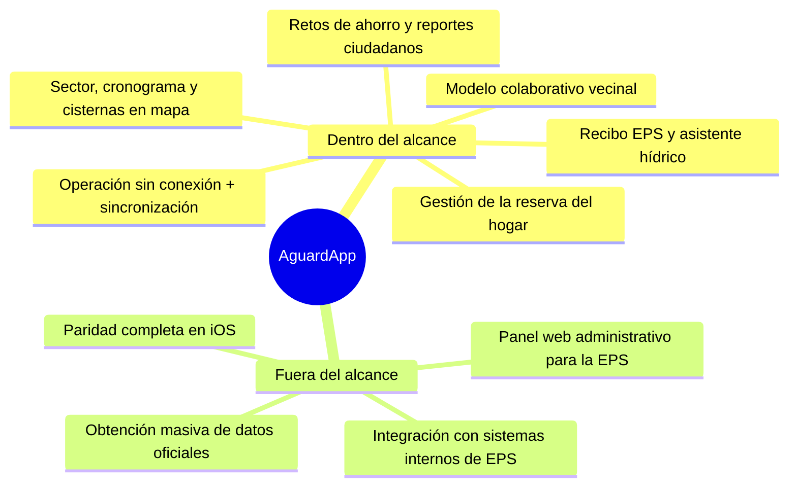
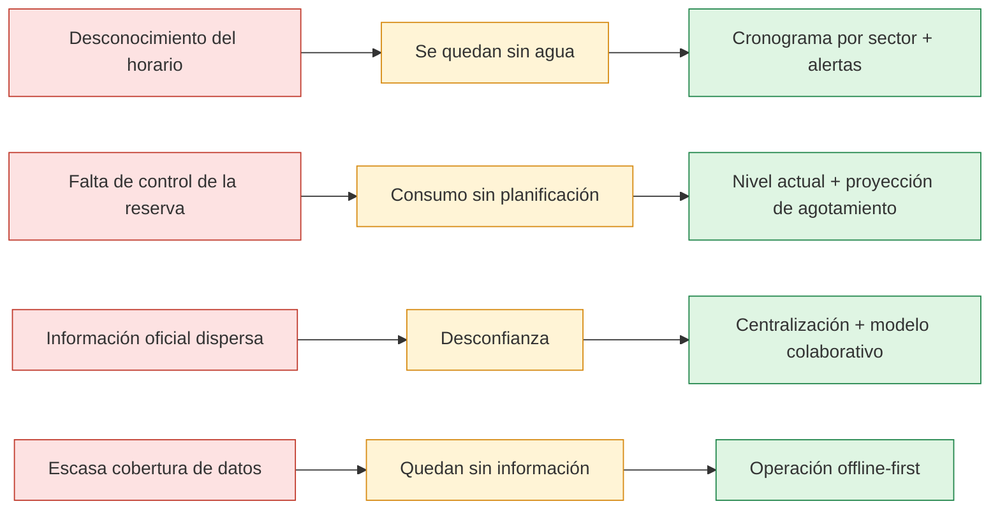
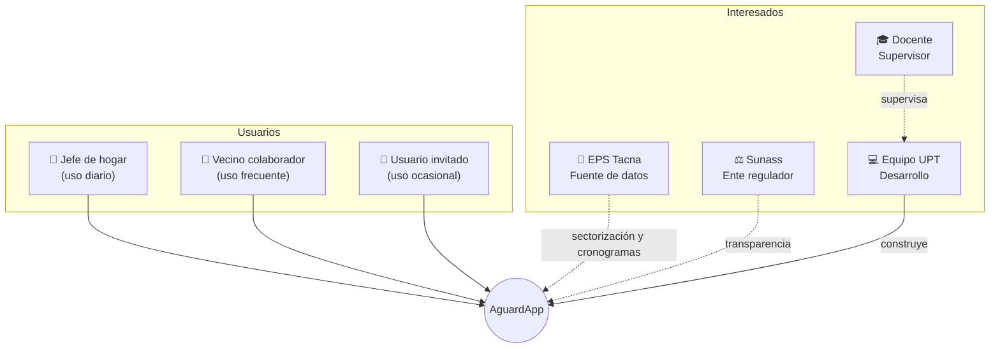
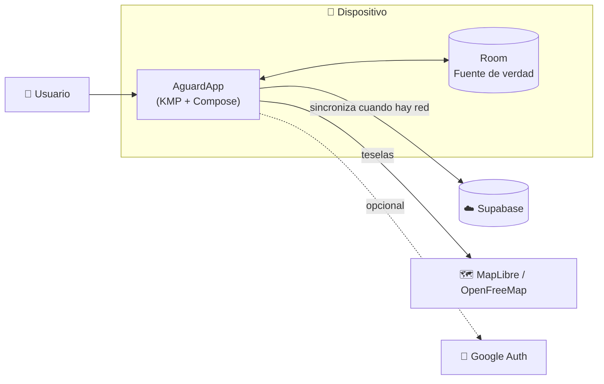
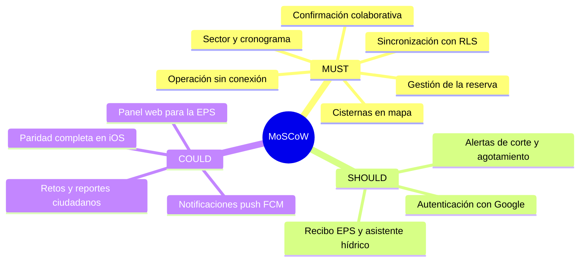
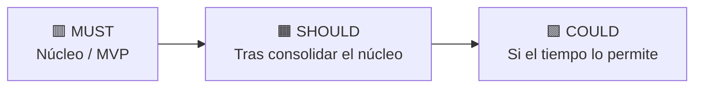

# AguardApp — Documento de Visión

> **Universidad Privada de Tacna** · Facultad de Ingeniería · Escuela Profesional de Ingeniería de Sistemas
> **Curso:** Soluciones Móviles I · **Docente:** Mag. Alberto Johnatan Flor Rodríguez
> **Proyecto:** AguardApp: sistema móvil para la gestión de la reserva domiciliaria de agua y la anticipación de cortes durante el racionamiento hídrico en Tacna
> **Versión:** 1.0 · Tacna – Perú, 2026

**Integrantes**

| Integrante | Código |
|---|---|
| Jahuira Pilco, Dayan Elvis | 2022075749 |
| Llica Mamani, Jimmy Mijair | 2023076789 |
| Mamani Cori, Cristhian Carlos | 2023077282 |
| Sierra Ruiz, Iker Alberto | 2023077090 |

## Control de versiones

| Versión | Hecha por | Revisada por | Aprobada por | Fecha | Motivo |
|---|---|---|---|---|---|
| 1.0 | DJ - JL - CM - IS | AFR | AFR | 30/09/2026 | Versión Original |

## Índice

1. [Introducción](#1-introducción)
2. [Posicionamiento](#2-posicionamiento)
3. [Descripción de los interesados y usuarios](#3-descripción-de-los-interesados-y-usuarios)
4. [Vista General del Producto](#4-vista-general-del-producto)
5. [Características del producto](#5-características-del-producto)
6. [Restricciones](#6-restricciones)
7. [Rangos de calidad](#7-rangos-de-calidad)
8. [Precedencia y Prioridad](#8-precedencia-y-prioridad)
9. [Otros requerimientos del producto](#9-otros-requerimientos-del-producto)
10. [Conclusiones](#10-conclusiones)
11. [Recomendaciones](#11-recomendaciones)
12. [Bibliografía](#12-bibliografía)
13. [Webgrafía](#13-webgrafía)

---

## 1. Introducción

### 1.1. Propósito

El propósito de este documento es definir la visión del sistema AguardApp desde la perspectiva de sus interesados y usuarios, describiendo las necesidades, características y restricciones de alto nivel que debe satisfacer. Su correcta elaboración garantiza que todos los miembros del equipo comprendan el "qué" y el "por qué" del producto, alineando el desarrollo con el problema que se busca resolver.

### 1.2. Alcance

El alcance del proyecto AguardApp abarca el diseño, desarrollo e implantación de una aplicación móvil multiplataforma (Android e iOS) que ayude a los hogares de Tacna a gestionar su reserva domiciliaria de agua y anticipar los cortes durante el racionamiento.

**Dentro del alcance del proyecto se considera:**

- Gestión de la reserva del hogar: cálculo del nivel actual, proyección de agotamiento y recomendaciones de ahorro.
- Asociación del domicilio a su sector, con la consulta del cronograma de abastecimiento y los puntos de cisterna cercanos sobre un mapa (MapLibre y OpenFreeMap).
- Modelo colaborativo en el que los vecinos confirman la llegada y el corte del agua para estimar el horario del sector.
- Operación sin conexión con base de datos local (Room) y sincronización con la nube (Supabase).
- Digitalización del recibo de EPS Tacna y un asistente hídrico orientativo.
- Retos de ahorro y reportes ciudadanos de incidencias.

**Fuera del alcance del proyecto se considera:**

- El panel administrativo web para la carga masiva de la sectorización oficial por parte de la EPS (se planea como mejora futura).
- La integración oficial con los sistemas internos de EPS Tacna.
- La paridad completa de funcionalidades en iOS; Android es la plataforma principal.
- La obtención masiva de datos oficiales de sectorización, que depende de gestiones externas con la EPS y la Sunass.

El proyecto se ejecuta durante el semestre académico 2026-II, con una inversión estimada de S/ 17,720.00 cubierta con recursos propios del equipo de desarrollo.

### 1.3. Definiciones, Siglas y Abreviaturas

| Término | Definición |
|---|---|
| AguardApp | Nombre del sistema objeto del presente proyecto. |
| KMP (Kotlin Multiplatform) | Tecnología que permite compartir código entre Android e iOS. |
| Compose Multiplatform | Framework de interfaz de usuario declarativa y multiplataforma. |
| Room | Biblioteca de persistencia local sobre SQLite en el dispositivo. |
| Supabase | Plataforma en la nube que provee PostgreSQL, autenticación y API. |
| RLS (Row Level Security) | Seguridad a nivel de fila: cada usuario accede solo a sus propios datos. |
| MapLibre | Biblioteca de mapas de código abierto, gratuita y multiplataforma. |
| EPS Tacna | Empresa Prestadora de Servicios de Saneamiento de Tacna. |
| Sector | Zona de la ciudad que comparte un mismo horario de abastecimiento. |
| Cronograma | Ventana de horario en que el agua llega a un sector. |
| Offline-first | Diseño en el que la base de datos local es la única fuente de verdad. |
| ODS | Objetivos de Desarrollo Sostenible de las Naciones Unidas. |

### 1.4. Referencias

- Informe de Factibilidad (FD01), Versión 1.0, 2026.

### 1.5. Visión General

AguardApp surge como una respuesta tecnológica al racionamiento crónico del agua potable en la ciudad de Tacna. El sistema pone en manos del ciudadano información confiable y anticipada sobre el abastecimiento de su sector, el estado de su reserva domiciliaria y la ubicación de cisternas cercanas, operando incluso sin conexión y con un modelo colaborativo entre vecinos. Este documento presenta el posicionamiento del producto, sus interesados y usuarios, sus características priorizadas y las restricciones que guían su construcción.

## 2. Posicionamiento

### 2.1. Oportunidad de negocio

Tacna, ubicada en una de las regiones más áridas del país, enfrenta un racionamiento sostenido del agua potable que afecta a la mayoría de sus hogares. Actualmente no existe una solución tecnológica que centralice la sectorización, los cronogramas de abastecimiento, el estado de la reserva del hogar y la ubicación de cisternas en una sola herramienta accesible y gratuita para el ciudadano.

La oportunidad se consolida en tres pilares:

- **Solución pionera:** no existe en Tacna una aplicación integral que combine cronograma por sector, gestión de la reserva del hogar y datos colaborativos de abastecimiento.
- **Modelo replicable:** validado en Tacna, el modelo es replicable en otras ciudades del sur del país que también sufren racionamiento (Moquegua, Arequipa, Ilo).
- **Alineación con políticas públicas:** la solución se alinea con las políticas de gestión eficiente del recurso hídrico y con los Objetivos de Desarrollo Sostenible, y puede articularse con la EPS y la Sunass.

### 2.2. Definición del problema

Los hogares de Tacna no disponen de información clara y oportuna sobre el abastecimiento de agua ni de una herramienta para controlar su reserva, lo que genera desabastecimiento imprevisto, gastos de emergencia y desperdicio del recurso. La siguiente tabla resume los problemas identificados y la oportunidad que atiende AguardApp:

| Problema identificado | Impacto en el ciudadano | Oportunidad que atiende AguardApp |
|---|---|---|
| Desconocimiento del horario de abastecimiento | Las familias se quedan sin agua de forma imprevista | Cronograma por sector, próximo abastecimiento y alertas |
| Falta de control de la reserva domiciliaria | Consumo sin planificación y desperdicio del recurso | Cálculo del nivel actual y proyección de agotamiento |
| Información oficial dispersa y poco confiable | Desconfianza y mala planificación del consumo | Centralización de datos y modelo colaborativo vecinal |
| Escasa cobertura de datos en sectores periféricos | Los más afectados quedan sin información | Operación sin conexión (offline-first) con datos locales |

## 3. Descripción de los interesados y usuarios

### 3.1. Resumen de los interesados

| Interesado | Rol | Expectativas principales |
|---|---|---|
| Hogares de Tacna | Beneficiarios y usuarios | Saber cuándo llega el agua y no quedarse sin reserva |
| EPS Tacna | Fuente de datos de sectorización | Difundir cronogramas y mejorar la comunicación con el usuario |
| Sunass | Ente regulador | Mayor transparencia del servicio de agua |
| Equipo de desarrollo (UPT) | Analistas y desarrolladores | Entregar un producto funcional y un caso de éxito académico |
| Docente del curso | Supervisor académico | Verificar el cumplimiento de los objetivos del curso |

### 3.2. Resumen de los usuarios

| Usuario | Descripción | Frecuencia de uso |
|---|---|---|
| Jefe de hogar | Administra la reserva del hogar y consulta el cronograma del sector | Diaria |
| Vecino colaborador | Confirma la llegada y el corte del agua en su sector | Frecuente |
| Usuario invitado | Consulta la información sin autenticarse | Ocasional |

### 3.3. Entorno de usuario

**Jefe de hogar**

- Adulto entre 25 y 60 años, con manejo básico de un teléfono inteligente y aplicaciones cotidianas.
- Necesidad: conocer de un vistazo cuánta agua le queda, cuándo vuelve el servicio y recibir alertas antes del corte.

**Vecino colaborador**

- Usuario del mismo sector dispuesto a reportar cuándo llegó o se cortó el agua.
- Necesidad: confirmar la llegada o el corte con un solo toque, de forma rápida y sin complicaciones.

**Adulto mayor o con baja alfabetización digital**

- Persona con uso muy básico del teléfono.
- Necesidad: interfaz simple, textos claros, iconos grandes y flujos lineales.

### 3.4. Perfiles de los interesados

**Hogares de Tacna**

- Responsables de administrar el agua del hogar durante el racionamiento.
- Expectativa: previsibilidad del abastecimiento y ahorro de agua. Restricción: teléfonos de gama básica y cobertura de datos limitada.

**Equipo de desarrollo (UPT)**

- Integrantes: Mamani (Core y Reserva), Jahuira (Sector y Mapas), Sierra (Recibo e IA), Llica (Retos y Reportes).
- Expectativa: entregar un producto funcional dentro del semestre 2026-II. Restricción: recursos propios limitados y tiempo del curso.

### 3.5. Perfiles de los Usuarios

| Perfil | Conocimientos requeridos | Interacción típica |
|---|---|---|
| Jefe de hogar | Manejo básico de smartphone y apps | Registra llenados y consulta reserva, sector y cisternas |
| Vecino colaborador | Manejo básico de smartphone | Confirma la llegada o el corte del agua con un toque |
| Usuario con baja alfabetización digital | Uso muy básico del teléfono | Consulta información con una interfaz simple e iconos grandes |

### 3.6. Necesidades de los interesados y usuarios

| Necesidad | Prioridad |
|---|---|
| Saber cuándo llega el agua a su sector | Alta |
| Conocer cuánta reserva le queda y hasta cuándo alcanza | Alta |
| Ubicar los puntos de cisterna cercanos | Alta |
| Operar sin conexión a internet | Alta |
| Recibir alertas antes del corte del servicio | Media |
| Digitalizar el recibo y entender el consumo | Media |
| Participar con retos de ahorro y reportes ciudadanos | Baja |

## 4. Vista General del Producto

### 4.1. Perspectiva del producto

AguardApp es un producto autónomo que opera como una aplicación móvil multiplataforma con un backend en la nube. No depende de sistemas preexistentes en el hogar del usuario: funciona con la base de datos local del dispositivo como fuente de verdad y se sincroniza con la nube cuando hay conexión. Se integra con servicios externos gratuitos para mapas (MapLibre y OpenFreeMap) y autenticación opcional (Google).

### 4.2. Resumen de capacidades

- Consulta del sector del domicilio, el cronograma de abastecimiento y el próximo horario de agua.
- Gestión de la reserva del hogar con proyección de agotamiento y recomendaciones de ahorro.
- Ubicación de puntos de cisterna cercanos sobre un mapa interactivo.
- Confirmación colaborativa de la llegada y el corte del agua entre vecinos del mismo sector.
- Operación sin conexión con sincronización automática a la nube.
- Digitalización del recibo de EPS Tacna y asistente hídrico.

### 4.3. Suposiciones y dependencias

- Los usuarios cuentan con un teléfono Android 8.0 o superior.
- El servicio en la nube (Supabase) se mantiene disponible en su plan gratuito durante el desarrollo y el piloto.
- La sectorización y los cronogramas oficiales dependen de la EPS Tacna; mientras no estén disponibles, se emplean el modelo colaborativo y datos de muestra.
- Los mapas se sirven mediante OpenFreeMap, sin necesidad de llave de API ni tarjeta.

### 4.4. Costos y precios

Los costos del proyecto se determinaron en el Informe de Factibilidad (FD01, Versión 1.0, 2026). Al emplearse herramientas gratuitas y de código abierto, el costo principal corresponde al recurso humano. El resumen es el siguiente:

| Categoría | Total (S/) |
|---|---:|
| Costos de personal | 16,000.00 |
| Costos generales | 850.00 |
| Costos operativos durante el desarrollo | 800.00 |
| Costos del ambiente | 70.00 |
| **Inversión total del proyecto** | **17,720.00** |

### 4.5. Licenciamiento e instalación

AguardApp se distribuye como una aplicación gratuita para los hogares de Tacna. El sistema se construye íntegramente con software libre y de código abierto, utilizado conforme a sus licencias, por lo que no requiere la compra de licencias comerciales. El código fuente es propiedad del equipo de desarrollo y se documenta para su posible registro. La instalación en el dispositivo del usuario se realiza mediante la tienda de aplicaciones.

## 5. Características del producto

Los requerimientos del producto se priorizan con el método **MoSCoW**.

**MUST (Indispensables)**

- Gestión de la reserva del hogar: cálculo del nivel actual y proyección de agotamiento.
- Consulta del sector, el cronograma de abastecimiento y el próximo horario de agua.
- Puntos de cisterna cercanos sobre mapa interactivo (MapLibre).
- Operación sin conexión con base de datos local (Room) como fuente de verdad.
- Sincronización con la nube (Supabase) con seguridad por fila.
- Confirmación colaborativa de la llegada y el corte del agua por sector.

**SHOULD (Importantes)**

- Alertas y avisos de próximo corte y de agotamiento de la reserva.
- Digitalización del recibo de EPS Tacna y asistente hídrico.
- Autenticación opcional con Google para funciones que la requieran.

**COULD (Opcionales)**

- Notificaciones push (FCM) de cortes y abastecimiento.
- Retos de ahorro gamificados y reportes ciudadanos de incidencias.
- Paridad completa de funcionalidades en iOS.
- Panel web administrativo para la carga de sectorización por parte de la EPS.

## 6. Restricciones

- El proyecto debe ejecutarse durante el semestre 2026-II, con una inversión que no exceda S/ 17,720.00, cubierta con recursos propios.
- La aplicación debe ser compatible con dispositivos Android 8.0 o superior, sin requerir hardware de gama alta.
- La solución debe construirse con tecnologías gratuitas y de código abierto (Kotlin Multiplatform, Compose, Room, Ktor, Koin, Supabase y MapLibre).
- La arquitectura debe ser limpia, con la capa de dominio independiente de frameworks, según la constitución del proyecto.
- Los datos oficiales de la EPS dependen de gestiones externas; la solución debe funcionar con el modelo colaborativo mientras no estén disponibles.

## 7. Rangos de calidad

- La aplicación debe funcionar en su totalidad sin conexión, tomando los datos locales como fuente de verdad.
- La sincronización de datos entre el dispositivo y la nube no debe superar los 5 segundos en condiciones normales de red.
- La cobertura de pruebas unitarias de la capa de dominio debe ser igual o superior al 70 %.
- El horario colaborativo del sector se estima con la mediana de al menos 3 confirmaciones de llegada y 3 de corte, para resistir reportes erróneos.
- La privacidad debe garantizarse almacenando en el servidor únicamente el sector del usuario, nunca la coordenada exacta del domicilio.

## 8. Precedencia y Prioridad

Los requerimientos se priorizan con el método MoSCoW. Tienen máxima prioridad (MUST) las funcionalidades núcleo del producto: la gestión de la reserva, la consulta del sector y su cronograma, y la operación sin conexión. Estas capacidades constituyen el mínimo producto viable evaluable. Los avisos, la digitalización del recibo y la autenticación (SHOULD) se abordan una vez consolidado el núcleo, y las funciones opcionales (COULD), como las notificaciones push, la gamificación y la paridad total en iOS, se implementan solo si el tiempo y los recursos lo permiten.

## 9. Otros requerimientos del producto

### a) Estándares legales

- **Ley N.° 29733 – Protección de Datos Personales:** el sistema aplica la privacidad por diseño: almacena la ubicación a nivel de sector, nunca la coordenada exacta, y usa seguridad por fila para que cada usuario acceda solo a sus datos.
- **Licenciamiento y propiedad intelectual:** se emplea software libre conforme a sus licencias; el código fuente es propiedad del equipo y se documenta para su eventual registro.

### b) Estándares de comunicación

- **Comunicación app – nube:** protocolo HTTPS con TLS 1.2 o superior.
- **Acceso a datos en la nube:** API REST de PostgREST provista por Supabase.
- **Autenticación:** OAuth 2.0 con Google, de uso opcional.

### c) Estándares de cumplimiento de la plataforma

- **Aplicación móvil:** lineamientos de Material Design 3 y políticas de Google Play para Android.
- Interfaz construida con Compose Multiplatform, con soporte para Android e iOS.

### d) Estándares de calidad y seguridad

- **Calidad:** aplicación de la norma ISO/IEC 25010 para evaluar funcionalidad, usabilidad, fiabilidad y mantenibilidad; gestión del código con Git y revisión por pares; pruebas unitarias de la capa de dominio.
- **Seguridad:** seguridad por fila en la base de datos en la nube; identidad del usuario mediante un UUID local e inmutable; cifrado de datos en tránsito con HTTPS/TLS; versionado del esquema de la base de datos con migraciones explícitas.

## 10. Conclusiones

El sistema AguardApp constituye una solución tecnológica pertinente, viable y alineada con una necesidad real de la ciudad de Tacna: gestionar la reserva domiciliaria de agua y anticipar los cortes durante el racionamiento.

El análisis de viabilidad técnica, económica, operativa, legal, social y ambiental realizado en el Informe de Factibilidad (FD01) respalda la decisión de avanzar al desarrollo, con una inversión estimada de S/ 17,720.00. El equipo cuenta, además, con un producto mínimo viable ya operativo que valida la arquitectura propuesta.

## 11. Recomendaciones

- Adoptar una metodología ágil con entregas parciales que permitan validar tempranamente las funcionalidades núcleo con usuarios reales.
- Priorizar la gestión formal de información con EPS Tacna y la Sunass, por ser la tarea con mayor plazo externo del proyecto.
- Realizar pruebas en dispositivos físicos, además de emuladores, para asegurar el correcto funcionamiento del mapa en distintos equipos.
- Reclutar entre 20 y 30 hogares piloto para validar el modelo colaborativo y medir los indicadores de impacto.
- Documentar adecuadamente el código fuente y respetar las reglas de la constitución del proyecto durante todo el desarrollo.

## 12. Bibliografía

- Congreso de la República del Perú. (2011). *Ley N.° 29733 – Ley de Protección de Datos Personales*. Lima, Perú.
- Sommerville, I. (2016). *Ingeniería de Software* (10.ª ed.). Pearson Educación.
- Pressman, R. S. (2014). *Ingeniería del Software: Un Enfoque Práctico* (8.ª ed.). McGraw-Hill.
- ISO/IEC. (2011). *ISO/IEC 25010:2011 – Systems and software engineering – SQuaRE*. Ginebra, Suiza.
- Superintendencia Nacional de Servicios de Saneamiento (Sunass). (s. f.). *Información sobre el servicio de agua potable en Tacna*.

## 13. Webgrafía

- Documentación oficial de Kotlin Multiplatform: <https://kotlinlang.org/docs/multiplatform.html>
- Documentación de Compose Multiplatform: <https://www.jetbrains.com/compose-multiplatform/>
- Documentación oficial de Supabase: <https://supabase.com/docs>
- Documentación oficial de MapLibre: <https://maplibre.org/>
- Documentación de Room (Android): <https://developer.android.com/training/data-storage/room>
