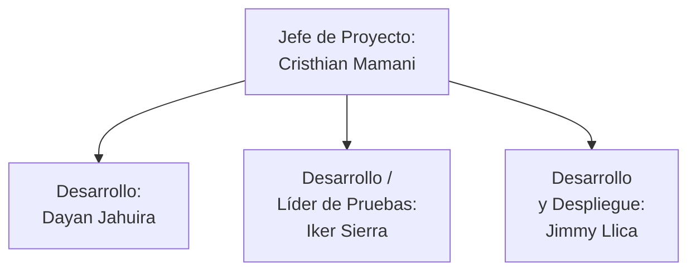
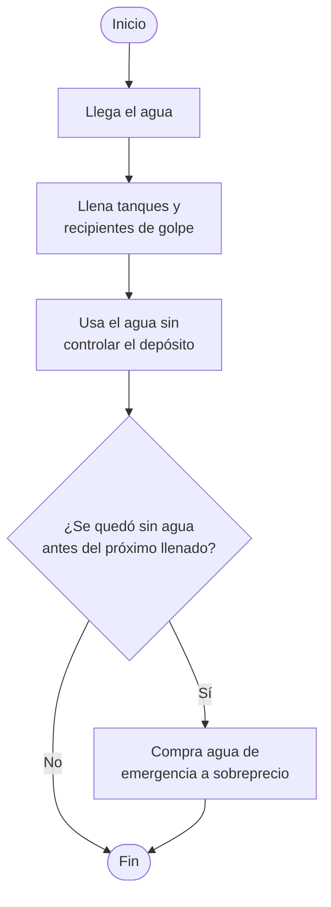
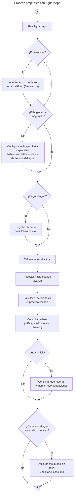
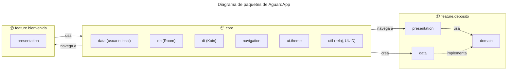
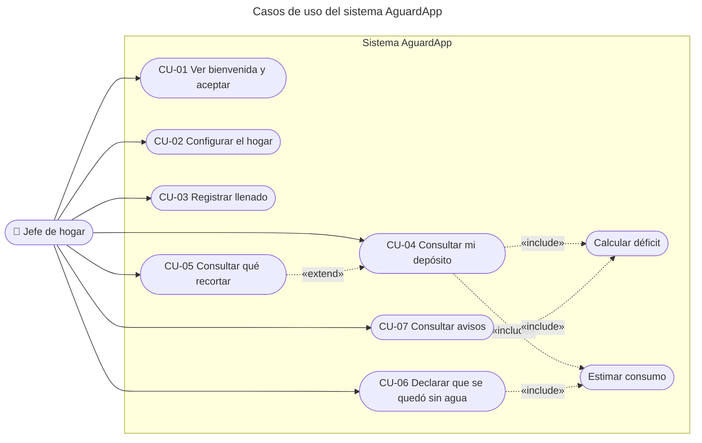
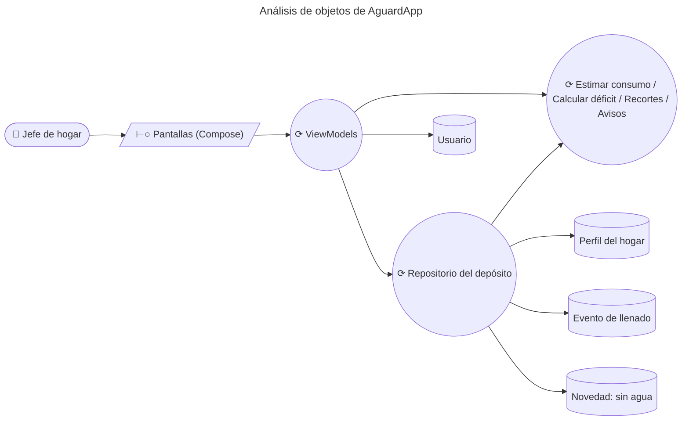
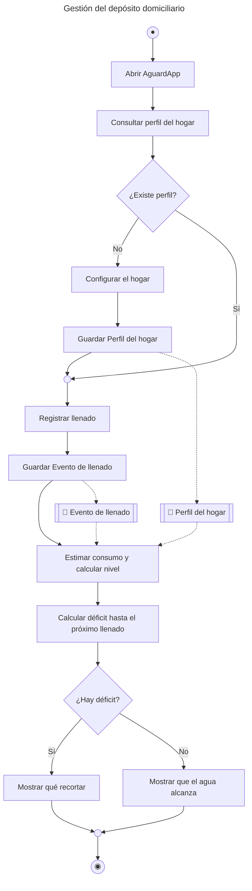
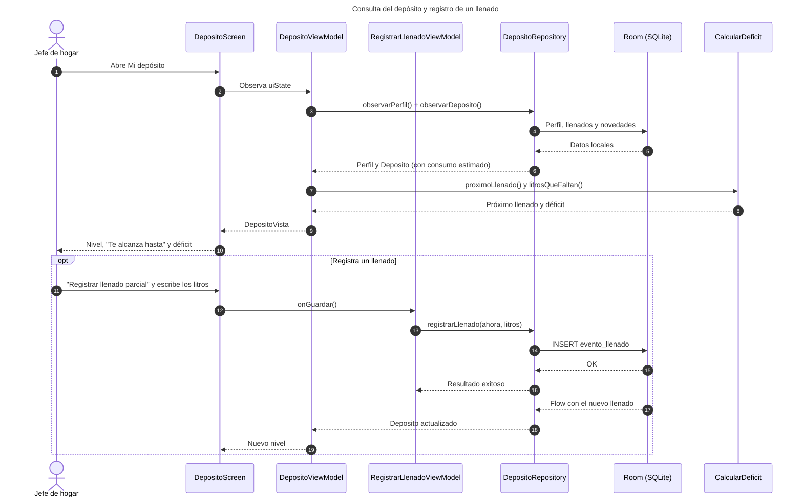
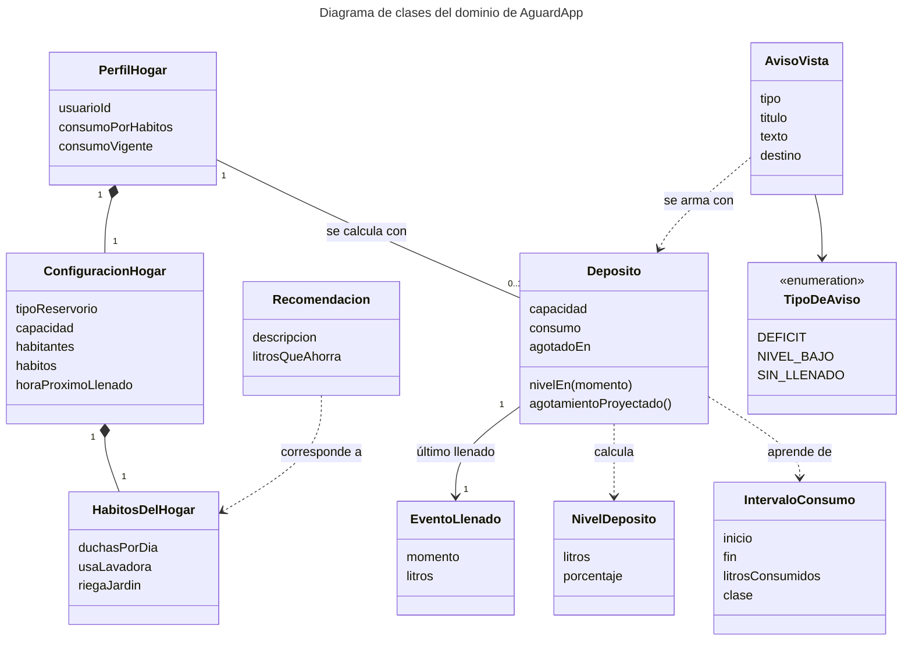

# AguardApp — Documento de Especificación de Requerimientos de Software (SRS)

> **Universidad Privada de Tacna** · Facultad de Ingeniería · Escuela Profesional de Ingeniería de Sistemas
> **Curso:** Soluciones Móviles I · **Docente:** Mag. Alberto Johnatan Flor Rodríguez
> **Sistema:** AguardApp: sistema móvil para la gestión de la reserva domiciliaria de agua y la anticipación de cortes durante el racionamiento hídrico en Tacna
> **Versión:** 2.1 · Tacna – Perú, 2026

**Integrantes**

| Integrante | Código |
|---|---|
| Jahuira Pilco, Dayan Elvis | 2022075749 |
| Llica Mamani, Jimmy Mijair | 2023076789 |
| Mamani Cori, Cristhian Carlos | 2023077282 |
| Sierra Ruiz, Iker Alberto | 2023077090 |

## Control de versiones

| Versión | Hecha por | Revisada por | Aprobada por | Fecha | Motivo |
|---|---|---|---|---|---|
| 1.0 | DJ - JL - CM - IS | AFR | AFR | 30/09/2026 | Versión Original |
| 2.0 | DJ - JL - CM - IS | — | — | 02/10/2026 | Actualización al sistema AguardApp: aplicación Android nativa centrada en el módulo Depósito, con base de datos local |
| 2.1 | DJ - JL - CM - IS | — | — | 02/10/2026 | Se agrega la pantalla Avisos (RF-09, RN-11, CU-07) |

## Índice

1. [Generalidades de la Empresa](#1-generalidades-de-la-empresa)
2. [Visionamiento de la Empresa](#2-visionamiento-de-la-empresa)
3. [Análisis de Procesos](#3-análisis-de-procesos)
4. [Especificación de Requerimientos de Software](#4-especificación-de-requerimientos-de-software)
5. [Fase de Desarrollo](#5-fase-de-desarrollo)
6. [Conclusiones](#6-conclusiones)
7. [Recomendaciones](#7-recomendaciones)
8. [Bibliografía](#8-bibliografía)
9. [Webgrafía](#9-webgrafía)

---

## 1. Generalidades de la Empresa

### 1.1. Nombre de la Empresa

AguardApp: sistema móvil para la gestión de la reserva domiciliaria de agua y la anticipación de cortes durante el racionamiento hídrico en Tacna.

### 1.2. Visión

Ser un referente en el desarrollo de soluciones móviles con impacto social en la región de Tacna, aplicando buenas prácticas de ingeniería de software para resolver problemas reales de la comunidad.

### 1.3. Misión

Desarrollar aplicaciones móviles accesibles y de calidad que mejoren la vida de los ciudadanos; para este proyecto, ayudando a los hogares de Tacna a saber cuánta agua les queda en su depósito y hasta cuándo les alcanza durante el racionamiento.

### 1.4. Organigrama

## 2. Visionamiento de la Empresa

### 2.1. Descripción del Problema

La ciudad de Tacna se abastece de agua potable bajo un esquema de racionamiento, con servicio solo durante algunas horas al día. Los hogares almacenan agua en tanques elevados, cisternas o bidones, pero no saben cuánta agua les queda ni hasta qué hora les alcanzará. Por eso se quedan sin agua de forma imprevista, compran agua de emergencia a sobreprecio y no ajustan su consumo a tiempo.

### 2.2. Objetivos de Negocios

- Reducir la incertidumbre de los hogares sobre cuánta agua les queda en su depósito.
- Disminuir los gastos por compra de agua de emergencia anticipando cuándo se acabará el agua.
- Fomentar el ahorro con recomendaciones concretas cuando el agua no alcanza hasta el próximo llenado.

### 2.3. Objetivos de Diseño

- Construir una aplicación Android nativa con Kotlin y Jetpack Compose.
- Garantizar el funcionamiento 100 % sin conexión, con una base de datos local (Room / SQLite) como única fuente de verdad.
- Aplicar el patrón MVVM en la presentación y una organización por dominio (DDD), con el dominio independiente de Android.
- Proteger la privacidad: todos los datos quedan en el teléfono y la aplicación no solicita permisos del sistema.

### 2.4. Alcance del proyecto

El sistema comprende la configuración del hogar (tipo y capacidad del depósito, habitantes, hábitos de consumo y hora habitual de llegada del agua), el registro de llenados completos o parciales, el cálculo del nivel actual del depósito, la proyección de la hora de agotamiento, el cálculo del déficit de litros hasta el próximo llenado, las recomendaciones de recorte de consumo, la declaración de "me quedé sin agua", con la que la aplicación aprende el consumo real del hogar, y una pantalla de avisos que alerta dentro de la aplicación sobre el déficit, el nivel bajo o la falta de un llenado registrado.

La aplicación es nativa para Android y se desarrolla con Kotlin, Jetpack Compose, Room, Koin y Navigation Compose. Todos los datos se guardan en una base de datos SQLite local; la aplicación no necesita internet ni cuentas de usuario.

Quedan fuera del alcance de esta versión: la consulta del sector y del cronograma oficial, el mapa de cisternas, la confirmación colaborativa de horarios, la digitalización de recibos, los retos y reportes ciudadanos, el asistente hídrico, la sincronización en la nube, el inicio de sesión con Google, las notificaciones push (los avisos solo se muestran dentro de la aplicación) y la versión para iOS.

### 2.5. Viabilidad del Sistema

Según el Informe de Factibilidad (FD01, Versión 1.0), el proyecto es viable en las dimensiones técnica, económica (inversión estimada de S/ 17,720.00 con VAN positivo y TIR del 22.2 %), operativa, legal (Ley N.° 29733), social y ambiental. La reducción del alcance a una aplicación local refuerza la viabilidad técnica y legal: no hay costos de servidor ni datos personales fuera del dispositivo.

### 2.6. Información obtenida del Levantamiento de Información

*(Sección sin contenido en el documento original.)*

## 3. Análisis de Procesos

A partir de la observación del comportamiento de los hogares durante el racionamiento, se modelaron el proceso actual (manual) y el proceso propuesto (con AguardApp).

### a) Diagrama del Proceso Actual – Diagrama de actividades

Actualmente, el vecino llena su depósito cuando llega el agua y la usa sin saber cuánto le queda, lo que lo lleva a quedarse sin agua y comprarla de emergencia.

### b) Diagrama del Proceso Propuesto – Diagrama de actividades Inicial

Con AguardApp, el vecino configura su hogar una vez, registra cada llenado con un toque y consulta en todo momento cuánta agua le queda, hasta cuándo le alcanza y cuántos litros le faltarán antes del próximo llenado.

## 4. Especificación de Requerimientos de Software

### a) Cuadro de Requerimientos funcionales Inicial

| ID | Requerimiento | Descripción | Prioridad |
|---|---|---|---|
| RF-01 | Mostrar bienvenida | Presentar la aplicación la primera vez y pedir el consentimiento para guardar los datos del hogar en el teléfono. | Alta |
| RF-02 | Configurar el hogar | Registrar el tipo de depósito, su capacidad, los habitantes, los hábitos de consumo y la hora habitual de llegada del agua. | Alta |
| RF-03 | Registrar llenado | Registrar un llenado completo (la capacidad del depósito) o parcial (los litros indicados por el usuario). | Alta |
| RF-04 | Consultar el depósito | Mostrar el nivel actual, el porcentaje, el último llenado, hasta cuándo alcanza el agua y el consumo estimado. | Alta |
| RF-05 | Calcular el déficit | Calcular los litros que faltarán antes del próximo llenado. | Alta |
| RF-06 | Recomendar recortes | Mostrar recomendaciones de ahorro según los hábitos del hogar y recalcular en vivo los litros ganados y los que faltan. | Media |
| RF-07 | Declarar que se quedó sin agua | Registrar que el agua se acabó ahora o a una hora anterior y ajustar el consumo estimado del hogar. | Media |
| RF-08 | Operar sin conexión | Funcionar sin internet, guardando toda la información en el teléfono. | Alta |
| RF-09 | Consultar avisos | Mostrar dentro de la aplicación las alertas del depósito y llevar al usuario a la pantalla que las resuelve. | Media |

### b) Cuadro de Requerimientos No funcionales

| ID | Requerimiento | Descripción |
|---|---|---|
| RNF-01 | Disponibilidad | La aplicación opera al 100 % sin conexión, con la base de datos local (Room / SQLite) como única fuente de verdad. |
| RNF-02 | Rendimiento | Las pantallas deben responder en un máximo de 2 segundos en condiciones normales; los cálculos se hacen en el dispositivo sin esperar a la red. |
| RNF-03 | Privacidad y seguridad | Ningún dato sale del teléfono. La aplicación no solicita permisos del sistema (ni internet, ni ubicación, ni cámara, ni notificaciones). El usuario se identifica con un UUID local. |
| RNF-04 | Usabilidad y accesibilidad | Interfaz con textos legibles, una sola fuente tipográfica, colores sólidos, botones a lo ancho de la pantalla y mensajes de error claros debajo de cada campo. |
| RNF-05 | Compatibilidad | Android 7.0 (API 24) o superior; probado contra la API 36. |
| RNF-06 | Mantenibilidad | Arquitectura MVVM + DDD: dominio en Kotlin puro, independiente de Android; cada pantalla con un Screen y un ViewModel; sin capas innecesarias. |
| RNF-07 | Exactitud del cálculo | La estimación del consumo debe usar el historial real del hogar cuando haya datos suficientes y limitar los cambios bruscos ante un error del usuario. |

### c) Cuadro de Requerimientos funcionales Final

Tras el análisis se mantuvieron los requerimientos iniciales, se precisaron sus validaciones y se detalló el requerimiento de avisos (RF-09):

| ID | Requerimiento | Descripción | Prioridad |
|---|---|---|---|
| RF-01 | Mostrar bienvenida | Se muestra solo la primera vez; sin aceptar el consentimiento no se puede empezar. | Alta |
| RF-02 | Configurar el hogar | Capacidad entre 200 y 5000 L; habitantes entre 1 y 12; hábitos (duchas por día, lavadora, riego) y hora del próximo llenado obligatoria. El botón Guardar se deshabilita mientras haya errores. Se usa al inicio y para editar desde Mi depósito. | Alta |
| RF-03 | Registrar llenado | Completo: se registran los litros de la capacidad. Parcial: los litros deben ser mayores que 0 y no superar la capacidad. No se pueden registrar llenados en el futuro. | Alta |
| RF-04 | Consultar el depósito | Nivel actual en litros y porcentaje, último llenado, "Te alcanza hasta", próximo llenado, consumo en L/h y promedio en L/persona/día. Se actualiza solo cada minuto. | Alta |
| RF-05 | Calcular el déficit | Déficit = consumo por hora × horas hasta el próximo llenado − nivel actual (nunca negativo). | Alta |
| RF-06 | Recomendar recortes | Solo se sugieren las acciones que corresponden a los hábitos del hogar; se muestra "Ganas X L" y "Te faltan Y L" o "¡Cubriste el déficit!". | Media |
| RF-07 | Declarar que se quedó sin agua | Opciones "Se acabó ahora" o "Se acabó antes, a las HH:mm". La hora debe tener formato válido, no ser futura y ser posterior al último llenado. Antes de registrar se muestra lo proyectado frente a lo ocurrido. | Media |
| RF-08 | Operar sin conexión | Todas las funciones trabajan con la base local. | Alta |
| RF-09 | Consultar avisos | Se abre desde "Ver avisos" en Mi depósito. Los avisos se generan según RN-11, cada tipo con su color; al tocar uno se navega a Qué recortar, a Registrar llenado completo o de vuelta a Mi depósito. Sin avisos se indica que el depósito alcanza hasta el próximo llenado. | Media |

### d) Reglas de Negocio

| ID | Regla de negocio |
|---|---|
| RN-01 | El agua llega todos los días a la hora configurada: el próximo llenado es hoy a esa hora si aún no pasó, o mañana si ya pasó. |
| RN-02 | El nivel del depósito baja de forma lineal desde el último llenado según el consumo por hora; nunca es menor que cero ni mayor que la capacidad. |
| RN-03 | El consumo se estima en este orden: (1) con el historial del hogar si hay datos suficientes, (2) con los hábitos declarados y (3) si no hay nada, suponiendo que el depósito dura 48 horas. |
| RN-04 | El historial alcanza para estimar con al menos un intervalo "observado" (terminó con "me quedé sin agua") o con dos intervalos entre llenados. Se usan los 5 más recientes y se toma la mediana. |
| RN-05 | Dos llenados separados por menos de 6 horas se consideran un relleno y no cuentan para el consumo; un intervalo de más del doble de la mediana se descarta como un llenado olvidado. |
| RN-06 | El consumo por hábitos se calcula con 60 L por persona al día más 30 L por ducha, 100 L si usa lavadora y 150 L si riega el jardín, repartidos en 12 horas de uso al día. |
| RN-07 | Al declarar que se quedó sin agua, el nuevo consumo no puede variar más de un 30 % respecto del anterior en una sola declaración. |
| RN-08 | Al registrar un llenado se descarta el consumo aprendido y se vuelve a estimar con todo el historial. |
| RN-09 | Las recomendaciones de recorte son: no lavar ropa hoy (80 L, si usa lavadora), no regar el jardín (80 L, si riega), duchas de 5 minutos (40 L, si se ducha), cerrar el caño al lavar platos (45 L) y usar un balde en el inodoro (30 L). |
| RN-10 | El usuario se identifica con un UUID local que se crea una sola vez y no cambia. |
| RN-11 | Los avisos se generan así: si el hogar no tiene llenados, solo "¿Llegó el agua a tu casa?"; si hay déficit (RF-05), "Tu reserva se agota antes de que vuelva el agua"; y si el nivel actual es menor al 20 % de la capacidad, "Te queda poca agua". Los avisos se calculan al vuelo y no se guardan. |

## 5. Fase de Desarrollo

### 5.1. Perfiles de Usuario

| Perfil | Descripción | Permisos principales |
|---|---|---|
| Jefe de hogar | Persona que administra el agua de la casa | Configurar el hogar, registrar llenados, consultar el depósito y el déficit, ver qué recortar, declarar que se quedó sin agua y consultar los avisos |

> La aplicación tiene un único perfil: no hay cuentas ni roles, y cada teléfono guarda los datos de un hogar.

### 5.2. Modelo Conceptual

#### a) Diagrama de Paquetes

#### b) Diagrama de Casos de Uso

#### c) Escenarios de Caso de Uso (narrativa)

| CU-01 | Ver bienvenida y aceptar |
|---|---|
| **Actor** | Jefe de hogar |
| **Precondición** | Es la primera vez que se abre la aplicación. |
| **Flujo principal** | 1) La aplicación muestra qué hace y la casilla de consentimiento. 2) El usuario acepta y toca "Empezar". 3) El sistema guarda que la bienvenida fue completada. 4) Navega a Configurar hogar (o a Mi depósito si el hogar ya estaba configurado). |
| **Postcondición** | La bienvenida no vuelve a mostrarse. |

| CU-02 | Configurar el hogar |
|---|---|
| **Actor** | Jefe de hogar |
| **Precondición** | El usuario pasó la bienvenida. |
| **Flujo principal** | 1) El usuario elige el tipo de depósito (tanque elevado, cisterna o bidones). 2) Ajusta la capacidad, los habitantes y los hábitos. 3) Elige la hora a la que suele llegar el agua. 4) El sistema valida cada campo y muestra el consumo estimado. 5) El usuario toca "Guardar". 6) El sistema guarda el perfil y calcula el consumo por hábitos. |
| **Flujo alternativo** | Si falta la hora o un valor está fuera de rango, se muestra el error debajo del campo y Guardar queda deshabilitado. |
| **Postcondición** | El perfil del hogar queda guardado; al editar, se descarta el consumo aprendido. |

| CU-03 | Registrar llenado |
|---|---|
| **Actor** | Jefe de hogar |
| **Precondición** | El hogar está configurado. |
| **Flujo principal** | 1) Desde Mi depósito, el usuario elige "llenado completo" o "llenado parcial". 2) Si es completo, confirma. 3) Si es parcial, escribe los litros. 4) El sistema valida y guarda el llenado con la fecha y hora actuales. 5) Vuelve a Mi depósito, que se actualiza solo. |
| **Flujo alternativo** | Si los litros son 0 o superan la capacidad, se muestra el error y no se guarda. |
| **Postcondición** | El depósito parte del nuevo llenado. |

| CU-04 | Consultar mi depósito |
|---|---|
| **Actor** | Jefe de hogar |
| **Precondición** | El hogar está configurado. |
| **Flujo principal** | 1) El sistema obtiene el perfil y el último llenado. 2) Estima el consumo (RN-03). 3) Calcula el nivel actual, la hora de agotamiento, el próximo llenado y el déficit. 4) Muestra la información y la actualiza cada minuto. |
| **Flujo alternativo** | Si no hay llenados, se invita a registrar el primero. |
| **Postcondición** | El usuario sabe cuánta agua le queda y hasta cuándo. |

| CU-05 | Consultar qué recortar |
|---|---|
| **Actor** | Jefe de hogar |
| **Precondición** | El depósito tiene déficit. |
| **Flujo principal** | 1) El usuario toca "¿Qué puedo recortar?". 2) El sistema muestra las recomendaciones que corresponden a sus hábitos. 3) El usuario marca acciones. 4) El sistema recalcula en vivo los litros ganados y los que faltan. |
| **Postcondición** | El usuario conoce un plan para que el agua alcance. |

| CU-06 | Declarar que se quedó sin agua |
|---|---|
| **Actor** | Jefe de hogar |
| **Precondición** | Existe al menos un llenado. |
| **Flujo principal** | 1) El sistema muestra lo proyectado frente a lo ocurrido. 2) El usuario elige "Se acabó ahora" o escribe la hora (HH:mm). 3) El sistema valida la hora. 4) Registra el agotamiento y ajusta el consumo (RN-07). 5) Vuelve a Mi depósito. |
| **Flujo alternativo** | Si la hora tiene formato inválido, es futura o es anterior al último llenado, se muestra el error debajo del campo. |
| **Postcondición** | El depósito queda en cero desde ese momento y el consumo aprendido se usa en las siguientes proyecciones. |

| CU-07 | Consultar avisos |
|---|---|
| **Actor** | Jefe de hogar |
| **Precondición** | El hogar está configurado. |
| **Flujo principal** | 1) Desde Mi depósito, el usuario toca "Ver avisos". 2) El sistema obtiene el perfil y el depósito y calcula el próximo llenado, el déficit y el nivel actual. 3) Muestra los avisos que correspondan (RN-11). 4) El usuario toca un aviso. 5) El sistema navega a la pantalla que lo resuelve: Qué recortar (déficit), Registrar llenado completo (sin llenado) o Mi depósito (nivel bajo). |
| **Flujo alternativo** | Si no hay avisos, se muestra "No tienes avisos" y que el depósito alcanza hasta el próximo llenado. |
| **Postcondición** | El usuario conoce las alertas de su depósito y la acción para atenderlas. |

### 5.3. Modelo Lógico

#### a) Análisis de Objetos

Diagrama de robustez: frontera (*boundary*), controladores (*control*) y entidades (*entity*).

#### b) Diagrama de Actividades con objetos

#### c) Diagrama de Secuencia

#### d) Diagrama de Clases

> `AvisoVista` y `TipoDeAviso` pertenecen a la capa de presentación (`AvisosViewModel`): los avisos se derivan del `Deposito` y no se guardan en la base de datos.

## 6. Conclusiones

- La especificación definió las funcionalidades de AguardApp mediante 9 requerimientos funcionales, 7 no funcionales y 11 reglas de negocio, centrados en la gestión del depósito domiciliario de agua.
- La reducción del alcance a un solo módulo (Depósito) permite entregar una solución completa, simple y que funciona sin conexión ni cuentas de usuario.
- El modelado de procesos evidencia la mejora frente al proceso manual: el hogar sabe cuánta agua le queda, hasta cuándo le alcanza y cuántos litros le faltarán antes del próximo llenado.
- Los diagramas de paquetes, casos de uso, actividades, secuencia y clases reflejan la arquitectura MVVM + DDD implementada en el código.

## 7. Recomendaciones

- Validar las reglas de estimación del consumo (RN-03 a RN-07) con hogares piloto y ajustar sus parámetros.
- Agregar pruebas unitarias para la capa de dominio, que es Kotlin puro y no depende de Android.
- Mantener la trazabilidad entre requerimientos, casos de uso y pruebas en las próximas versiones.
- Evaluar en versiones futuras los módulos que quedaron fuera del alcance (sector, notificaciones push a partir de los avisos actuales, sincronización) sin perder el funcionamiento sin conexión.

## 8. Bibliografía

- Congreso de la República del Perú. (2011). *Ley N.° 29733 – Ley de Protección de Datos Personales*. Lima, Perú.
- Sommerville, I. (2016). *Ingeniería de Software* (10.ª ed.). Pearson Educación.
- Pressman, R. S. (2014). *Ingeniería del Software: Un Enfoque Práctico* (8.ª ed.). McGraw-Hill.
- IEEE. (1998). *IEEE Std 830-1998 – Recommended Practice for Software Requirements Specifications*.
- Evans, E. (2003). *Domain-Driven Design: Tackling Complexity in the Heart of Software*. Addison-Wesley.

## 9. Webgrafía

- Documentación de Jetpack Compose: <https://developer.android.com/compose>
- Documentación de Room: <https://developer.android.com/training/data-storage/room>
- Guía de arquitectura de apps Android: <https://developer.android.com/topic/architecture>
- Documentación de Koin: <https://insert-koin.io/docs>
- Documentación de Mermaid: <https://mermaid.js.org/>
