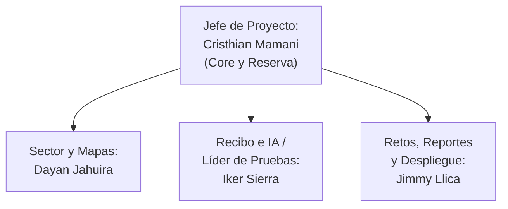
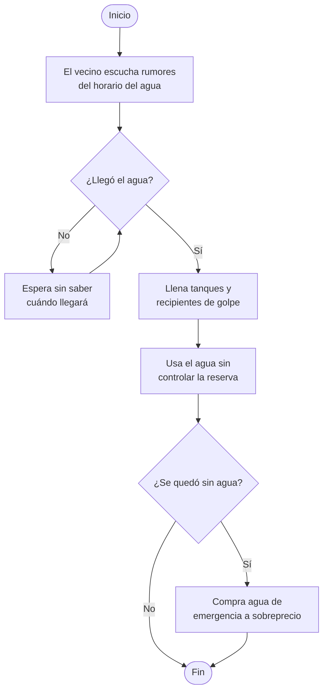
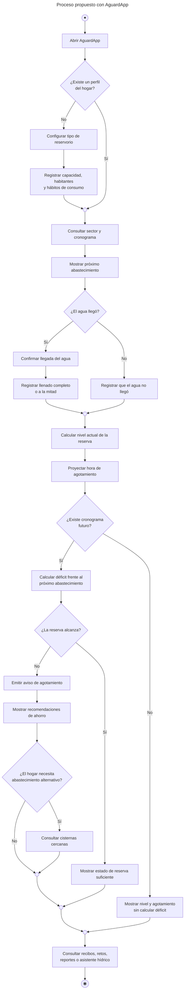
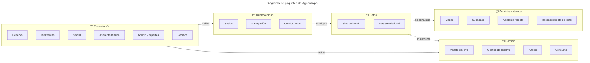
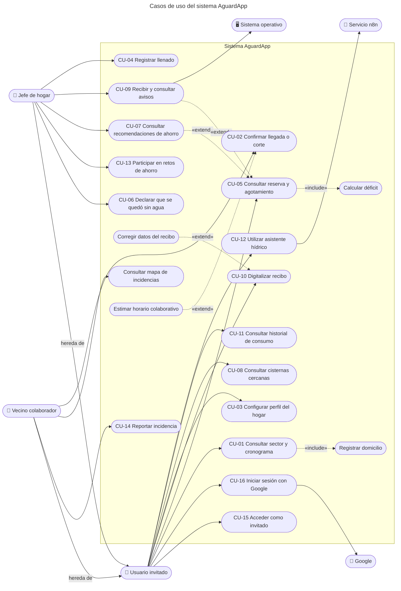
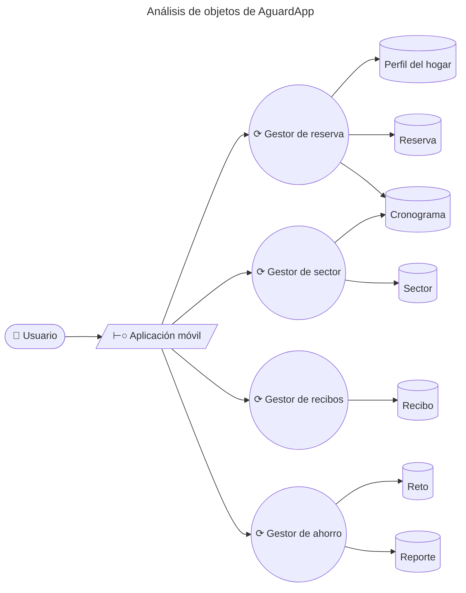
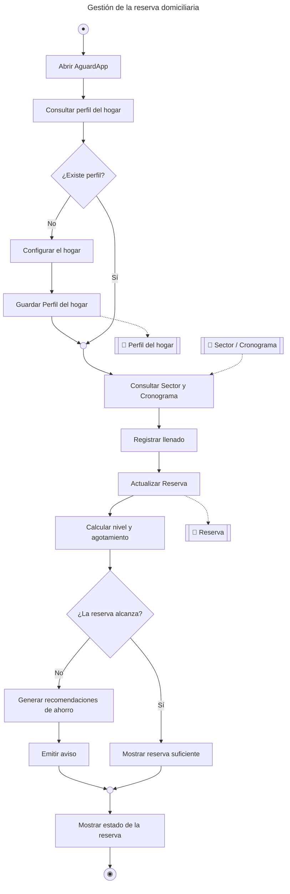
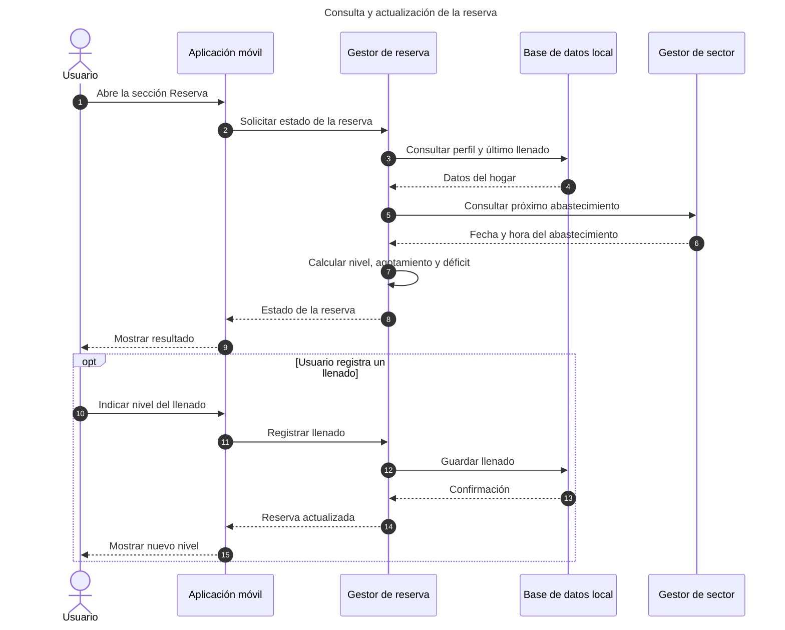
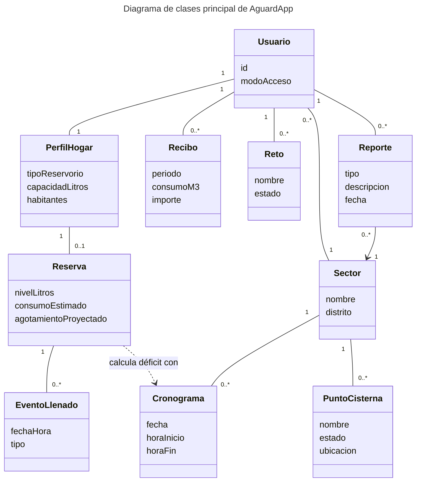

# AguardApp — Documento de Especificación de Requerimientos de Software (SRS)

> **Universidad Privada de Tacna** · Facultad de Ingeniería · Escuela Profesional de Ingeniería de Sistemas
> **Curso:** Soluciones Móviles I · **Docente:** Mag. Alberto Johnatan Flor Rodríguez
> **Sistema:** AguardApp: sistema móvil para la gestión de la reserva domiciliaria de agua y la anticipación de cortes durante el racionamiento hídrico en Tacna
> **Versión:** 1.0 · Tacna – Perú, 2026

**Integrantes**

| Integrante | Código |
|---|---|
| Jahuira Pilco, Dayan Elvis | 2022075749 |
| Llica Mamani, Jimmy Mijair | 2023076789 |
| Mamani Cori, Cristhian Carlos | 2023077282 |
| Sierra Ruiz, Iker Alberto | 2023077090 |

## Control de versiones

| Versión | Hecha por | Revisada por | Aprobada por | Fecha | Motivo |
|---|---|---|---|---|---|
| 1.0 | DJ - JL - CM - IS | AFR | AFR | 30/09/2026 | Versión Original |

## Índice

1. [Generalidades de la Empresa](#1-generalidades-de-la-empresa)
2. [Visionamiento de la Empresa](#2-visionamiento-de-la-empresa)
3. [Análisis de Procesos](#3-análisis-de-procesos)
4. [Especificación de Requerimientos de Software](#4-especificación-de-requerimientos-de-software)
5. [Fase de Desarrollo](#5-fase-de-desarrollo)
6. [Conclusiones](#6-conclusiones)
7. [Recomendaciones](#7-recomendaciones)
8. [Bibliografía](#8-bibliografía)
9. [Webgrafía](#9-webgrafía)

---

## 1. Generalidades de la Empresa

### 1.1. Nombre de la Empresa

AguardApp: sistema móvil para la gestión de la reserva domiciliaria de agua y la anticipación de cortes durante el racionamiento hídrico en Tacna.

### 1.2. Visión

Ser un referente en el desarrollo de soluciones móviles con impacto social en la región de Tacna, aplicando buenas prácticas de ingeniería de software para resolver problemas reales de la comunidad.

### 1.3. Misión

Desarrollar aplicaciones móviles multiplataforma, accesibles y de calidad, que mejoren la vida de los ciudadanos; para este proyecto, ayudando a los hogares de Tacna a gestionar su reserva de agua durante el racionamiento.

### 1.4. Organigrama

## 2. Visionamiento de la Empresa

### 2.1. Descripción del Problema

La ciudad de Tacna se abastece de agua potable bajo un esquema de racionamiento por sectores, con servicio solo durante algunas horas al día. Los hogares no cuentan con información clara y oportuna sobre cuándo llegará el agua a su sector ni sobre cuánta reserva les queda, lo que ocasiona desabastecimiento imprevisto, compra de agua de emergencia a sobreprecio y desperdicio del recurso. La información oficial es dispersa y poco confiable, lo que agrava la mala planificación del consumo.

### 2.2. Objetivos de Negocios

- Reducir la incertidumbre de los hogares sobre el abastecimiento de agua durante el racionamiento.
- Disminuir los gastos por compra de agua de emergencia mediante una mejor planificación de la reserva.
- Fomentar el ahorro y el consumo responsable del agua en la ciudad de Tacna.

### 2.3. Objetivos de Diseño

- Construir una aplicación multiplataforma (Android e iOS) con Kotlin Multiplatform y Compose.
- Garantizar la operación sin conexión con una base de datos local como fuente de verdad.
- Aplicar una arquitectura limpia en capas, con el dominio independiente de frameworks.
- Asegurar la privacidad de los datos del usuario mediante seguridad por fila y almacenamiento a nivel de sector.

### 2.4. Alcance del proyecto

El sistema comprende la gestión de la reserva domiciliaria de agua, la configuración del perfil del hogar, la consulta del sector y su cronograma de abastecimiento, la ubicación de cisternas cercanas, la confirmación colaborativa de horarios, la digitalización de recibos de EPS Tacna, la consulta del historial de consumo, la generación de recomendaciones de ahorro, los retos semanales, los reportes ciudadanos, los avisos de agotamiento y el asistente hídrico.

La aplicación utiliza Kotlin Multiplatform y Compose Multiplatform para compartir la lógica de negocio y una parte importante de la interfaz entre Android e iOS. La versión Android incluye reconocimiento de texto mediante ML Kit, notificaciones locales, tareas periódicas con WorkManager e inicio de sesión con Google. La versión iOS comparte el dominio y la interfaz multiplataforma, pero sus integraciones específicas todavía deben ser compiladas y verificadas.

El sistema funciona sin conexión para la consulta y modificación de la información almacenada localmente. Las operaciones que requieren servicios externos, como la sincronización con Supabase, el inicio de sesión con Google, el asistente hídrico remoto y la actualización de información desde la nube, necesitan conexión a internet.

Quedan fuera del alcance el panel administrativo web para EPS Tacna, la integración directa con los sistemas internos de la empresa, la administración institucional de los cronogramas y la garantía de paridad completa entre Android e iOS durante la versión actual del proyecto.

### 2.5. Viabilidad del Sistema

Según el Informe de Factibilidad (FD01, Versión 1.0), el proyecto es viable en las dimensiones técnica (equipo competente y tecnologías gratuitas con un MVP operativo), económica (inversión estimada de S/ 17,720.00 con VAN positivo y TIR del 22.2 %), operativa, legal (Ley N.° 29733), social y ambiental.

### 2.6. Información obtenida del Levantamiento de Información

*(Sección sin contenido en el documento original.)*

## 3. Análisis de Procesos

A partir de la observación del comportamiento de los hogares durante el racionamiento, se modelaron el proceso actual (manual) y el proceso propuesto (con AguardApp).

### a) Diagrama del Proceso Actual – Diagrama de actividades

Actualmente, el vecino depende de rumores sobre el horario del agua, llena recipientes de golpe cuando llega y usa el agua sin controlar su reserva, lo que lo lleva a quedarse sin agua y comprarla de emergencia.

### b) Diagrama del Proceso Propuesto – Diagrama de actividades Inicial

Con AguardApp, el vecino consulta su sector y cronograma, conoce su reserva y el próximo abastecimiento, confirma la llegada del agua, registra el llenado y recibe recomendaciones de ahorro y la ubicación de cisternas cercanas.

## 4. Especificación de Requerimientos de Software

### a) Cuadro de Requerimientos funcionales Inicial

| ID | Requerimiento | Descripción | Prioridad |
|---|---|---|---|
| RF-01 | Registrar domicilio | Marcar la ubicación del domicilio por GPS o en el mapa y asociarla a un sector. | Alta |
| RF-02 | Consultar sector | Mostrar el sector, el distrito y la continuidad del servicio del domicilio. | Alta |
| RF-03 | Consultar cronograma | Mostrar el horario del día y el próximo abastecimiento, o informar si el sector aún no tiene horario. | Alta |
| RF-04 | Configurar perfil del hogar | Registrar el tipo y la capacidad del reservorio, los habitantes y los hábitos de consumo. | Alta |
| RF-05 | Registrar llenado | Registrar el momento en que se llenó la reserva del hogar. | Alta |
| RF-06 | Calcular reserva y agotamiento | Estimar los litros disponibles y calcular hasta cuándo alcanza la reserva y el déficit frente al próximo abastecimiento. | Alta |
| RF-07 | Recomendar recortes | Sugerir recortes de consumo cuando la reserva no alcanza hasta el próximo abastecimiento. | Media |
| RF-08 | Ver cisternas cercanas | Mostrar en un mapa los puntos de cisterna cercanos, ordenados por distancia y con su estado. | Alta |
| RF-09 | Confirmar llegada o corte | Permitir a los vecinos confirmar la llegada o el corte del agua en su sector. | Alta |
| RF-10 | Estimar horario colaborativo | Calcular el horario del sector con la mediana de las confirmaciones de los vecinos. | Media |
| RF-11 | Operar sin conexión y sincronizar | Funcionar con datos locales y sincronizarlos con la nube al recuperar la conexión, con inicio de sesión opcional con Google. | Alta |

### b) Cuadro de Requerimientos No funcionales

| ID | Requerimiento | Descripción |
|---|---|---|
| RNF-01 | Disponibilidad | La aplicación opera al 100 % sin conexión, con la base local como fuente de verdad, y sincroniza en menos de 5 segundos al recuperar la red. |
| RNF-02 | Rendimiento | Las pantallas que consulten información local deben responder en un tiempo máximo de 2 segundos bajo condiciones normales. La sincronización debe iniciarse al recuperar la conexión, aunque su duración dependerá de la red y del servicio remoto. |
| RNF-03 | Seguridad | La comunicación con servicios externos debe utilizar HTTPS/TLS. Los datos almacenados en Supabase deben protegerse mediante políticas de seguridad por fila y asociarse a una identidad autorizada. |
| RNF-04 | Privacidad | La ubicación exacta del domicilio debe procesarse localmente. En la nube debe almacenarse el sector asociado y no la coordenada exacta del domicilio. Las fotografías de reportes solo deben utilizarse con autorización del usuario. |
| RNF-05 | Usabilidad y accesibilidad | La interfaz debe utilizar textos legibles, iconos acompañados de descripciones, controles de tamaño adecuado, mensajes comprensibles y flujos simples para usuarios con distintos niveles de experiencia tecnológica. |
| RNF-06 | Portabilidad | La lógica de negocio y las interfaces compartidas deben desarrollarse con Kotlin Multiplatform y Compose Multiplatform. Las funciones específicas de cada plataforma deben documentarse y probarse por separado. |
| RNF-07 | Compatibilidad | La versión Android debe ser compatible con Android 8.0 o superior. La compatibilidad con iOS dependerá de la compilación y verificación de las integraciones específicas de dicha plataforma. |
| RNF-08 | Mantenibilidad y pruebas | El sistema debe aplicar arquitectura limpia, mantener el dominio independiente de frameworks, limitar preferentemente los archivos a 150 líneas y alcanzar como mínimo 70 % de cobertura en la lógica de dominio. |

### c) Cuadro de Requerimientos funcionales Final

Tras el análisis, se incorporaron requerimientos adicionales al listado inicial:

| ID | Requerimiento | Descripción | Prioridad |
|---|---|---|---|
| RF-01 | Registrar domicilio | Marcar la ubicación del domicilio por GPS o en el mapa y asociarla a un sector. | Alta |
| RF-02 | Consultar sector | Mostrar el sector, el distrito y la continuidad del servicio del domicilio. | Alta |
| RF-03 | Consultar cronograma | Mostrar el horario del día y el próximo abastecimiento, o informar si el sector aún no tiene horario. | Alta |
| RF-04 | Configurar perfil del hogar | Registrar el tipo y la capacidad del reservorio, los habitantes y los hábitos de consumo. | Alta |
| RF-05 | Registrar llenado | Registrar el momento en que se llenó la reserva del hogar. | Alta |
| RF-06 | Calcular reserva y agotamiento | Estimar los litros disponibles y calcular hasta cuándo alcanza la reserva y el déficit frente al próximo abastecimiento. | Alta |
| RF-07 | Recomendar recortes | Sugerir recortes de consumo cuando la reserva no alcanza hasta el próximo abastecimiento. | Media |
| RF-08 | Ver cisternas cercanas | Mostrar en un mapa los puntos de cisterna cercanos, ordenados por distancia y con su estado. | Alta |
| RF-09 | Confirmar llegada o corte | Permitir a los vecinos confirmar la llegada o el corte del agua en su sector. | Alta |
| RF-10 | Estimar horario colaborativo | Calcular el horario del sector con la mediana de las confirmaciones de los vecinos. | Media |
| RF-11 | Operar sin conexión y sincronizar | Funcionar con datos locales y sincronizarlos con la nube al recuperar la conexión, con inicio de sesión opcional con Google. | Alta |
| RF-12 | Emitir alertas | Avisar antes del corte del servicio y antes del agotamiento de la reserva. | Media |
| RF-13 | Digitalizar recibo | Capturar mediante la cámara un recibo de EPS Tacna, extraer sus datos mediante reconocimiento de texto, permitir su revisión y corrección manual, almacenarlo localmente y mostrar el historial de consumo del hogar. | Media |
| RF-14 | Retos de ahorro | Proponer retos semanales de ahorro y llevar la racha del usuario. | Baja |
| RF-15 | Reportar incidencias | Registrar reportes ciudadanos de fugas o falta de agua, con foto y ubicación. | Baja |

### d) Reglas de Negocio

| ID | Regla de negocio |
|---|---|
| RN-01 | El inicio de la ventana de abastecimiento cuenta como abastecido; la hora de fin ya no. |
| RN-02 | El horario colaborativo requiere al menos 3 confirmaciones de llegada y 3 de corte por sector y fecha. |
| RN-03 | El horario del sector se estima con la mediana de las confirmaciones, para resistir reportes erróneos. |
| RN-04 | El sector del domicilio es aquel cuyo centro está más cerca de la ubicación del usuario. |
| RN-05 | En el servidor solo se almacena el sector del usuario, nunca la coordenada exacta del domicilio. |
| RN-06 | La aplicación funciona en modo invitado; la autenticación es opcional. |

## 5. Fase de Desarrollo

### 5.1. Perfiles de Usuario

| Perfil | Descripción | Permisos principales |
|---|---|---|
| Jefe de hogar | Administra la reserva y consulta el sector | Registrar llenados, consultar reserva, sector y cisternas |
| Vecino colaborador | Reporta la llegada y el corte del agua | Confirmar llegada/corte del agua del sector |
| Usuario invitado | Consulta sin autenticarse | Consultar sector, cronograma y cisternas |

### 5.2. Modelo Conceptual

#### a) Diagrama de Paquetes

#### b) Diagrama de Casos de Uso

> **Nota:** el acceso como invitado (CU-15) crea una identidad local.

#### c) Escenarios de Caso de Uso (narrativa)

| CU-01 | Consultar sector y cronograma |
|---|---|
| **Actor** | Jefe de hogar / Usuario invitado |
| **Precondición** | La aplicación tiene una ubicación de referencia del domicilio. |
| **Flujo principal** | 1) El usuario abre la pantalla Sector. 2) El sistema resuelve el sector más cercano. 3) Obtiene el cronograma y las cisternas. 4) Calcula el próximo abastecimiento. 5) Muestra la información. |
| **Postcondición** | El usuario conoce su sector, su cronograma y el próximo horario del agua. |

| CU-02 | Confirmar llegada del agua |
|---|---|
| **Actor** | Vecino colaborador |
| **Precondición** | El usuario está autenticado y pertenece a un sector. |
| **Flujo principal** | 1) El usuario toca 'Llegó el agua'. 2) El sistema registra la confirmación local. 3) La sube a la nube con seguridad por fila. 4) Recalcula el total de confirmaciones. 5) Muestra un mensaje de agradecimiento. |
| **Postcondición** | La confirmación queda registrada y contribuye a la estimación del horario del sector. |

| CU-03 | Configurar perfil del hogar |
|---|---|
| **Actor** | Jefe de hogar |
| **Precondición** | El usuario ingresó a la aplicación. |
| **Flujo principal** | El usuario selecciona el tipo de almacenamiento, registra su capacidad, número de habitantes y hábitos de consumo. El sistema valida la información, estima el consumo inicial y guarda el perfil localmente. |
| **Postcondición** | El perfil del hogar queda disponible para calcular la reserva. |

| CU-04 | Registrar llenado |
|---|---|
| **Actor** | Jefe de hogar |
| **Precondición** | Existe un perfil del hogar configurado. |
| **Flujo principal** | El usuario indica si el reservorio se llenó completamente o hasta la mitad. El sistema registra la fecha y hora, actualiza el nivel y recalcula la proyección. |
| **Postcondición** | La reserva queda actualizada. |

| CU-05 | Consultar reserva y agotamiento |
|---|---|
| **Actor** | Jefe de hogar |
| **Precondición** | Existe un perfil y al menos un evento de llenado. |
| **Flujo principal** | El sistema obtiene el último llenado, estima el consumo, calcula los litros restantes, la hora de agotamiento y el déficit frente al próximo abastecimiento. |
| **Postcondición** | El usuario conoce el estado actual de su reserva. |

| CU-06 | Declarar que se quedó sin agua |
|---|---|
| **Actor** | Jefe de hogar |
| **Precondición** | Existe una reserva activa. |
| **Flujo principal** | El usuario indica que el agua se agotó ahora o selecciona una hora anterior. El sistema previsualiza el cambio, registra la observación y recalcula el consumo. |
| **Postcondición** | La reserva queda en cero desde el momento declarado. |

| CU-07 | Consultar recomendaciones de ahorro |
|---|---|
| **Actor** | Jefe de hogar |
| **Precondición** | La reserva presenta un déficit. |
| **Flujo principal** | El sistema muestra recomendaciones correspondientes a los hábitos del hogar. El usuario selecciona acciones y el sistema calcula litros ahorrados, horas ganadas y déficit restante. |
| **Postcondición** | El usuario obtiene un plan de reducción de consumo. |

| CU-08 | Consultar cisternas cercanas |
|---|---|
| **Actor** | Usuario invitado, autenticado o jefe de hogar |
| **Precondición** | Existe una ubicación de referencia. |
| **Flujo principal** | El sistema obtiene los puntos de cisterna, calcula la distancia, descarta los que estén fuera del radio y los muestra ordenados de menor a mayor distancia. |
| **Postcondición** | El usuario conoce las cisternas disponibles y su estado. |

| CU-09 | Recibir y consultar avisos |
|---|---|
| **Actor** | Jefe de hogar |
| **Precondición** | Existe información suficiente para proyectar la reserva. |
| **Flujo principal** | El sistema evalúa periódicamente la reserva, registra el aviso y notifica al usuario cuando el agua pueda agotarse antes del siguiente abastecimiento o cuando deba confirmar un llenado. |
| **Postcondición** | El aviso queda disponible en el historial. |

| CU-10 | Digitalizar recibo |
|---|---|
| **Actor** | Jefe de hogar |
| **Precondición** | El usuario otorgó permiso para usar la cámara. |
| **Flujo principal** | El usuario fotografía el recibo. El sistema reconoce el texto, extrae los campos, muestra una vista de revisión y permite corregirlos antes de guardar. |
| **Postcondición** | El recibo validado queda almacenado localmente. |

| CU-11 | Consultar historial de consumo |
|---|---|
| **Actor** | Jefe de hogar |
| **Precondición** | Existe al menos un recibo guardado. |
| **Flujo principal** | El sistema ordena los recibos por periodo, muestra el historial y representa gráficamente el consumo. |
| **Postcondición** | El usuario puede comparar su consumo entre periodos. |

| CU-12 | Utilizar asistente hídrico |
|---|---|
| **Actor** | Jefe de hogar |
| **Precondición** | El usuario ingresó a la pantalla del asistente. |
| **Flujo principal** | El usuario escribe una consulta. El sistema guarda el mensaje, lo envía al servicio remoto cuando existe conexión y muestra la respuesta. |
| **Postcondición** | La conversación queda disponible localmente. |

| CU-13 | Participar en retos de ahorro |
|---|---|
| **Actor** | Jefe de hogar |
| **Precondición** | Existen retos disponibles. |
| **Flujo principal** | El usuario consulta los retos, registra su cumplimiento y el sistema actualiza la racha y las insignias. |
| **Postcondición** | El progreso queda almacenado y pendiente de sincronización cuando corresponda. |

| CU-14 | Reportar incidencia |
|---|---|
| **Actor** | Vecino colaborador |
| **Precondición** | El usuario tiene un sector asociado. |
| **Flujo principal** | El usuario selecciona el tipo de incidencia, agrega una descripción, una fotografía y una ubicación de referencia. El sistema valida y registra el reporte. |
| **Postcondición** | La incidencia queda registrada localmente y, cuando sea posible, en la nube. |

| CU-15 | Acceder como invitado |
|---|---|
| **Actor** | Usuario invitado |
| **Precondición** | Es la primera ejecución o no existe una sesión activa. |
| **Flujo principal** | El usuario selecciona continuar como invitado. El sistema crea o recupera una identidad local y permite el acceso a las funciones locales. |
| **Postcondición** | El usuario puede utilizar la aplicación sin autenticarse. |

| CU-16 | Iniciar sesión con Google |
|---|---|
| **Actor** | Jefe de hogar |
| **Precondición** | Existe conexión y los servicios de Google están disponibles. |
| **Flujo principal** | El usuario selecciona iniciar sesión, completa la autenticación y el sistema vincula la sesión con los datos locales e inicia la sincronización. |
| **Postcondición** | Existe una sesión autenticada o se conserva el modo invitado. |

### 5.3. Modelo Lógico

#### a) Análisis de Objetos

Diagrama de robustez: frontera (*boundary*), controladores (*control*) y entidades (*entity*).

#### b) Diagrama de Actividades con objetos

#### c) Diagrama de Secuencia

#### d) Diagrama de Clases

## 6. Conclusiones

- La especificación de requerimientos definió las funcionalidades del sistema AguardApp mediante 15 requerimientos funcionales y 8 requerimientos no funcionales. Estos requisitos comprenden la gestión de la reserva domiciliaria, consulta del sector y cronograma, ubicación de cisternas, digitalización de recibos, emisión de avisos, retos de ahorro, reportes ciudadanos, asistencia hídrica, operación sin conexión y sincronización con la nube.
- El modelado de procesos evidenció la mejora que aporta la solución frente al proceso manual actual de los hogares.
- Los diagramas de paquetes, casos de uso, actividades, secuencia y clases sustentan una arquitectura limpia, modular y multiplataforma.

El desarrollo actual presenta diferentes niveles de disponibilidad según la plataforma. Android concentra las funcionalidades que dependen de servicios específicos del dispositivo, como el reconocimiento de texto del recibo, las notificaciones locales, la ejecución periódica en segundo plano y el inicio de sesión con Google. La versión para iOS comparte la lógica y la interfaz desarrolladas con Kotlin Multiplatform, pero todavía requiere compilación, integración y verificación en un dispositivo compatible.

## 7. Recomendaciones

- Validar los requerimientos con hogares piloto antes del desarrollo final, priorizando los de alta prioridad (MUST).
- Mantener la trazabilidad entre requerimientos, casos de uso y pruebas a lo largo del proyecto.
- Actualizar los diagramas conforme evolucione el diseño, conservando su código Mermaid para facilitar el versionado.

## 8. Bibliografía

- Congreso de la República del Perú. (2011). *Ley N.° 29733 – Ley de Protección de Datos Personales*. Lima, Perú.
- Sommerville, I. (2016). *Ingeniería de Software* (10.ª ed.). Pearson Educación.
- Pressman, R. S. (2014). *Ingeniería del Software: Un Enfoque Práctico* (8.ª ed.). McGraw-Hill.
- IEEE. (1998). *IEEE Std 830-1998 – Recommended Practice for Software Requirements Specifications*.

## 9. Webgrafía

- Documentación de Kotlin Multiplatform: <https://kotlinlang.org/docs/multiplatform.html>
- Documentación de Compose Multiplatform: <https://www.jetbrains.com/compose-multiplatform/>
- Documentación de Supabase: <https://supabase.com/docs>
- Documentación de Mermaid: <https://mermaid.js.org/>
