# FD04 — Documento de Arquitectura de Software (SAD)

## Proyecto AguardApp

**Sistema:** AguardApp — sistema móvil para la gestión del depósito domiciliario de agua durante el racionamiento hídrico en Tacna.  
**Curso:** Soluciones Móviles I  
**Docente:** Mag. Alberto Johnatan Flor Rodríguez  
**Versión:** 2.0  
**Fecha:** 02/10/2026  
**Lugar:** Tacna — Perú, 2026

### Integrantes

- Jahuira Pilco, Dayan Elvis (2022075749)
- Llica Mamani, Jimmy Mijair (2023076789)
- Mamani Cori, Cristhian Carlos (2023077282)
- Sierra Ruiz, Iker Alberto (2023077090)

---

## Control de versiones

| Versión | Hecha por | Revisada por | Aprobada por | Fecha | Motivo |
|---|---|---|---|---|---|
| 1.0 | DJ - JL - CM - IS | AFR | AFR | 30/09/2026 | Versión original |
| 2.0 | DJ - JL - CM - IS | — | — | 02/10/2026 | Actualización a la arquitectura de AguardApp: Android nativo, MVVM + DDD, módulo Depósito y base de datos local |

---

# 1. Introducción

## 1.1. Propósito — Modelo 4+1

Este documento presenta una visión global de la arquitectura del sistema AguardApp utilizando el modelo de vistas 4+1 de Kruchten. Describe las decisiones arquitectónicas significativas mediante cinco vistas complementarias: casos de uso, lógica, implementación o desarrollo, procesos y despliegue físico.

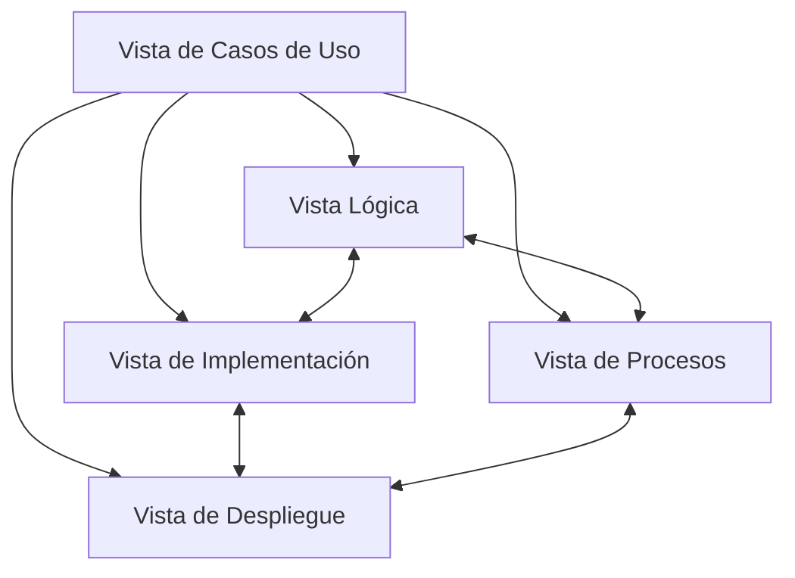

## 1.2. Alcance

El documento describe la arquitectura de la versión actual de AguardApp: una aplicación Android nativa de un solo módulo (`app`) con dos funcionalidades (`bienvenida` y `deposito`), persistencia local con Room y sin servicios externos. Cubre la organización en capas y paquetes, la interacción entre objetos, el modelo de datos, los componentes, los procesos y el despliegue. Sirve de guía para el desarrollo y el mantenimiento del sistema.

## 1.3. Definiciones, siglas y abreviaturas

| Término | Definición |
|---|---|
| SAD | Software Architecture Document (Documento de Arquitectura de Software). |
| Modelo 4+1 | Modelo de Kruchten con cinco vistas arquitectónicas complementarias. |
| MVVM | Model-View-ViewModel, patrón de la capa de presentación. |
| DDD | Domain-Driven Design: el código se organiza alrededor del dominio (modelos, repositorios y casos de uso). |
| Jetpack Compose | Kit de interfaz declarativa de Android. |
| Room | Biblioteca de persistencia local sobre SQLite. |
| Koin | Biblioteca de inyección de dependencias para Kotlin. |
| UiState | Clase de datos con todo lo que una pantalla necesita mostrar. |
| QA | Quality Attribute (atributo de calidad del software). |

## 1.4. Organización del documento

El documento se organiza en cuatro secciones: introducción; objetivos y restricciones arquitectónicas; representación de la arquitectura mediante las vistas del modelo 4+1; y atributos de calidad del software.

---

# 2. Objetivos y restricciones arquitectónicas

## 2.1. Priorización de requerimientos

### 2.1.1. Requerimientos funcionales

| ID | Descripción | Prioridad |
|---|---|---|
| RF-01 | Mostrar la bienvenida y pedir el consentimiento la primera vez | Alta |
| RF-02 | Configurar el hogar (depósito, habitantes, hábitos y hora del próximo llenado) | Alta |
| RF-03 | Registrar un llenado completo o parcial | Alta |
| RF-04 | Consultar el depósito: nivel, hasta cuándo alcanza y consumo | Alta |
| RF-05 | Calcular el déficit hasta el próximo llenado | Alta |
| RF-06 | Recomendar recortes de consumo | Media |
| RF-07 | Declarar que se quedó sin agua y ajustar el consumo | Media |
| RF-08 | Operar sin conexión | Alta |

### 2.1.2. Requerimientos no funcionales — atributos de calidad

| ID | Atributo | Descripción | Prioridad |
|---|---|---|---|
| RNF-01 | Disponibilidad | Funcionamiento 100 % sin conexión, con Room como única fuente de verdad. | Alta |
| RNF-02 | Privacidad y seguridad | Ningún dato sale del teléfono; la aplicación no solicita permisos; identidad con UUID local. | Alta |
| RNF-03 | Usabilidad | Interfaz simple, una sola fuente, colores sólidos y errores claros debajo de cada campo. | Alta |
| RNF-04 | Compatibilidad | Android 7.0 (API 24) o superior; probado contra la API 36. | Media |
| RNF-05 | Mantenibilidad | MVVM + DDD; dominio en Kotlin puro, independiente de Android; un Screen y un ViewModel por pantalla. | Alta |

## 2.2. Restricciones

- La aplicación debe funcionar sin conexión, con la base de datos local como única fuente de verdad.
- El dominio (`domain/`) no puede depender de Android, Room ni Koin: es Kotlin puro.
- Solo se usan tecnologías gratuitas y de código abierto; no hay backend ni servicios en la nube.
- La persistencia se realiza con Room; el esquema se exporta en `app/schemas/`.
- Las pantallas no contienen lógica de negocio: solo pintan el `UiState` y llaman funciones del ViewModel.

---

# 3. Representación de la arquitectura del sistema

## 3.1. Vista de casos de uso

El único actor es el jefe de hogar, que usa la aplicación en su propio teléfono.

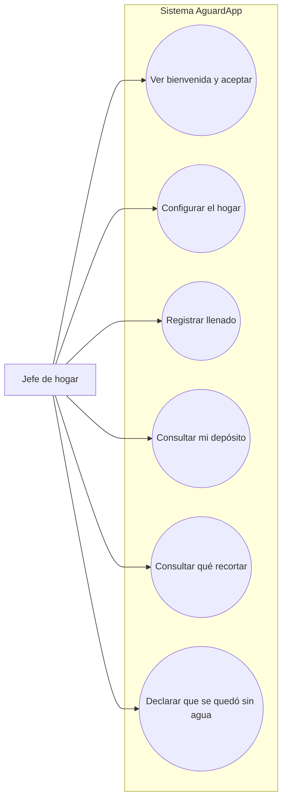

## 3.2. Vista lógica

### 3.2.1. Diagrama de subsistemas / paquetes

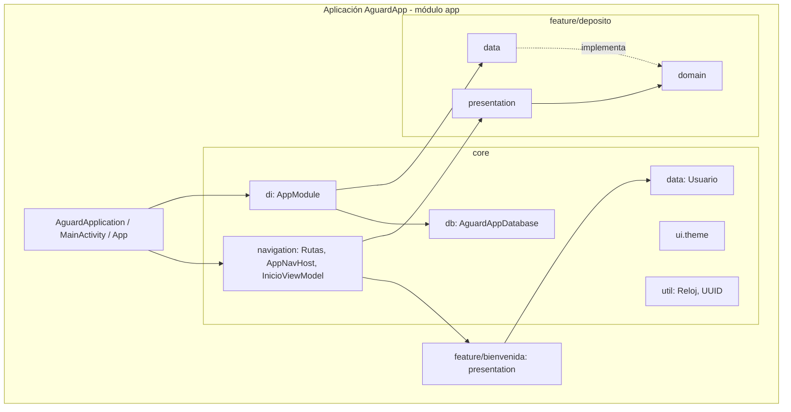

### 3.2.2. Diagramas de secuencia — vista de diseño

#### Módulo 1: Inicio y bienvenida

##### 1.1. Inicio de la aplicación y elección de la primera pantalla

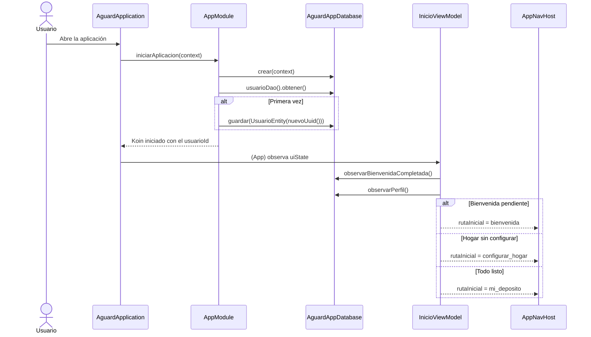

##### 1.2. Aceptar y empezar

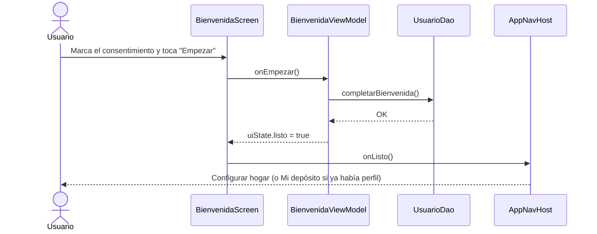

#### Módulo 2: Depósito

##### 2.1. Configuración del hogar

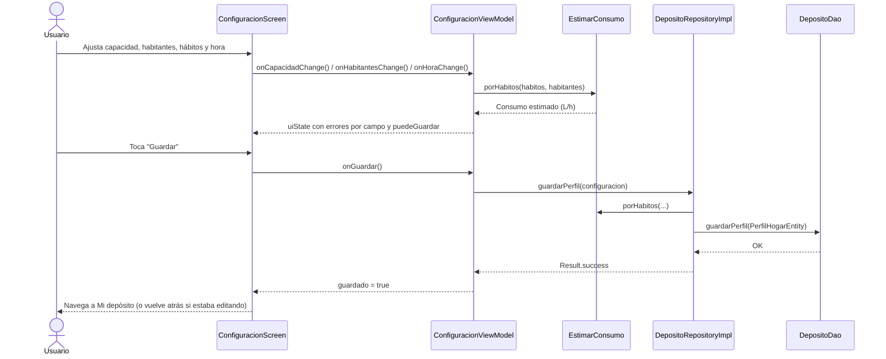

##### 2.2. Registro de un llenado (completo o parcial)

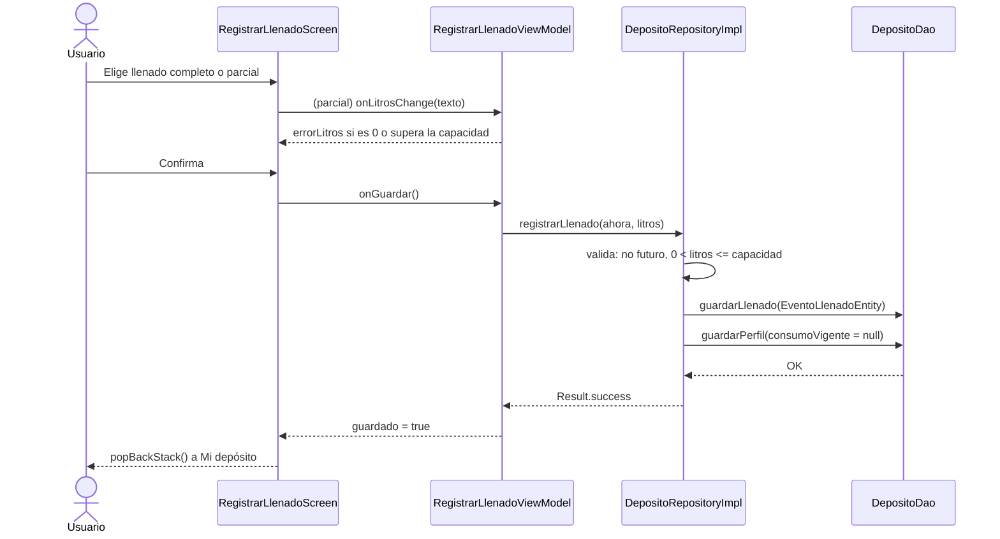

##### 2.3. Monitoreo reactivo del depósito

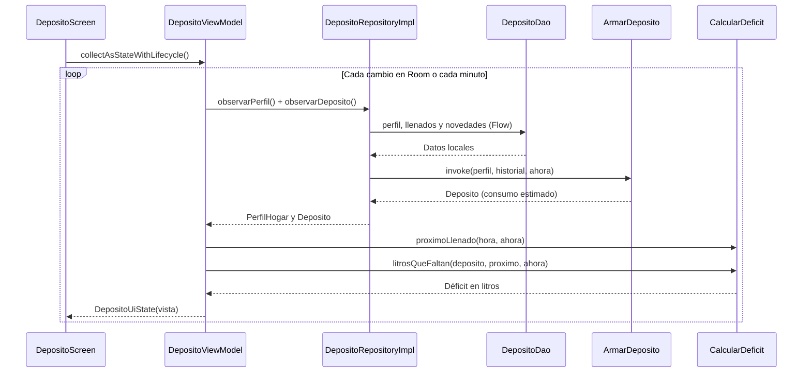

##### 2.4. Declaración de "me quedé sin agua"

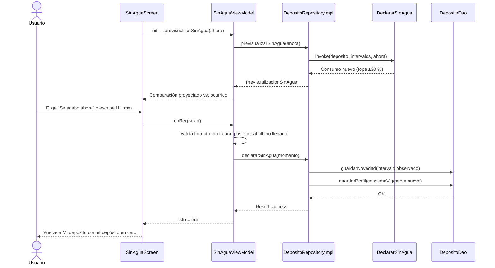

##### 2.5. Qué recortar

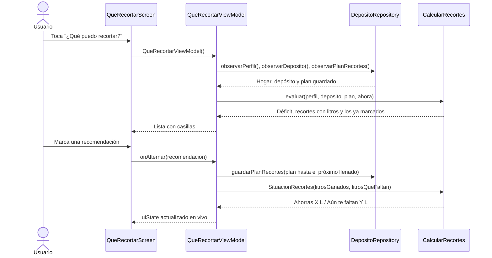

### 3.2.3. Diagrama de colaboración

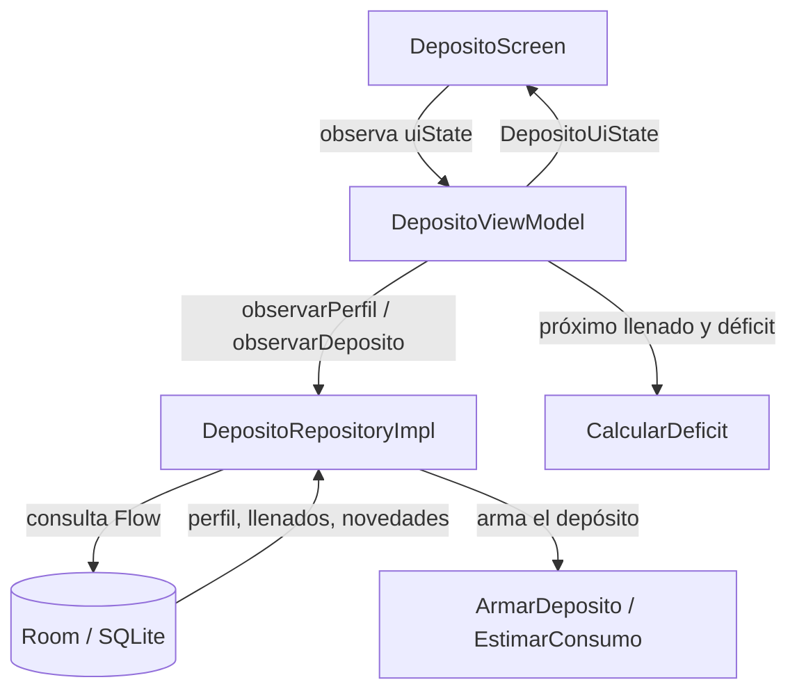

### 3.2.4. Diagrama de objetos

Ejemplo de un hogar con un tanque de 1 100 L, 4 personas, 2 duchas por día y lavadora, que llenó a las 5:10 a.m. Sin historial, el consumo sale de los hábitos: (4 × (60 + 2 × 30) + 100) / 12 = 48,3 L/h. A las 2:00 p.m. quedan 1 100 − 48,3 × 8,83 ≈ 673 L, y el tanque se agota a las 3:56 a.m. del día siguiente; como el agua vuelve a las 5:00 a.m., el déficit es de 48,3 × 15 − 673 ≈ 52 L.

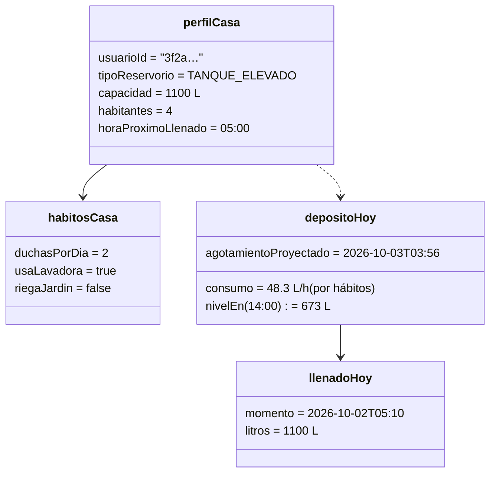

### 3.2.5. Diagrama de clases

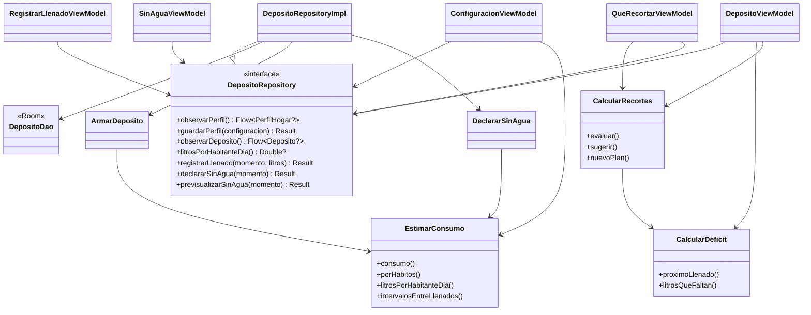

### 3.2.6. Diagrama de base de datos

Base de datos local `aguardapp.db` (Room, versión 3). De la versión 2 a la 3 se agregó la tabla `plan_recortes` con una migración automática (`AutoMigration`), que conserva los datos existentes.

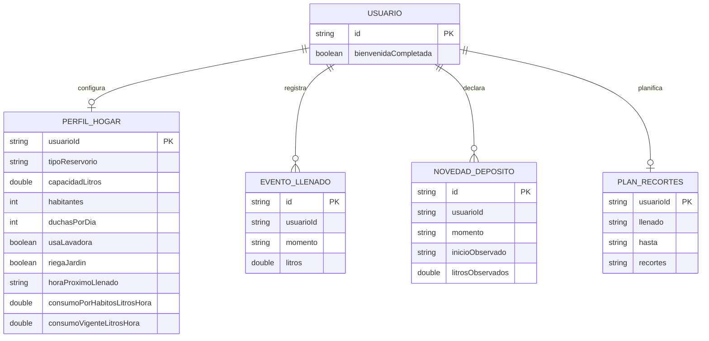

## 3.3. Vista de implementación — desarrollo

### 3.3.1. Diagrama de arquitectura de software / paquetes

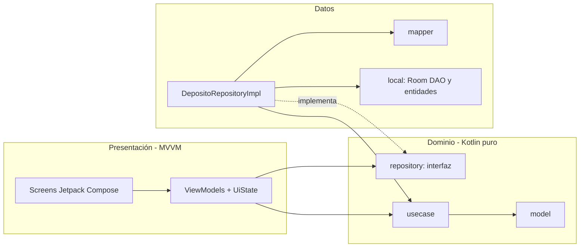

Estructura de carpetas del código:

```
app/src/main/java/com/example/aguardapp/
├── AguardApplication.kt · MainActivity.kt · App.kt
├── core/
│   ├── data/Usuario.kt            (entidad y DAO del usuario local)
│   ├── db/AguardAppDatabase.kt    (Room)
│   ├── di/AppModule.kt            (Koin)
│   ├── navigation/                (Rutas, AppNavHost, InicioViewModel)
│   ├── ui/theme/                  (colores, tema, tipografía)
│   └── util/Reloj.kt              (hora actual y UUID)
└── feature/
    ├── bienvenida/presentation/   (BienvenidaScreen, BienvenidaViewModel)
    └── deposito/
        ├── domain/   model/ · repository/ · usecase/
        ├── data/     DepositoRepositoryImpl · local/ · mapper/
        └── presentation/  *Screen + *ViewModel · FormatoDeposito · componentes/
```

### 3.3.2. Diagrama de arquitectura del sistema / componentes

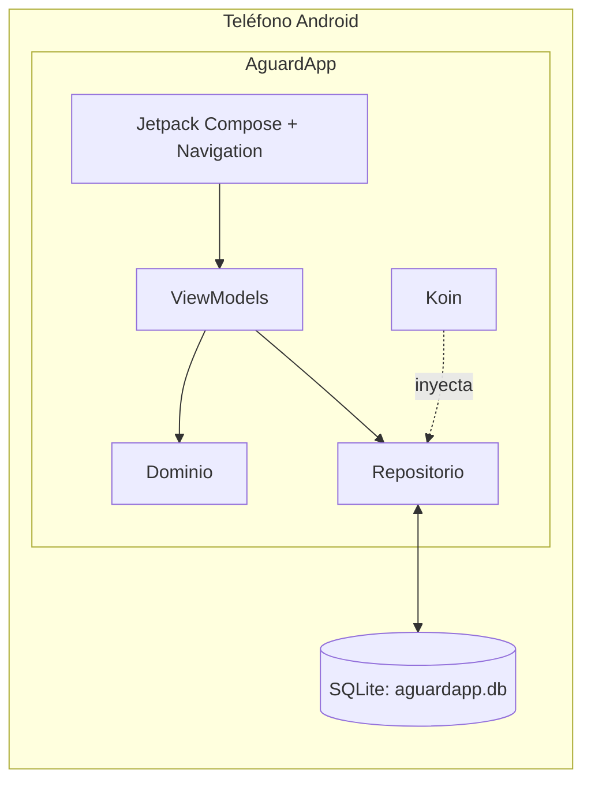

> La aplicación no se conecta a ningún servicio externo.

## 3.4. Vista de procesos

### 3.4.1. Diagrama de actividad del sistema

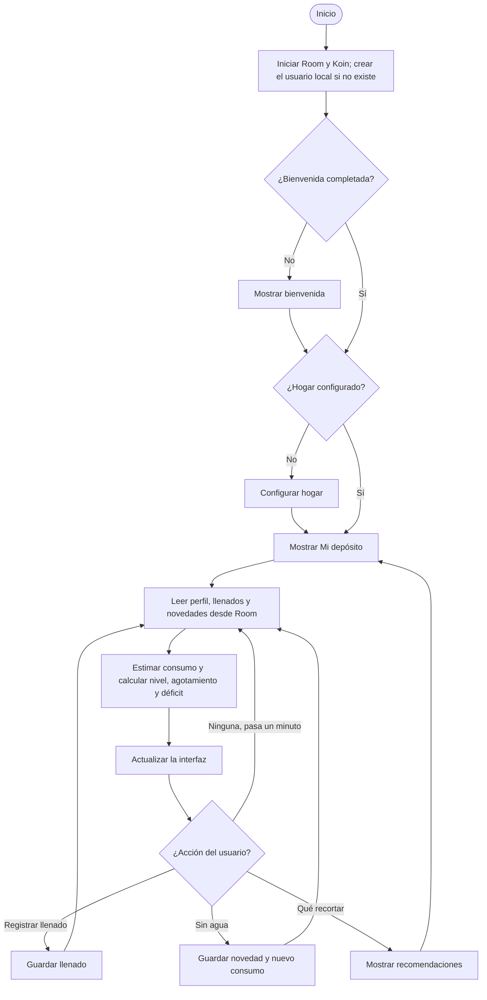

Las operaciones con la base de datos se ejecutan en corrutinas fuera del hilo principal; las pantallas observan `StateFlow` y se recomponen solo cuando cambia su estado.

## 3.5. Vista de despliegue — vista física

### 3.5.1. Diagrama de despliegue

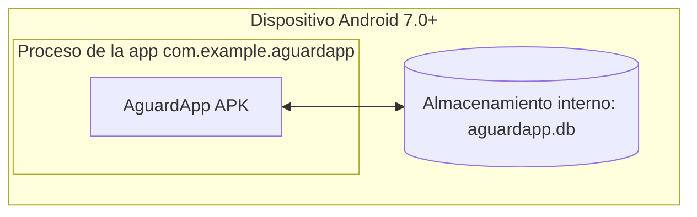

La aplicación se distribuye como un único APK. No requiere servidor, cuenta de usuario ni conexión a internet.

---

# 4. Atributos de calidad del software

## 4.1. Escenario de funcionalidad

Los atributos de calidad (QA) son propiedades medibles que indican en qué grado el sistema satisface las necesidades de sus interesados. AguardApp entrega de forma completa las funciones del módulo Depósito: configurar el hogar, registrar llenados, consultar el nivel y el déficit, ver qué recortar y declarar que se quedó sin agua.

## 4.2. Escenario de usabilidad

Un usuario sin experiencia configura su hogar y registra un llenado en menos de un minuto: los controles son botones grandes, el formulario muestra el error exacto debajo de cada campo y el botón Guardar solo se habilita cuando todo es válido. El diseño usa colores sólidos y una sola fuente para facilitar la lectura.

## 4.3. Escenario de confiabilidad

Sin conexión, la aplicación funciona igual porque no depende de la red. Las validaciones del dominio y del repositorio impiden datos incoherentes (llenados en el futuro, litros mayores que la capacidad, agotamientos anteriores al último llenado), y el tope de ±30 % evita que un error del usuario desordene la estimación del consumo.

## 4.4. Escenario de rendimiento

Todas las consultas se resuelven en la base local; los cálculos (nivel, agotamiento, déficit) son operaciones simples en memoria. La pantalla Mi depósito se refresca cada minuto sin bloquear la interfaz.

## 4.5. Escenario de mantenibilidad

El dominio es Kotlin puro y no depende de Android, por lo que puede probarse con pruebas unitarias simples. Cada pantalla tiene solo dos archivos (Screen y ViewModel), y la inyección de dependencias está en un único módulo de Koin, lo que facilita agregar nuevas funcionalidades.

## 4.6. Otros escenarios

**Privacidad:** la aplicación no declara permisos en el `AndroidManifest.xml` y ningún dato sale del dispositivo, en línea con la privacidad por diseño de la Ley N.° 29733.
