# FD04 — Documento de Arquitectura de Software (SAD)

## Proyecto AguardApp

**Sistema:** AguardApp — sistema móvil para la gestión de la reserva domiciliaria de agua y la anticipación de cortes durante el racionamiento hídrico en Tacna.  
**Curso:** Soluciones Móviles I  
**Docente:** Mag. Alberto Johnatan Flor Rodríguez  
**Versión:** 1.0  
**Fecha:** 30/09/2026  
**Lugar:** Tacna — Perú, 2026

### Integrantes

- Jahuira Pilco, Dayan Elvis (2022075749)
- Llica Mamani, Jimmy Mijair (2023076789)
- Mamani Cori, Cristhian Carlos (2023077282)
- Sierra Ruiz, Iker Alberto (2023077090)

---

## Control de versiones

| Versión | Hecha por | Revisada por | Aprobada por | Fecha | Motivo |
|---|---|---|---|---|---|
| 1.0 | DJ - JL - CM - IS | AFR | AFR | 30/09/2026 | Versión original |

---

# 1. Introducción

## 1.1. Propósito — Modelo 4+1

Este documento presenta una visión global de la arquitectura del sistema AguardApp utilizando el modelo de vistas 4+1 de Kruchten. Describe las decisiones arquitectónicas significativas mediante cinco vistas complementarias: casos de uso, lógica, implementación o desarrollo, procesos y despliegue físico.

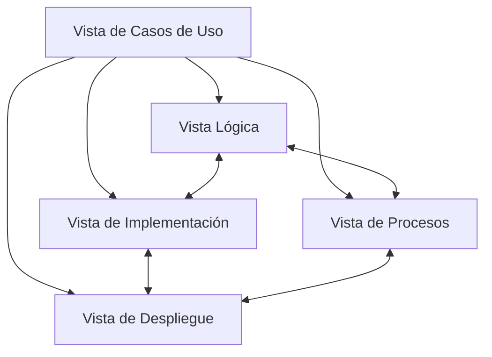

## 1.2. Alcance

El documento se centra en las vistas arquitectónicas del sistema AguardApp: la organización lógica en capas y paquetes, la interacción entre objetos, el modelo de datos, los componentes de implementación, los procesos y el despliegue físico. Sirve de guía para el desarrollo y el mantenimiento del sistema.

## 1.3. Definiciones, siglas y abreviaturas

| Término | Definición |
|---|---|
| SAD | Software Architecture Document (Documento de Arquitectura de Software). |
| Modelo 4+1 | Modelo de Kruchten con cinco vistas arquitectónicas complementarias. |
| KMP | Kotlin Multiplatform, para compartir código entre Android e iOS. |
| MVVM | Model-View-ViewModel, patrón de la capa de presentación. |
| QA | Quality Attribute (atributo de calidad del software). |
| RLS | Row Level Security (seguridad a nivel de fila). |
| Room | Biblioteca de persistencia local sobre SQLite. |
| Supabase | Plataforma en la nube: PostgreSQL, autenticación y API REST. |

## 1.4. Organización del documento

El documento se organiza en cuatro secciones: introducción; objetivos y restricciones arquitectónicas; representación de la arquitectura mediante las vistas del modelo 4+1; y atributos de calidad del software.

---

# 2. Objetivos y restricciones arquitectónicas

## 2.1. Priorización de requerimientos

### 2.1.1. Requerimientos funcionales

| ID | Descripción | Prioridad |
|---|---|---|
| RF-01 | Registrar el domicilio y asociarlo a su sector | Alta |
| RF-02 | Consultar el sector y la continuidad del servicio | Alta |
| RF-03 | Consultar el cronograma y el próximo abastecimiento | Alta |
| RF-04 | Configurar el perfil del hogar y su reservorio | Alta |
| RF-05 | Registrar el llenado de la reserva | Alta |
| RF-06 | Calcular la reserva, su agotamiento y el déficit | Alta |
| RF-07 | Recomendar recortes de consumo | Media |
| RF-08 | Ver las cisternas cercanas en el mapa | Alta |
| RF-09 | Confirmar la llegada o el corte del agua | Alta |
| RF-10 | Estimar el horario con las confirmaciones | Media |
| RF-11 | Operar sin conexión y sincronizar con la nube | Alta |
| RF-12 | Emitir alertas de corte y de agotamiento | Media |
| RF-13 | Digitalizar el recibo y consultar el historial | Media |
| RF-14 | Proponer retos de ahorro y su racha | Baja |
| RF-15 | Registrar reportes ciudadanos de incidencias | Baja |

### 2.1.2. Requerimientos no funcionales — atributos de calidad

| ID | Atributo | Descripción | Prioridad |
|---|---|---|---|
| RNF-01 | Disponibilidad | La aplicación opera al 100 % sin conexión, con la base local como fuente de verdad, y sincroniza en menos de 5 segundos al recuperar la red. | Alta |
| RNF-02 | Seguridad y privacidad | Seguridad por fila (RLS), HTTPS/TLS y UUID local; en el servidor solo se guarda el sector, nunca la coordenada exacta (Ley N.° 29733). | Alta |
| RNF-03 | Usabilidad | Interfaz intuitiva, con iconos claros y flujos simples, apta para adultos mayores. | Alta |
| RNF-04 | Portabilidad | Compatible con Android 8.0 o superior e iOS con un solo código (Kotlin Multiplatform). | Media |
| RNF-05 | Mantenibilidad | Arquitectura limpia con el dominio independiente de frameworks, archivos de hasta 150 líneas y cobertura de dominio de al menos 70 %. | Alta |

## 2.2. Restricciones

- La arquitectura debe permitir la operación sin conexión, con la base de datos local como única fuente de verdad.
- El dominio debe ser independiente de frameworks (Room, Ktor, Koin, Android o iOS).
- Solo se pueden usar tecnologías gratuitas y de código abierto; el backend es Supabase en su plan gratuito.
- La persistencia se realiza con Room y esquema versionado; la comunicación con la nube, con Ktor/PostgREST sobre HTTPS.
- Las capacidades de plataforma se resuelven con `expect/actual`, nunca con condicionales dentro del código común.

---

# 3. Representación de la arquitectura del sistema

## 3.1. Vista de casos de uso

Actores principales: jefe de hogar, usuario invitado y vecino colaborador.

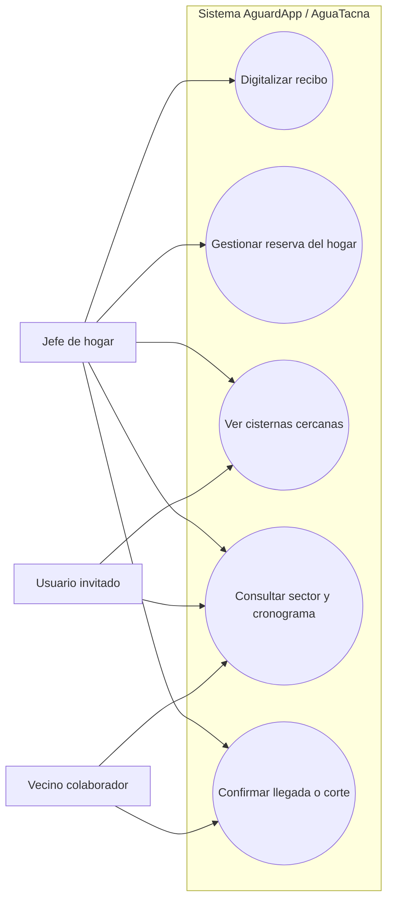

## 3.2. Vista lógica

### 3.2.1. Diagrama de subsistemas / paquetes

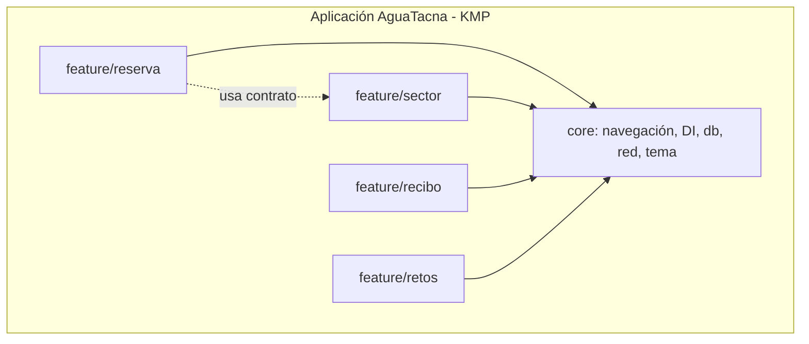

### 3.2.2. Diagramas de secuencia — vista de diseño

> Los siguientes diagramas Mermaid reorganizan los flujos mostrados en el informe original para que sean versionables y legibles en Markdown.

#### Módulo 1: Sesión, onboarding y bienvenida

##### 1.1. Verificación de estado de sesión y onboarding

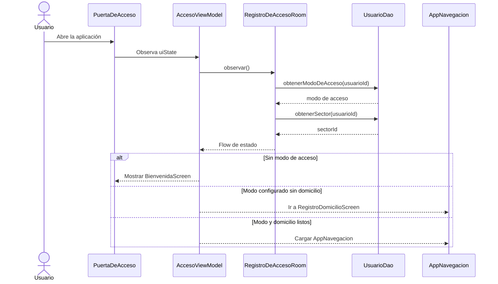

##### 1.2. Inicio de sesión anónimo — Empezar sin cuenta

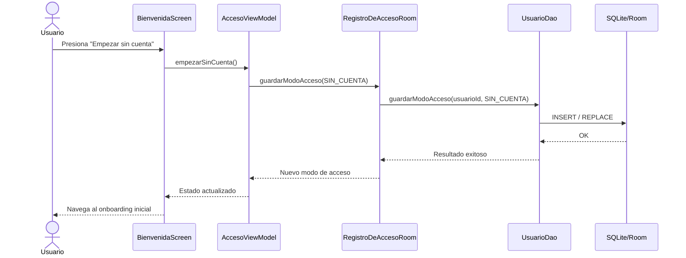

##### 1.3. Inicio de sesión con Google

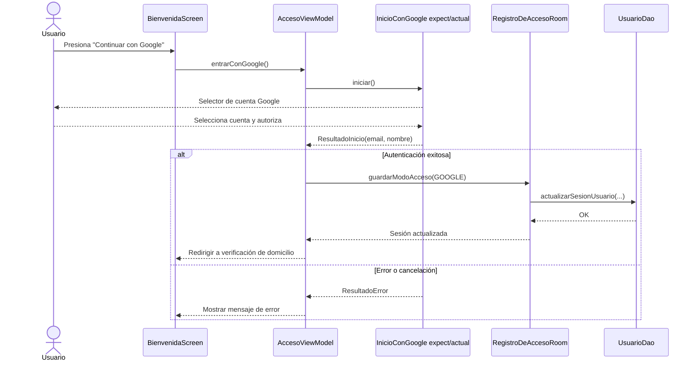

#### Módulo 2: Reserva — Gestión hídrica del hogar

##### 2.1. Configuración inicial del hogar

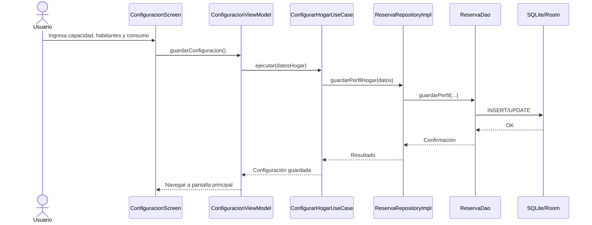

##### 2.2. Registro de evento de llenado

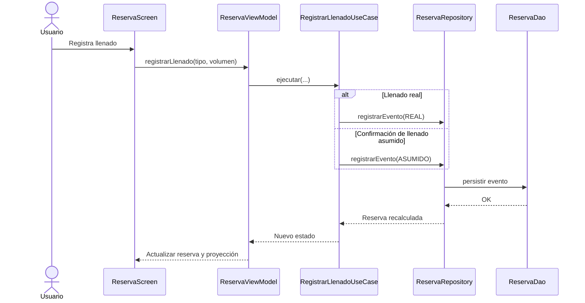

##### 2.3. Monitoreo reactivo y proyección continua de agotamiento

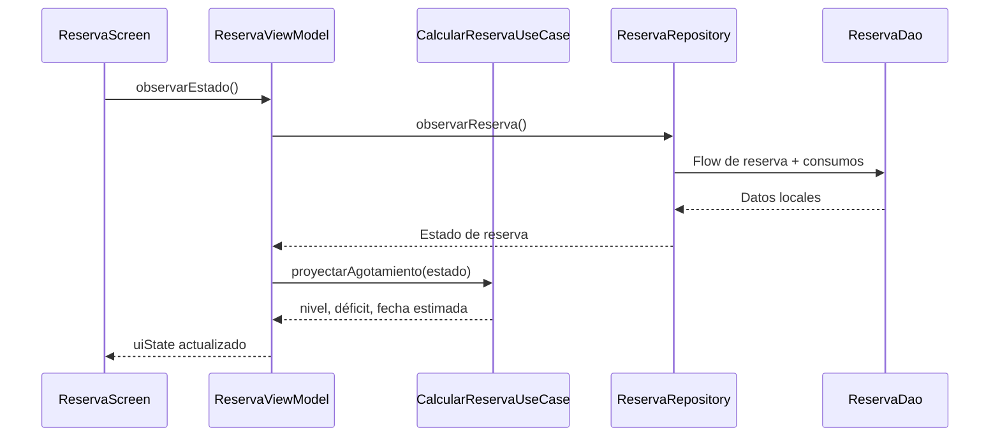

##### 2.4. Declaración de agotamiento real y recalibración

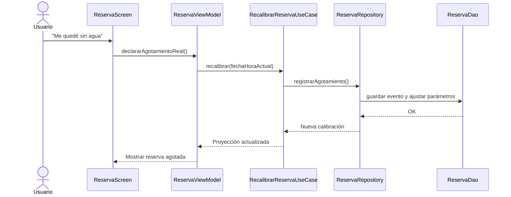

##### 2.5. Simulación y sugerencia de recortes de consumo

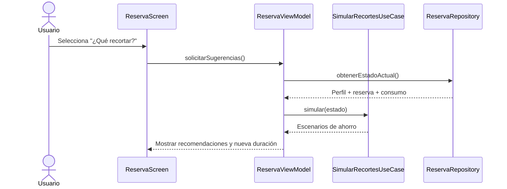

##### 2.6. Tarea periódica de recálculo y avisos preventivos

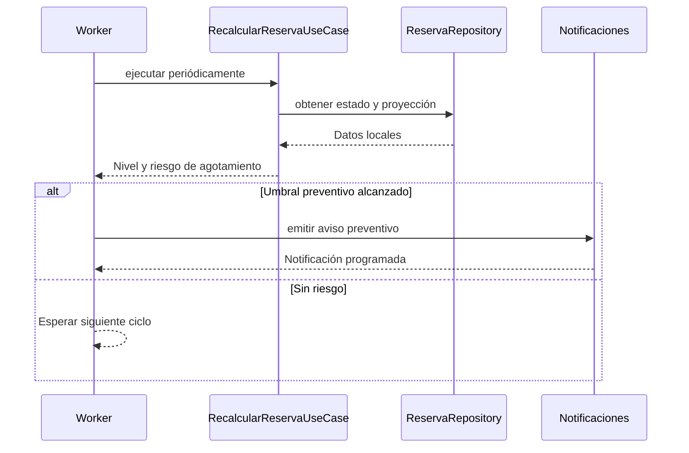

##### 2.7. Sincronización en la nube con Supabase

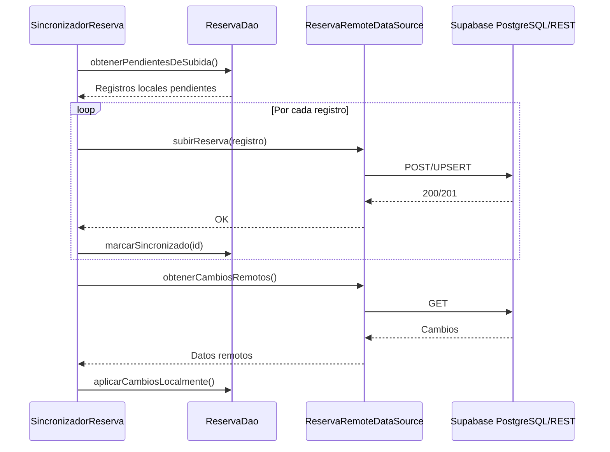

#### Módulo 3: Sector y abastecimiento — horarios y cisternas

##### 3.1. Detección espacial y registro de domicilio / sector

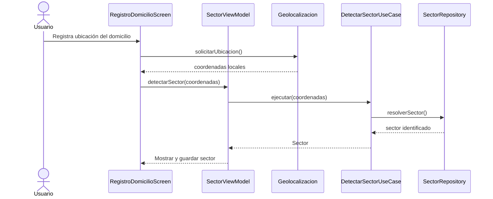

##### 3.2. Consulta de cronograma vigente y próximo abastecimiento

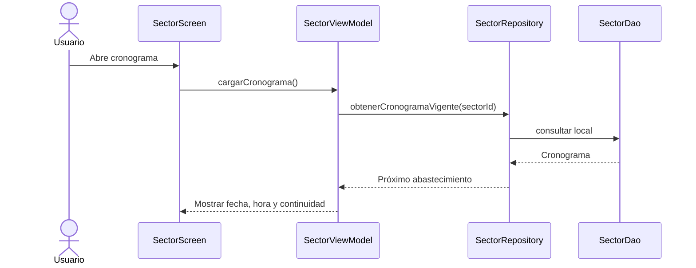

##### 3.3. Confirmación colaborativa comunitaria — llegada / corte

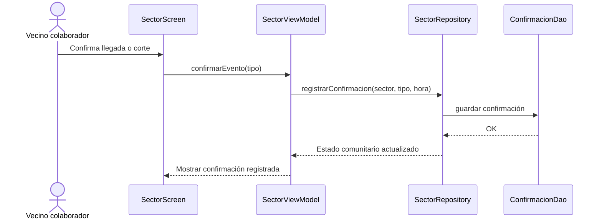

##### 3.4. Consolidación algorítmica del cronograma colaborativo por mediana

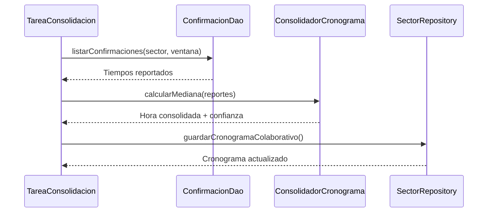

##### 3.5. Búsqueda y localización espacial de puntos de cisterna

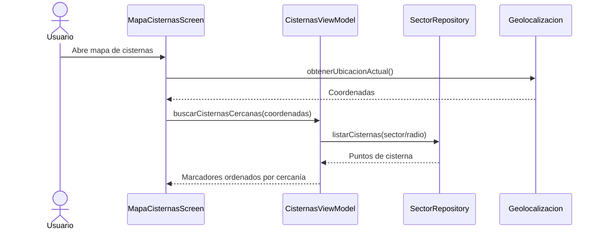

##### 3.6. Sincronización remota de sectores y cronogramas con Supabase

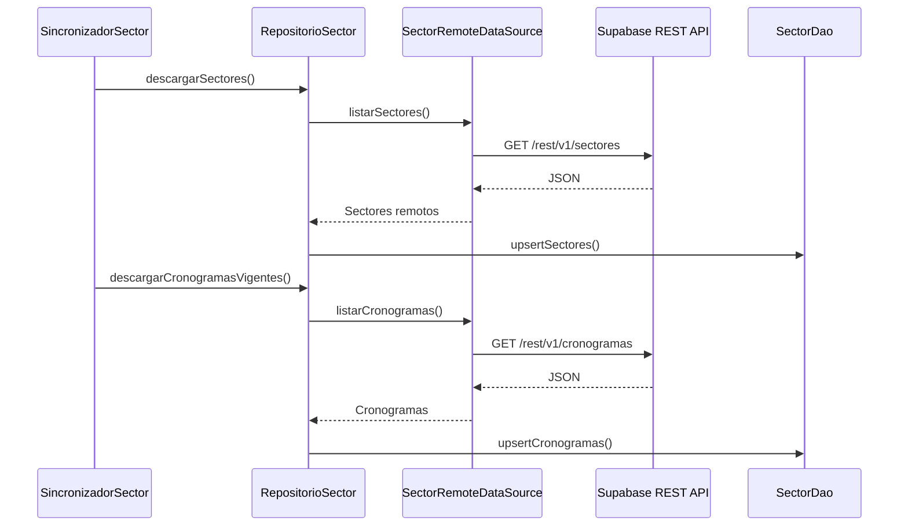

#### Módulo 4: Recibo y digitalización — OCR y facturación EPS Tacna

##### 4.1. Captura fotográfica y procesamiento OCR del recibo físico

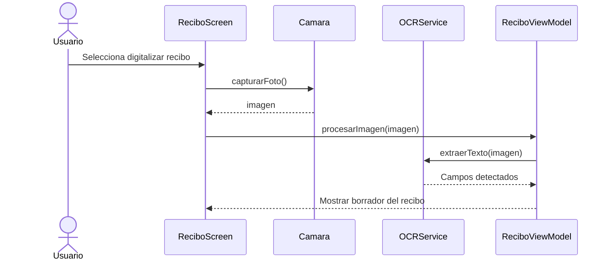

##### 4.2. Revisión asistida y corrección de campos del borrador

```mermaid
sequenceDiagram
    actor U as Usuario
    participant S as EditarReciboScreen
    participant VM as ReciboViewModel
    participant VAL as ValidadorRecibo
    U->>S: Revisa campos OCR
    U->>S: Corrige datos
    S->>VM: actualizarBorrador(campos)
    VM->>VAL: validarFormato(campos)
    VAL-->>VM: Errores / válido
    VM-->>S: Mostrar validaciones
```

##### 4.3. Confirmación, validación estricta y guardado del recibo

```mermaid
sequenceDiagram
    actor U as Usuario
    participant S as EditarReciboScreen
    participant VM as ReciboViewModel
    participant UC as GuardarReciboUseCase
    participant R as ReciboRepository
    participant DAO as ReciboDao
    U->>S: Confirma recibo
    S->>VM: guardar()
    VM->>UC: validarYGuardar(borrador)
    UC->>UC: validación estricta
    alt Datos válidos
      UC->>R: guardarRecibo()
      R->>DAO: insert()
      DAO-->>R: OK
      R-->>UC: Guardado
      UC-->>VM: Éxito
      VM-->>S: Recibo confirmado
    else Datos inválidos
      UC-->>VM: Lista de errores
      VM-->>S: Solicitar corrección
    end
```

##### 4.4. Registro manual de lectura de medidor cúbico

```mermaid
sequenceDiagram
    actor U as Usuario
    participant S as MedidorScreen
    participant VM as ReciboViewModel
    participant R as ReciboRepository
    participant DAO as LecturaMedidorDao
    U->>S: Ingresa lectura en m³
    S->>VM: registrarLectura(valor, fecha)
    VM->>R: guardarLectura()
    R->>DAO: insert()
    DAO-->>R: OK
    R-->>VM: Historial actualizado
    VM-->>S: Mostrar nueva lectura
```

##### 4.5. Consulta histórica de consumo y detección de consumo atípico

```mermaid
sequenceDiagram
    actor U as Usuario
    participant S as HistorialConsumoScreen
    participant VM as ReciboViewModel
    participant R as ReciboRepository
    participant ALG as DetectorConsumoAtipico
    U->>S: Abre historial
    S->>VM: cargarHistorial()
    VM->>R: listarConsumos()
    R-->>VM: Serie histórica
    VM->>ALG: analizar(consumos)
    ALG-->>VM: Tendencia + posibles atípicos
    VM-->>S: Mostrar historial y alertas
```

##### 4.6. Sincronización bidireccional de recibos con Supabase

```mermaid
sequenceDiagram
    participant SYNC as SincronizadorRecibo
    participant DAO as ReciboDao
    participant API as ReciboRemoteDataSource
    participant SB as Supabase/PostgreSQL
    SYNC->>DAO: obtenerPendientes()
    DAO-->>SYNC: Recibos locales
    SYNC->>API: subirRecibos()
    API->>SB: POST/UPSERT
    SB-->>API: OK
    API-->>SYNC: Sincronizados
    SYNC->>API: descargarCambios()
    API->>SB: GET
    SB-->>API: Recibos remotos
    API-->>SYNC: Cambios
    SYNC->>DAO: fusionarCambios()
```

#### Módulo 5: Asistente hídrico inteligente — n8n e IA

##### 5.1. Envío de pregunta ciudadana y consulta a webhook n8n

```mermaid
sequenceDiagram
    actor U as Usuario
    participant S as AsistenteScreen
    participant VM as AsistenteViewModel
    participant API as AsistenteRepository
    participant N8N as Webhook n8n
    U->>S: Escribe pregunta
    S->>VM: enviarPregunta(texto)
    VM->>API: consultarAsistente(texto, contexto)
    API->>N8N: POST webhook
    N8N-->>API: Respuesta IA
    API-->>VM: Mensaje de respuesta
    VM-->>S: Mostrar respuesta
```

##### 5.2. Observación reactiva de conversación y estado escribiendo

```mermaid
sequenceDiagram
    participant S as AsistenteScreen
    participant VM as AsistenteViewModel
    participant R as ConversacionRepository
    participant FLOW as EstadoConversacion
    S->>VM: observarConversacion()
    VM->>R: mensajesFlow()
    R->>FLOW: observar()
    FLOW-->>R: mensajes + estadoEscribiendo
    R-->>VM: Estado reactivo
    VM-->>S: Re-componer interfaz
```

##### 5.3. Limpieza y reinicio de la conversación

```mermaid
sequenceDiagram
    actor U as Usuario
    participant S as AsistenteScreen
    participant VM as AsistenteViewModel
    participant R as ConversacionRepository
    participant DAO as MensajeDao
    U->>S: Selecciona limpiar conversación
    S->>VM: limpiar()
    VM->>R: eliminarMensajes()
    R->>DAO: deleteAll()
    DAO-->>R: OK
    R-->>VM: Conversación vacía
    VM-->>S: Reiniciar estado visual
```

#### Módulo 6: Retos y reportes ciudadanos — gamificación y comunidad

##### 6.1. Consulta de retos semanales y posición relativa en el sector

```mermaid
sequenceDiagram
    actor U as Usuario
    participant S as RetosScreen
    participant VM as RetosViewModel
    participant R as RetosRepository
    participant DAO as RetosDao
    U->>S: Abre retos
    S->>VM: cargarRetosSemana()
    VM->>R: obtenerRetos(sector)
    R->>DAO: consultarRetosYProgreso()
    DAO-->>R: Retos + puntos
    R-->>VM: Retos y posición relativa
    VM-->>S: Mostrar retos y ranking relativo
```

##### 6.2. Marcado de reto cumplido y recálculo de racha

```mermaid
sequenceDiagram
    actor U as Usuario
    participant S as RetosScreen
    participant VM as RetosViewModel
    participant UC as CompletarRetoUseCase
    participant R as RetosRepository
    U->>S: Marca reto cumplido
    S->>VM: completarReto(id)
    VM->>UC: ejecutar(id)
    UC->>R: guardarProgreso()
    R-->>UC: Historial actualizado
    UC->>UC: recalcularRacha()
    UC-->>VM: Racha + puntos
    VM-->>S: Actualizar progreso
```

##### 6.3. Generación y registro de reporte ciudadano con evidencia fotográfica

```mermaid
sequenceDiagram
    actor U as Usuario
    participant S as ReporteScreen
    participant CAM as Camara
    participant VM as ReportesViewModel
    participant R as ReportesRepository
    participant DAO as ReporteDao
    U->>S: Crea reporte de incidencia
    S->>CAM: capturarEvidencia()
    CAM-->>S: Foto
    S->>VM: enviarReporte(tipo, descripción, ubicación, foto)
    VM->>R: registrarReporte()
    R->>DAO: guardar reporte local
    DAO-->>R: OK
    R-->>VM: Reporte registrado
    VM-->>S: Mostrar confirmación
```

##### 6.4. Exploración de incidencias en el mapa comunitario

```mermaid
sequenceDiagram
    actor U as Usuario
    participant M as MapaComunitarioScreen
    participant VM as ReportesViewModel
    participant R as ReportesRepository
    U->>M: Abre mapa comunitario
    M->>VM: cargarIncidencias(zona)
    VM->>R: listarReportes(zona)
    R-->>VM: Incidencias vigentes
    VM-->>M: Marcadores de incidencias
    U->>M: Selecciona marcador
    M-->>U: Detalle del reporte
```

### 3.2.3. Diagrama de colaboración

```mermaid
flowchart TB
    S[SectorScreen]
    VM[SectorViewModel]
    R[SectorRepository]
    ROOM[(Room)]
    SB[(Supabase)]

    S -- confirmarLlegada / confirmarCorte --> VM
    VM -- registrar confirmación --> R
    R -- guardar --> ROOM
    R -- sincronizar --> SB
    ROOM -- datos locales --> R
    SB -- cambios remotos --> R
    R -- estado actualizado --> VM
    VM -- UI State --> S
```

### 3.2.4. Diagrama de objetos

```mermaid
classDiagram
    class sectorCH04 {
      idSector = CH-04
      nombre = Ciudad Nueva 04
      distrito = Ciudad Nueva
    }
    class cronogramaHoy {
      fuente = EPS
      turno = mañana
      fecha
    }
    class cisternaMercado {
      ubicacion = PuntoCisterna
      estado = TERMINADO
    }
    class centro {
      coordenada
    }
    sectorCH04 --> cronogramaHoy
    sectorCH04 --> cisternaMercado
    sectorCH04 --> centro
```

### 3.2.5. Diagrama de clases

```mermaid
classDiagram
    class SectorRepositoryImpl
    class SectorRepository {
      <<interface>>
      +obtenerSectores()
      +obtenerCronogramas()
      +registrarConfirmacion()
    }
    class Sector {
      +String id
      +String nombre
      +String distrito
    }
    class Cronograma {
      +String id
      +LocalDate fecha
      +LocalTime horaInicio
      +LocalTime horaFin
    }
    class PuntoCisterna {
      +String id
      +String nombre
      +LatLng ubicacion
    }
    class ConfirmacionVecinal {
      +String id
      +LocalDateTime instante
      +String tipo
    }

    SectorRepositoryImpl ..|> SectorRepository
    SectorRepository --> Sector
    Sector "1" --> "*" Cronograma
    Sector "1" --> "*" PuntoCisterna
    Sector "1" --> "*" ConfirmacionVecinal
```

### 3.2.6. Diagrama de base de datos

```mermaid
erDiagram
    SECTOR ||--o{ CRONOGRAMA : tiene
    SECTOR ||--o{ PUNTO_CISTERNA : contiene
    SECTOR ||--o{ CONFIRMACION_VECINAL : recibe
    PERFIL_HOGAR ||--o{ RESERVA_EVENTO : registra
    PERFIL_HOGAR ||--o{ RECIBO : posee

    SECTOR {
      string id PK
      string nombre
      string distrito
      string estado
      int version
    }
    CRONOGRAMA {
      string id PK
      string sector_id FK
      date fecha
      time hora_inicio
      time hora_fin
      string fuente
    }
    PUNTO_CISTERNA {
      string id PK
      string sector_id FK
      string nombre
      float latitud
      float longitud
      string estado
    }
    CONFIRMACION_VECINAL {
      string id PK
      string sector_id FK
      string tipo
      datetime fecha_hora
    }
    PERFIL_HOGAR {
      string usuario_id PK
      float reservorio_litros
      int habitantes
    }
    RESERVA_EVENTO {
      string id PK
      string usuario_id FK
      string tipo
      datetime fecha_hora
      float litros
    }
    RECIBO {
      string id PK
      string usuario_id FK
      date periodo
      float consumo_m3
      float importe
    }
```

## 3.3. Vista de implementación — desarrollo

### 3.3.1. Diagrama de arquitectura de software / paquetes

```mermaid
flowchart LR
    subgraph P[Capa de Presentación - MVVM]
      UI[Compose Multiplatform]
      VM[ViewModels]
    end
    subgraph D[Capa de Datos]
      REP[Repositorios]
      ROOM[Room]
      NET[Sincronización / Ktor]
    end
    subgraph DOM[Capa de Dominio pura]
      MOD[Modelos]
      UC[Casos de uso]
    end

    UI --> VM
    VM --> UC
    UC --> REP
    REP --> ROOM
    REP --> NET
    REP --> MOD
    UC --> MOD
```

### 3.3.2. Diagrama de arquitectura del sistema / componentes

```mermaid
flowchart LR
    subgraph DEVICE[Dispositivo móvil]
      APP[App AguardApp - KMP / Compose]
      LOCAL[(Room / SQLite local)]
      APP <--> LOCAL
    end

    subgraph EXT[Servicios externos]
      OSM[OpenStreetMap]
      GOOGLE[Google Identity]
    end

    subgraph CLOUD[Supabase Cloud]
      PG[(PostgreSQL + RLS)]
      AUTH[Supabase Auth]
    end

    APP -- OAuth --> GOOGLE
    APP -- mapas --> OSM
    APP -- HTTPS / PostgREST --> PG
    APP -- HTTPS --> AUTH
```

## 3.4. Vista de procesos

### 3.4.1. Diagrama de actividad del sistema

```mermaid
flowchart TD
    A([Inicio]) --> B[El usuario configura o consulta su hogar]
    B --> C[El sistema obtiene información local]
    C --> D[Determina sector / reserva / cronograma]
    D --> E{¿Hay Internet?}
    E -- No --> F[Trabajar con fuente local]
    E -- Sí --> G[Sincronizar datos remotos]
    F --> H[Actualizar interfaz]
    G --> H
    H --> I[Notificar cambios o alertas]
    I --> J([Fin])
```

## 3.5. Vista de despliegue — vista física

### 3.5.1. Diagrama de despliegue

```mermaid
flowchart TB
    subgraph MOBILE[Mobile: Android / iOS]
      APP[App KMP]
      ROOM[(Room / SQLite)]
      APP <--> ROOM
    end

    subgraph EXTERNAL[Servicios externos]
      OSM[OpenStreetMap]
      GID[Google Identity]
    end

    subgraph SUPA[Supabase Cloud]
      DB[(PostgreSQL + RLS)]
      AUTH[Supabase Auth]
    end

    APP -- HTTPS --> OSM
    APP -- HTTPS --> GID
    APP -- HTTPS / REST --> DB
    APP -- HTTPS --> AUTH
```

---

# 4. Atributos de calidad del software

## 4.1. Escenario de funcionalidad

Los atributos de calidad (QA) son propiedades medibles que indican en qué grado el sistema satisface las necesidades de sus interesados.

## 4.2. Escenario de usabilidad

El sistema entrega las funciones núcleo —consulta de sector y cronograma, gestión de la reserva, cisternas y confirmación colaborativa— de forma completa y coherente, incluso sin conexión, tomando los datos locales como fuente de verdad.

## 4.3. Escenario de confiabilidad

Ante la pérdida de conexión, la aplicación sigue funcionando con los datos locales y sincroniza automáticamente al recuperar la red. La seguridad por fila garantiza que cada usuario acceda solo a sus datos, y el esquema versionado evita la pérdida de información en las migraciones.

## 4.4. Escenario de rendimiento

Las consultas de sector, cronograma y reserva se resuelven localmente de forma inmediata. La sincronización con la nube se completa en menos de 5 segundos en condiciones normales de red.

## 4.5. Escenario de mantenibilidad

La arquitectura limpia, con el dominio independiente de frameworks y archivos de hasta 150 líneas, facilita la extensión y el mantenimiento. El uso de `expect/actual` aísla las diferencias de plataforma.

## 4.6. Otros escenarios

El sistema responde a los eventos del usuario sin bloqueos: las operaciones de datos se ejecutan en corrutinas fuera del hilo principal, y la interfaz declarativa (Compose) se recompone solo ante cambios de estado, manteniendo la fluidez.

---

## Nota de conversión

Este archivo Markdown conserva la estructura textual del informe SAD y reemplaza los diagramas gráficos por versiones Mermaid editables. Los diagramas de secuencia fueron reorganizados en una forma semánticamente equivalente y legible para documentación en repositorios.
