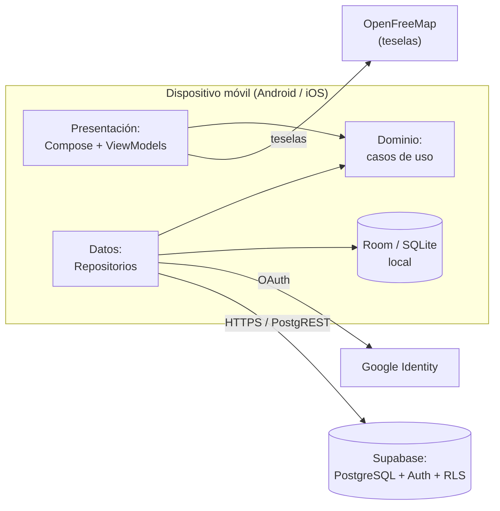
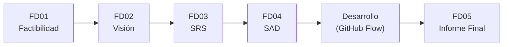
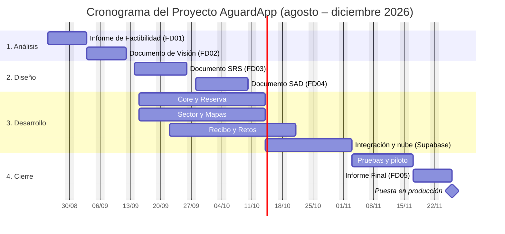
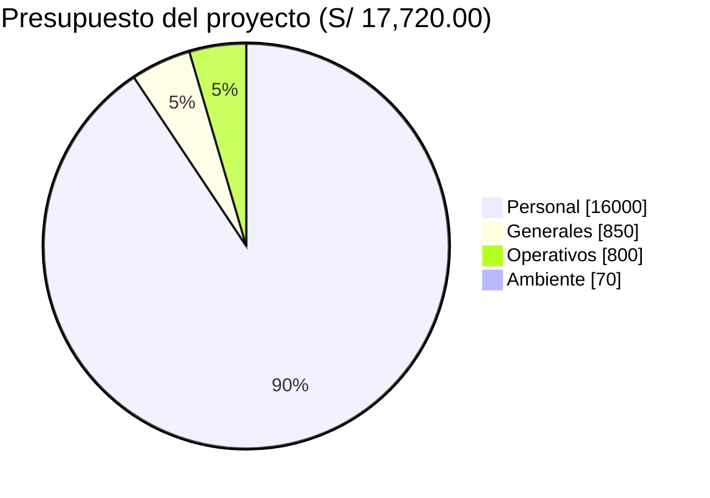

# AguardApp — Informe Final

> **Universidad Privada de Tacna** · Facultad de Ingeniería · Escuela Profesional de Ingeniería de Sistemas
> **Curso:** Soluciones Móviles I · **Docente:** Mag. Alberto Johnatan Flor Rodríguez
> **Proyecto:** AguardApp
> **Versión:** 1.0 · Tacna – Perú, 2026

**Integrantes**

| Integrante | Código |
|---|---|
| Jahuira Pilco, Dayan Elvis | 2022075749 |
| Llica Mamani, Jimmy Mijair | 2023076789 |
| Mamani Cori, Cristhian Carlos | 2023077282 |
| Sierra Ruiz, Iker Alberto | 2023077090 |

## Control de versiones

| Versión | Hecha por | Revisada por | Aprobada por | Fecha | Motivo |
|---|---|---|---|---|---|
| 1.0 | DJ - JL - CM - IS | AFR | AFR | 30/09/2026 | Versión Original |

## Índice

1. [Antecedentes](#1-antecedentes)
2. [Planteamiento del Problema](#2-planteamiento-del-problema)
3. [Objetivos](#3-objetivos)
4. [Marco Teórico](#4-marco-teórico)
5. [Desarrollo de la Solución](#5-desarrollo-de-la-solución)
6. [Cronograma](#6-cronograma)
7. [Presupuesto](#7-presupuesto)
8. [Conclusión](#8-conclusión)
- [Recomendaciones](#recomendaciones)
- [Bibliografía](#bibliografía)
- [Anexos](#anexos)

---

## 1. Antecedentes

El presente documento constituye el Informe Final del proyecto AguardApp, desarrollado por el equipo de desarrollo AguardApp.

AguardApp es una aplicación móvil multiplataforma (Android e iOS) que ayuda a los hogares de Tacna a gestionar su reserva domiciliaria de agua y anticipar los cortes durante el racionamiento del servicio. Este informe consolida el trabajo realizado durante el proyecto, integrando los documentos elaborados en cada etapa: el Informe de Factibilidad (FD01), el Documento de Visión (FD02), la Especificación de Requerimientos de Software (FD03) y el Documento de Arquitectura de Software (FD04), que se adjuntan como anexos.

## 2. Planteamiento del Problema

### 2.1. Problema

La ciudad de Tacna, ubicada en una de las regiones más áridas del Perú, se abastece de agua potable bajo un esquema de racionamiento por sectores, con servicio solo durante algunas horas al día y en horarios que varían por zona. Los hogares no cuentan con información clara y oportuna sobre cuándo llegará el agua a su sector ni sobre cuánta reserva les queda, lo que ocasiona desabastecimiento imprevisto, compra de agua de emergencia a sobreprecio y desperdicio del recurso. La información oficial se difunde de manera dispersa y poco confiable, lo que agrava la mala planificación del consumo.

### 2.2. Justificación

El desarrollo de AguardApp se justifica por la necesidad de poner en manos del ciudadano información confiable y anticipada sobre el abastecimiento de agua. Desde la perspectiva social, reduce la incertidumbre y el estrés de las familias y fomenta la organización vecinal mediante un modelo colaborativo. Desde la perspectiva económica, disminuye los gastos por compra de agua de emergencia. Desde la perspectiva ambiental, promueve el ahorro y el consumo responsable de un recurso escaso. Y desde la perspectiva técnica, demuestra la viabilidad de una solución multiplataforma, gratuita y con operación sin conexión, construida con buenas prácticas de ingeniería de software.

### 2.3. Alcance

**Dentro del alcance del proyecto se considera:**

- Gestión de la reserva del hogar: nivel actual, proyección de agotamiento y recomendaciones de ahorro.
- Asociación del domicilio a su sector, con cronograma de abastecimiento y cisternas cercanas sobre un mapa.
- Modelo colaborativo de confirmación de la llegada y el corte del agua.
- Operación sin conexión (Room) con sincronización en la nube (Supabase).
- Digitalización del recibo de EPS Tacna y retos de ahorro.

**Fuera del alcance del proyecto se considera:**

- El panel administrativo web para la carga masiva de sectorización por parte de la EPS.
- La integración con los sistemas internos de EPS Tacna y la paridad total de funcionalidades en iOS.

El proyecto se ejecuta entre agosto y diciembre de 2026, con una inversión estimada de S/ 17,720.00 cubierta con recursos propios del equipo.

## 3. Objetivos

### 3.1. Objetivo general

Desarrollar una aplicación móvil que permita a los hogares de Tacna planificar y optimizar el uso de su reserva domiciliaria de agua durante el racionamiento, anticipando los cortes del servicio.

### 3.2. Objetivos específicos

- **Gestionar la reserva del hogar:** calcular el nivel de la reserva, proyectar su agotamiento y recomendar recortes de consumo.
- **Asociar el domicilio a su sector:** asociar el domicilio al sector y mostrar su cronograma y los puntos de cisterna cercanos.
- **Implementar el modelo colaborativo:** estimar el horario del sector a partir de las confirmaciones de los vecinos.
- **Operar sin conexión:** funcionar sin conexión y sincronizar con la nube garantizando la privacidad de los datos.

## 4. Marco Teórico

### Racionamiento del agua y gestión del recurso hídrico

El racionamiento del agua es una medida de distribución del servicio por horarios y zonas ante la escasez del recurso. En ciudades como Tacna, de clima desértico, el acceso al agua potable es intermitente, lo que exige a los hogares planificar su reserva. La gestión eficiente del recurso hídrico a nivel domiciliario requiere información oportuna sobre el abastecimiento y el consumo.

### Desarrollo móvil multiplataforma (Kotlin Multiplatform y Compose)

Kotlin Multiplatform (KMP) permite compartir la lógica de negocio entre Android e iOS con un solo código, mientras que Compose Multiplatform ofrece una interfaz declarativa común. Este enfoque reduce el tiempo y el costo de desarrollo y facilita el mantenimiento de la aplicación.

### Arquitectura limpia y diseño offline-first

La arquitectura limpia separa el sistema en capas (presentación, dominio y datos) con el dominio independiente de frameworks, lo que facilita las pruebas y la portabilidad. El diseño offline-first establece la base de datos local (Room) como única fuente de verdad, tratando la red como un mecanismo de sincronización; así la aplicación funciona aun sin conexión, requisito esencial en los sectores periféricos.

### Backend en la nube y seguridad (Supabase y RLS)

Supabase es una plataforma en la nube que ofrece una base de datos PostgreSQL, autenticación y una API REST automática. La seguridad a nivel de fila (Row Level Security, RLS) garantiza que cada usuario acceda únicamente a sus propios datos, cumpliendo con la privacidad por diseño exigida por la Ley N.° 29733.

### Sistemas colaborativos de datos

Los sistemas colaborativos obtienen información de los propios usuarios (crowdsourcing). En AguardApp, los vecinos confirman la llegada y el corte del agua, y el sistema estima el horario del sector mediante la mediana de las confirmaciones, un estadístico robusto frente a reportes erróneos.

## 5. Desarrollo de la Solución

### 5.1. Análisis de Factibilidad (técnico, económica, operativa, social, legal, ambiental)

| Dimensión | Resultado | Sustento |
|---|---|---|
| Técnica | **Factible** | El equipo domina las tecnologías seleccionadas (todas gratuitas y de código abierto) y cuenta con un producto mínimo viable operativo que valida la arquitectura, incluyendo la pantalla de sector con mapa, la gestión de la reserva y la sincronización real con Supabase. |
| Económica | **Viable** | La inversión estimada es de S/ 17,720.00, con un VAN de S/ 3,176.00, una TIR del 22.2 % y una relación beneficio/costo de 1.14, según el Informe de Factibilidad (FD01). |
| Operativa | **Factible** | La aplicación es intuitiva, funciona sin conexión y no requiere personal adicional para su operación; los hogares la usan con un teléfono de gama básica. |
| Social | **Positiva** | Promueve el acceso equitativo al agua, la organización vecinal y el consumo responsable, contribuyendo a los ODS 6, 9, 11 y 12. |
| Legal | **Factible** | Cumple la Ley N.° 29733 de Protección de Datos Personales mediante la privacidad por diseño (almacenamiento a nivel de sector y seguridad por fila) y utiliza software libre conforme a sus licencias. |
| Ambiental | **Positiva** | Incentiva el ahorro y evita el desperdicio del agua, un recurso escaso en Tacna, sin generar residuos físicos ni requerir hardware de alto consumo. |

### 5.2. Tecnología de Desarrollo

La solución se construye con un conjunto de tecnologías gratuitas y de código abierto. La siguiente tabla resume el stack y su justificación:

| Capa | Tecnología | Justificación |
|---|---|---|
| Multiplataforma | Kotlin Multiplatform + Compose | Un solo código para Android e iOS. |
| Base de datos local | Room | Operación sin conexión (fuente de verdad). |
| Backend / nube | Supabase (PostgreSQL + Auth) | Base relacional con seguridad por fila; plan gratuito. |
| Cliente HTTP | Ktor + kotlinx.serialization | Comunicación con la nube, multiplataforma. |
| Inyección de dependencias | Koin | Configuración simple del grafo de dependencias. |
| Mapas | MapLibre + OpenFreeMap | Mapas gratuitos, sin llave de API. |

La arquitectura general de la solución se muestra a continuación:

**Figura 1.** Arquitectura general de la solución AguardApp.

### 5.3. Metodología de implementación (Documento de VISIÓN, SRS, SAD)

El desarrollo siguió el flujo de trabajo GitHub Flow (rama por funcionalidad, revisión por pares y una rama principal protegida) y una arquitectura limpia en tres capas con MVVM en la presentación. La ingeniería de requisitos y el diseño se documentaron en tres entregables, adjuntos como anexos:

- **Documento de Visión (FD02):** define el posicionamiento, los interesados, las características (MoSCoW) y las restricciones del producto.
- **Documento SRS (FD03):** especifica los requerimientos funcionales y no funcionales, los procesos y los modelos (casos de uso, clases, secuencia).
- **Documento SAD (FD04):** describe la arquitectura mediante el modelo de vistas 4+1 (lógica, implementación, procesos y despliegue).

Al cierre del proyecto se cuenta con un producto mínimo viable operativo: la vertical de sector completa (registro de domicilio, mi sector, puntos de cisterna y estado sin horario), la gestión de la reserva, la operación sin conexión con Room y la sincronización real con Supabase con seguridad por fila.

## 6. Cronograma

Cronograma del Proyecto AguardApp (agosto – diciembre 2026). Comienzo: mar 25/08/26 · Fin: jue 26/11/26.

| # | Tarea | Duración | Comienzo | Fin | Predecesoras | Recursos |
|---|---|---|---|---|---|---|
| 1 | **1. Análisis** | **15 días** | **mar 25/08/26** | **vie 11/09/26** | | |
| 2 | Informe de Factibilidad (FD01) | 7 días | mar 25/08/26 | mié 02/09/26 | | Equipo Análisis |
| 3 | Documento de Visión (FD02) | 7 días | jue 03/09/26 | vie 11/09/26 | 2 | Equipo Análisis |
| 4 | **2. Diseño** | **20 días** | **lun 14/09/26** | **vie 09/10/26** | | |
| 5 | Documento SRS (FD03) | 10 días | lun 14/09/26 | vie 25/09/26 | 3 | Equipo Diseño |
| 6 | Documento SAD (FD04) | 10 días | lun 28/09/26 | vie 09/10/26 | 5 | Equipo Diseño |
| 7 | **3. Desarrollo** | **35 días** | **mar 15/09/26** | **lun 02/11/26** | | |
| 8 | Core y Reserva | 21 días | mar 15/09/26 | mar 13/10/26 | | Equipo Desarrollo |
| 9 | Sector y Mapas | 21 días | mar 15/09/26 | mar 13/10/26 | | Equipo Desarrollo |
| 10 | Recibo y Retos | 21 días | mar 22/09/26 | mar 20/10/26 | | Equipo Desarrollo |
| 11 | Integración y nube (Supabase) | 14 días | mié 14/10/26 | lun 02/11/26 | 8 | Equipo Backend |
| 12 | **4. Cierre** | **24 días** | **mar 03/11/26** | **jue 26/11/26** | | |
| 13 | Pruebas y piloto | 10 días | mar 03/11/26 | lun 16/11/26 | 11 | Equipo QA |
| 14 | Informe Final (FD05) | 7 días | mar 17/11/26 | mié 25/11/26 | 13 | Equipo Dirección |
| 15 | Puesta en producción | 0 días | jue 26/11/26 | jue 26/11/26 | 14 | Equipo TI |

## 7. Presupuesto

El presupuesto del proyecto, detallado en el Informe de Factibilidad, se resume a continuación. El costo principal corresponde al recurso humano, dado que las herramientas empleadas son gratuitas.

| Categoría | Total (S/) |
|---|---:|
| Costos de personal (4 desarrolladores x 4 meses) | 16,000.00 |
| Costos generales (útiles, impresiones, equipo de pruebas) | 850.00 |
| Costos operativos durante el desarrollo (internet, energía) | 800.00 |
| Costos del ambiente (dominio; nube y mapas gratuitos) | 70.00 |
| **Inversión total del proyecto** | **17,720.00** |

## 8. Conclusión

- AguardApp responde a una necesidad real de la ciudad de Tacna: gestionar la reserva domiciliaria de agua y anticipar los cortes durante el racionamiento.
- El proyecto es viable y factible en las dimensiones técnica, económica, operativa, social, legal y ambiental, con indicadores financieros que respaldan la inversión (VAN positivo, TIR del 22.2 % y B/C de 1.14).
- La arquitectura limpia, multiplataforma y offline-first, documentada en los entregables FD01 a FD04, permitió construir un producto mínimo viable operativo dentro del plazo previsto.
- El modelo colaborativo y la privacidad por diseño (seguridad por fila, almacenamiento a nivel de sector) distinguen a la solución y la alinean con la Ley N.° 29733.

## Recomendaciones

- Formalizar la gestión de información con EPS Tacna y la Sunass para incorporar la sectorización y los cronogramas oficiales.
- Realizar un piloto con 20 a 30 hogares para validar el modelo colaborativo y medir los indicadores de impacto.
- Completar las capacidades de plataforma pendientes (ubicación por GPS y notificaciones push) y la paridad en iOS.
- Mantener las pruebas en dispositivos físicos y la cobertura de la capa de dominio por encima del 70 %.

## Bibliografía

- Congreso de la República del Perú. (2011). *Ley N.° 29733 – Ley de Protección de Datos Personales*. Lima, Perú.
- Kruchten, P. (1995). Architectural Blueprints — The 4+1 View Model of Software Architecture. *IEEE Software, 12*(6), 42–50.
- Sommerville, I. (2016). *Ingeniería de Software* (10.ª ed.). Pearson Educación.
- Pressman, R. S. (2014). *Ingeniería del Software: Un Enfoque Práctico* (8.ª ed.). McGraw-Hill.
- ISO/IEC. (2011). *ISO/IEC 25010:2011 – Systems and software engineering – SQuaRE*.

## Anexos

- **Anexo 01:** [Informe de Factibilidad (FD01)](FD01-Factibilidad.md)
- **Anexo 02:** [Documento de Visión (FD02)](FD02-Vision.md)
- **Anexo 03:** [Documento de Especificación de Requerimientos de Software (FD03)](FD03-SRS.md)
- **Anexo 04:** [Documento de Arquitectura de Software (FD04)](FD04-SAD.md)
