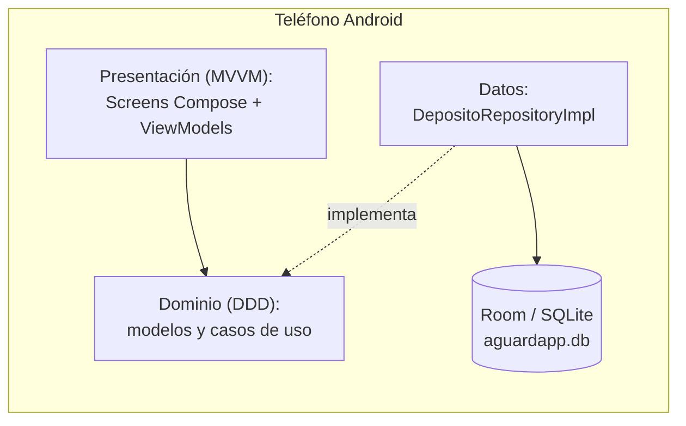
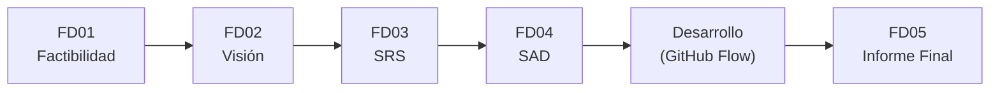
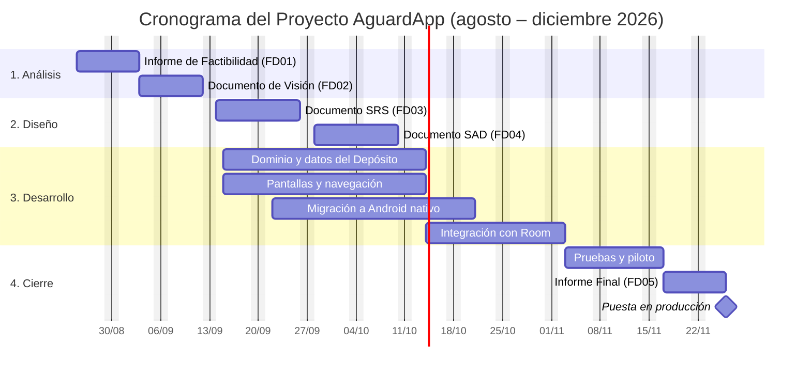
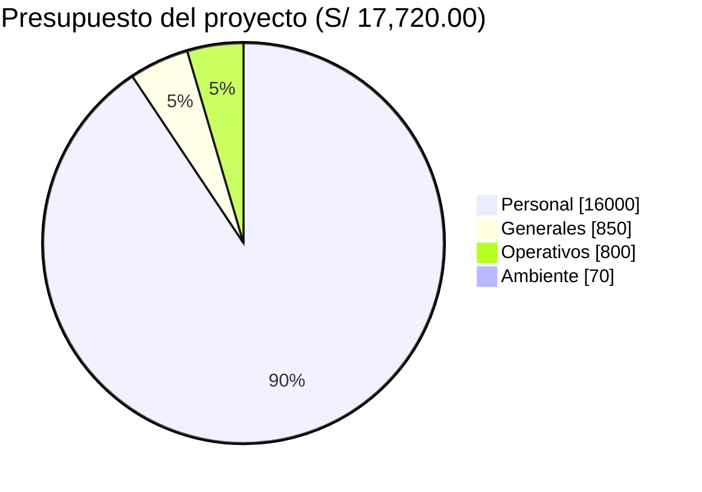

# AguardApp — Informe Final

> **Universidad Privada de Tacna** · Facultad de Ingeniería · Escuela Profesional de Ingeniería de Sistemas
> **Curso:** Soluciones Móviles I · **Docente:** Mag. Alberto Johnatan Flor Rodríguez
> **Proyecto:** AguardApp
> **Versión:** 2.1 · Tacna – Perú, 2026

**Integrantes**

| Integrante | Código |
|---|---|
| Jahuira Pilco, Dayan Elvis | 2022075749 |
| Llica Mamani, Jimmy Mijair | 2023076789 |
| Mamani Cori, Cristhian Carlos | 2023077282 |
| Sierra Ruiz, Iker Alberto | 2023077090 |

## Control de versiones

| Versión | Hecha por | Revisada por | Aprobada por | Fecha | Motivo |
|---|---|---|---|---|---|
| 1.0 | DJ - JL - CM - IS | AFR | AFR | 30/09/2026 | Versión Original |
| 2.0 | DJ - JL - CM - IS | — | — | 02/10/2026 | Actualización al sistema AguardApp: aplicación Android nativa, módulo Depósito y base de datos local |
| 2.1 | DJ - JL - CM - IS | — | — | 02/10/2026 | Se agrega la pantalla Avisos a las funcionalidades implementadas |

## Índice

1. [Antecedentes](#1-antecedentes)
2. [Planteamiento del Problema](#2-planteamiento-del-problema)
3. [Objetivos](#3-objetivos)
4. [Marco Teórico](#4-marco-teórico)
5. [Desarrollo de la Solución](#5-desarrollo-de-la-solución)
6. [Cronograma](#6-cronograma)
7. [Presupuesto](#7-presupuesto)
8. [Conclusión](#8-conclusión)
- [Recomendaciones](#recomendaciones)
- [Bibliografía](#bibliografía)
- [Anexos](#anexos)

---

## 1. Antecedentes

El presente documento constituye el Informe Final del proyecto AguardApp, desarrollado por el equipo de desarrollo AguardApp.

El proyecto nació como **AguaTacna**, una aplicación Kotlin Multiplatform (Android e iOS) con varios módulos: reserva, sector y mapas, recibos, retos, asistente hídrico y sincronización con la nube. Durante el desarrollo, el equipo decidió concentrar el esfuerzo en el problema central —saber cuánta agua le queda al hogar y hasta cuándo le alcanza— y migró la solución a **AguardApp**, una aplicación **Android nativa** con un único módulo funcional, **Depósito**, que trabaja por completo con una base de datos local.

Este informe consolida el trabajo realizado e integra los documentos elaborados en cada etapa: el Informe de Factibilidad (FD01), el Documento de Visión (FD02), la Especificación de Requerimientos de Software (FD03) y el Documento de Arquitectura de Software (FD04), que se adjuntan como anexos.

## 2. Planteamiento del Problema

### 2.1. Problema

La ciudad de Tacna, ubicada en una de las regiones más áridas del Perú, se abastece de agua potable bajo un esquema de racionamiento, con servicio solo durante algunas horas al día. Los hogares guardan agua en tanques, cisternas o bidones, pero no saben cuánta les queda ni hasta qué hora les alcanzará. Esto ocasiona desabastecimiento imprevisto, compra de agua de emergencia a sobreprecio y un consumo que no se ajusta a tiempo.

### 2.2. Justificación

El desarrollo de AguardApp se justifica por la necesidad de que cada hogar conozca el estado de su depósito y anticipe cuándo se quedará sin agua. Desde la perspectiva social, reduce la incertidumbre y el estrés de las familias. Desde la perspectiva económica, disminuye los gastos por compra de agua de emergencia. Desde la perspectiva ambiental, promueve el ahorro con recomendaciones concretas cuando el agua no alcanza. Y desde la perspectiva técnica, demuestra que una aplicación simple, gratuita y sin conexión, construida con buenas prácticas (MVVM + DDD), resuelve el problema principal sin depender de servicios externos.

### 2.3. Alcance

**Dentro del alcance del proyecto se considera:**

- Bienvenida con consentimiento para guardar los datos en el teléfono.
- Configuración del hogar: tipo y capacidad del depósito, habitantes, hábitos y hora habitual de llegada del agua.
- Registro de llenados completos o parciales.
- Cálculo del nivel actual, de la hora de agotamiento y del déficit de litros hasta el próximo llenado.
- Recomendaciones de recorte de consumo según los hábitos del hogar, con un plan que se guarda hasta el próximo llenado.
- Declaración de "me quedé sin agua", con la que la aplicación aprende el consumo real.
- Avisos dentro de la aplicación cuando el agua no alcanza hasta el próximo llenado, cuando el nivel baja del 20 % o cuando aún no se registró ningún llenado.
- Operación 100 % sin conexión con una base de datos local (Room / SQLite).

**Fuera del alcance del proyecto se considera:**

- La consulta del sector, los cronogramas oficiales y el mapa de cisternas.
- La digitalización de recibos, los retos y reportes ciudadanos y el asistente hídrico.
- La sincronización en la nube, el inicio de sesión con Google y las notificaciones push (los avisos solo se muestran dentro de la aplicación).
- La versión para iOS y la integración con los sistemas de EPS Tacna.

El proyecto se ejecuta entre agosto y diciembre de 2026, con una inversión estimada de S/ 17,720.00 cubierta con recursos propios del equipo.

## 3. Objetivos

### 3.1. Objetivo general

Desarrollar una aplicación móvil que permita a los hogares de Tacna conocer y planificar el uso del agua de su depósito durante el racionamiento, anticipando cuándo se quedarán sin agua.

### 3.2. Objetivos específicos

- **Gestionar el depósito del hogar:** calcular el nivel actual y proyectar hasta cuándo alcanza el agua.
- **Anticipar la falta de agua:** calcular el déficit de litros hasta el próximo llenado, avisar al usuario y recomendar recortes de consumo.
- **Aprender el consumo real:** ajustar la estimación con el historial de llenados y las declaraciones de "me quedé sin agua".
- **Operar sin conexión y con privacidad:** funcionar sin internet y sin sacar datos del teléfono.

## 4. Marco Teórico

### Racionamiento del agua y gestión del recurso hídrico

El racionamiento del agua es una medida de distribución del servicio por horarios ante la escasez del recurso. En ciudades como Tacna, de clima desértico, el acceso al agua potable es intermitente, lo que exige a los hogares almacenar agua y planificar su consumo hasta el siguiente abastecimiento.

### Desarrollo móvil nativo (Kotlin y Jetpack Compose)

Kotlin es el lenguaje recomendado para Android, y Jetpack Compose es su kit de interfaz declarativa: la pantalla se describe en función de su estado y se vuelve a dibujar sola cuando el estado cambia. Esto simplifica el código de la interfaz y reduce errores.

### Arquitectura MVVM + DDD y diseño offline-first

El patrón MVVM separa la pantalla (View) de su lógica de presentación (ViewModel), que expone un estado observable (`StateFlow<UiState>`). El diseño guiado por el dominio (DDD) organiza el código alrededor de los conceptos del problema —depósito, llenado, consumo, déficit— en una capa de dominio independiente de Android. El diseño offline-first establece la base de datos local (Room) como única fuente de verdad, de modo que la aplicación funciona aun sin conexión.

### Estimación del consumo con datos del propio hogar

AguardApp estima el consumo con el historial real del hogar (los intervalos entre llenados y los momentos en que se quedó sin agua) y usa la mediana, un estadístico robusto frente a datos erróneos. Si aún no hay historial suficiente, estima a partir de los hábitos declarados.

### Privacidad por diseño

La Ley N.° 29733 exige proteger los datos personales. AguardApp aplica la privacidad por diseño: todos los datos se guardan en el teléfono, no se envían a ningún servidor y la aplicación no solicita permisos del sistema.

## 5. Desarrollo de la Solución

### 5.1. Análisis de Factibilidad (técnico, económica, operativa, social, legal, ambiental)

| Dimensión | Resultado | Sustento |
|---|---|---|
| Técnica | **Factible** | El equipo domina las tecnologías seleccionadas (todas gratuitas y de código abierto). La aplicación compila y funciona como un único APK, sin depender de servidores. |
| Económica | **Viable** | La inversión estimada es de S/ 17,720.00, con un VAN de S/ 3,176.00, una TIR del 22.2 % y una relación beneficio/costo de 1.14, según el Informe de Factibilidad (FD01). Al no usar servicios en la nube, no hay costos de operación adicionales. |
| Operativa | **Factible** | La aplicación es simple, funciona sin conexión y no requiere personal adicional; los hogares la usan con un teléfono de gama básica (Android 7.0 o superior). |
| Social | **Positiva** | Ayuda a las familias a anticipar la falta de agua y a consumir de forma responsable, contribuyendo a los ODS 6, 11 y 12. |
| Legal | **Factible** | Cumple la Ley N.° 29733: ningún dato sale del teléfono y la aplicación no solicita permisos. Utiliza software libre conforme a sus licencias. |
| Ambiental | **Positiva** | Incentiva el ahorro y evita el desperdicio del agua, un recurso escaso en Tacna, sin generar residuos físicos. |

### 5.2. Tecnología de Desarrollo

La solución se construye con un conjunto de tecnologías gratuitas y de código abierto:

| Capa | Tecnología | Justificación |
|---|---|---|
| Lenguaje y plataforma | Kotlin · Android (API 24 a 36) | Lenguaje oficial de Android; compatible con teléfonos de gama básica. |
| Interfaz | Jetpack Compose + Material 3 | Interfaz declarativa, con el tema propio de la app (colores sólidos y una sola fuente). |
| Navegación | Navigation Compose | Rutas declaradas en un solo NavHost. |
| Base de datos local | Room (SQLite) | Operación sin conexión; única fuente de verdad. |
| Inyección de dependencias | Koin | Un único módulo simple para la base de datos, el reloj y el repositorio. |
| Fechas y horas | kotlinx-datetime | Cálculo del nivel, del agotamiento y del próximo llenado. |

La arquitectura general de la solución se muestra a continuación:

**Figura 1.** Arquitectura general de la solución AguardApp.

Las pantallas implementadas y sus rutas de navegación son:

| Ruta | Pantalla | Función |
|---|---|---|
| `bienvenida` | Bienvenida | Presenta la app y pide el consentimiento (solo la primera vez). |
| `configurar_hogar` | Configurar hogar | Formulario del hogar con validaciones y hora del próximo llenado escrita en formato 24 h. |
| `mi_deposito` | Mi depósito | Nivel, "Te alcanza hasta", próximo llenado, déficit y consumo. |
| `registrar_llenado/{tipo}` | Registrar llenado | Llenado completo (confirmar) o parcial (con litros). |
<<<<<<< HEAD
| `que_recortar` | Qué recortar | Recomendaciones con litros según el hogar; lo marcado se guarda hasta el próximo llenado y se refleja en Mi depósito y Avisos. |
| `me_quede_sin_agua` | Me quedé sin agua | "Se acabó ahora" o "Se acabó antes, a las HH:mm" (hora escrita; si es posterior a la actual, se toma como de ayer). |
=======
| `que_recortar/{deficit}` | Qué recortar | Recomendaciones con casillas y cálculo en vivo. |
| `me_quede_sin_agua` | Me quedé sin agua | "Se acabó ahora" o "Se acabó antes, a las HH:mm". |
| `avisos` | Avisos | Alertas de déficit, nivel bajo (menos del 20 %) o sin llenado; cada aviso lleva a la pantalla que lo resuelve. |
>>>>>>> 8e708ca9b09819baaa17a6ebe4c00186960a411c

### 5.3. Metodología de implementación (Documento de VISIÓN, SRS, SAD)

El desarrollo siguió el flujo de trabajo GitHub Flow (rama por funcionalidad, revisión por pares y una rama principal protegida) y una arquitectura MVVM + DDD. La ingeniería de requisitos y el diseño se documentaron en tres entregables, adjuntos como anexos:

- **Documento de Visión (FD02):** define el posicionamiento, los interesados, las características y las restricciones del producto.
- **Documento SRS (FD03):** especifica los requerimientos funcionales y no funcionales, las reglas de negocio, los procesos y los modelos (casos de uso, clases y secuencia).
- **Documento SAD (FD04):** describe la arquitectura mediante el modelo de vistas 4+1 (lógica, implementación, procesos y despliegue).

Durante la implementación se tomaron estas decisiones:

1. **Migración a Android nativo:** el código de AguaTacna (Kotlin Multiplatform) se trasladó a un único módulo Android (`app`), reemplazando las piezas multiplataforma por sus equivalentes de Android.
2. **Reducción del alcance:** se eliminaron los módulos de sector, recibo, retos y asistente, junto con sus librerías (mapas, OCR, cámara y permisos).
3. **Solo datos locales:** se eliminaron la sincronización con Supabase, el inicio de sesión con Google y las notificaciones; la aplicación ya no necesita internet ni permisos.
4. **Simplificación de la arquitectura:** cada pantalla quedó con un Screen y un ViewModel; los modelos y casos de uso del dominio se agruparon por tema; la inyección de dependencias se concentró en un único módulo.
5. **Diseño:** colores sólidos sin degradados ni sombras, y una sola fuente tipográfica en toda la app.
6. **Avisos dentro de la aplicación:** en lugar de notificaciones push, que requieren permisos, se agregó una pantalla de avisos que se calcula a partir del depósito y no necesita tablas nuevas.
7. **Base de datos versión 2:** el esquema de Room se exporta en `app/schemas/`; al no haber migraciones, cada cambio de versión recrea la base local.

Al cierre de esta versión se cuenta con una aplicación funcional que permite configurar el hogar, registrar llenados, consultar el depósito y el déficit, ver qué recortar, declarar que se quedó sin agua y consultar los avisos del depósito, todo sin conexión.

## 6. Cronograma

Cronograma del Proyecto AguardApp (agosto – diciembre 2026). Comienzo: mar 25/08/26 · Fin: jue 26/11/26.

| # | Tarea | Duración | Comienzo | Fin | Predecesoras | Recursos |
|---|---|---|---|---|---|---|
| 1 | **1. Análisis** | **15 días** | **mar 25/08/26** | **vie 11/09/26** | | |
| 2 | Informe de Factibilidad (FD01) | 7 días | mar 25/08/26 | mié 02/09/26 | | Equipo Análisis |
| 3 | Documento de Visión (FD02) | 7 días | jue 03/09/26 | vie 11/09/26 | 2 | Equipo Análisis |
| 4 | **2. Diseño** | **20 días** | **lun 14/09/26** | **vie 09/10/26** | | |
| 5 | Documento SRS (FD03) | 10 días | lun 14/09/26 | vie 25/09/26 | 3 | Equipo Diseño |
| 6 | Documento SAD (FD04) | 10 días | lun 28/09/26 | vie 09/10/26 | 5 | Equipo Diseño |
| 7 | **3. Desarrollo** | **35 días** | **mar 15/09/26** | **lun 02/11/26** | | |
| 8 | Dominio y datos del Depósito | 21 días | mar 15/09/26 | mar 13/10/26 | | Equipo Desarrollo |
| 9 | Pantallas y navegación | 21 días | mar 15/09/26 | mar 13/10/26 | | Equipo Desarrollo |
| 10 | Migración a Android nativo y simplificación | 21 días | mar 22/09/26 | mar 20/10/26 | | Equipo Desarrollo |
| 11 | Integración con la base local (Room) | 14 días | mié 14/10/26 | lun 02/11/26 | 8 | Equipo Desarrollo |
| 12 | **4. Cierre** | **24 días** | **mar 03/11/26** | **jue 26/11/26** | | |
| 13 | Pruebas y piloto | 10 días | mar 03/11/26 | lun 16/11/26 | 11 | Equipo QA |
| 14 | Informe Final (FD05) | 7 días | mar 17/11/26 | mié 25/11/26 | 13 | Equipo Dirección |
| 15 | Puesta en producción | 0 días | jue 26/11/26 | jue 26/11/26 | 14 | Equipo TI |

## 7. Presupuesto

El presupuesto del proyecto, detallado en el Informe de Factibilidad, se resume a continuación. El costo principal corresponde al recurso humano, dado que las herramientas empleadas son gratuitas y la aplicación no usa servicios en la nube.

| Categoría | Total (S/) |
|---|---:|
| Costos de personal (4 desarrolladores x 4 meses) | 16,000.00 |
| Costos generales (útiles, impresiones, equipo de pruebas) | 850.00 |
| Costos operativos durante el desarrollo (internet, energía) | 800.00 |
| Costos del ambiente (dominio) | 70.00 |
| **Inversión total del proyecto** | **17,720.00** |

## 8. Conclusión

- AguardApp responde a una necesidad real de la ciudad de Tacna: saber cuánta agua le queda al hogar y hasta cuándo le alcanza durante el racionamiento.
- El proyecto es viable y factible en las dimensiones técnica, económica, operativa, social, legal y ambiental, con indicadores financieros que respaldan la inversión (VAN positivo, TIR del 22.2 % y B/C de 1.14).
- Concentrar el producto en el módulo Depósito, con una aplicación Android nativa y datos locales, simplificó la arquitectura y eliminó la dependencia de servidores, cuentas y permisos.
- La arquitectura MVVM + DDD, documentada en los entregables FD03 y FD04, separa el dominio de Android y deja cada pantalla con un Screen y un ViewModel, lo que facilita el mantenimiento.
- La privacidad por diseño —ningún dato sale del teléfono— alinea la solución con la Ley N.° 29733.

## Recomendaciones

- Realizar un piloto con 20 a 30 hogares para validar la estimación del consumo y ajustar sus parámetros.
- Agregar pruebas unitarias para la capa de dominio (estimación del consumo, déficit y recortes), que es Kotlin puro.
- Evaluar en próximas versiones la reincorporación de funciones fuera del alcance actual (notificaciones push a partir de los avisos actuales, sector y cronograma oficial, sincronización opcional), sin perder el funcionamiento sin conexión.
- Mantener las pruebas en dispositivos físicos de gama básica.

## Bibliografía

- Congreso de la República del Perú. (2011). *Ley N.° 29733 – Ley de Protección de Datos Personales*. Lima, Perú.
- Kruchten, P. (1995). Architectural Blueprints — The 4+1 View Model of Software Architecture. *IEEE Software, 12*(6), 42–50.
- Evans, E. (2003). *Domain-Driven Design: Tackling Complexity in the Heart of Software*. Addison-Wesley.
- Sommerville, I. (2016). *Ingeniería de Software* (10.ª ed.). Pearson Educación.
- Pressman, R. S. (2014). *Ingeniería del Software: Un Enfoque Práctico* (8.ª ed.). McGraw-Hill.
- ISO/IEC. (2011). *ISO/IEC 25010:2011 – Systems and software engineering – SQuaRE*.

## Anexos

- **Anexo 01:** [Informe de Factibilidad (FD01)](FD01-Factibilidad.md)
- **Anexo 02:** [Documento de Visión (FD02)](FD02-Vision.md)
- **Anexo 03:** [Documento de Especificación de Requerimientos de Software (FD03)](FD03-SRS.md)
- **Anexo 04:** [Documento de Arquitectura de Software (FD04)](FD04-SAD.md)
